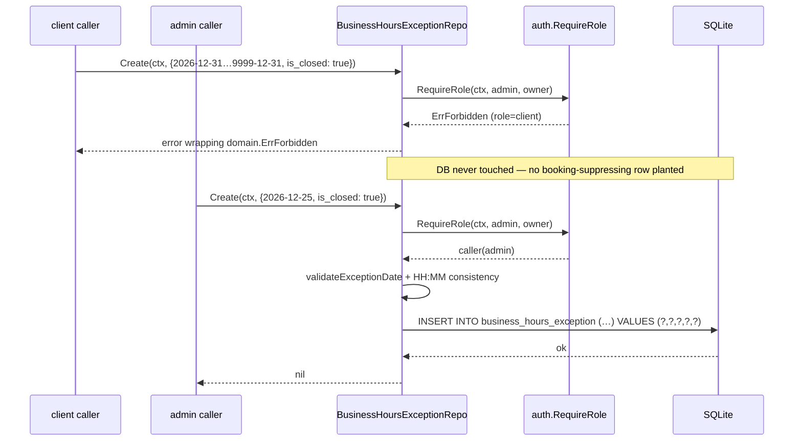
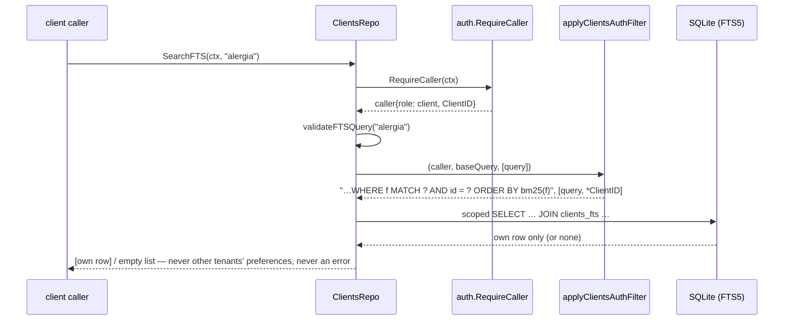

# Design: Repository Auth Integration (clients + business_hours_exception)

> Change: `feat-repository-auth-integration` · 2026-08-23
> Depends on: proposal (sdd/feat-repository-auth-integration/proposal), delta specs
> `specs/clients/spec.md` (REQ-CL-AUTH-001…005) and `specs/business-hours-exception/spec.md`
> (REQ-BHE-AUTH-001…002), exploration (sdd/…/explore).
> PRD anchors: §3.8.4 (3-layer model, repo-layer enforcement), §3.8.7 item 6 (last auth debt),
> §3.7.13 Paso 3a (`check_availability` reads the exception on the hot path).

## Technical Approach

Wire `auth.Caller` enforcement into the last two ungated repositories using the two
canonical patterns already in the codebase:

- **Pattern A — `auth.RequireRole`** (writes; precedent `services.go:32`): fail-fast role
  gate for `ClientsRepo` writes + `FindByPhone` + `GetOrCreate` (staff/default branch) and
  `BusinessHoursExceptionRepo.Create`/`Delete`.
- **Pattern B — `RequireCaller` + scoped WHERE** (reads; precedent `bookings.go:129–137`):
  caller-scoped filtering for `ClientsRepo.FindByID`/`SearchFTS` via a new package-private
  local helper `applyClientsAuthFilter` that emits ` AND id = ?` for client callers, and
  presence-only `RequireCaller` for `BusinessHoursExceptionRepo.Get`/`List`.

No method signature changes: `ctx` already flows through every method; auth is enforced
inside the method bodies. No schema, `go.mod`, `auth_filter.go`, use-case, or MCP-tool
changes. The 3-layer model (PRD §3.8.4) gets its persistence-edge enforcement ahead of
Fase 3 admin tools; Fase 2 tools are unaffected (their consumers already enforce roles
and never touch `ClientsRepo`).

## Authorization Matrix (the contract)

From `explore.md` §Recommendation, pinned by the delta specs. "E/F/U rejection" =
staff → `domain.ErrForbidden`, caller-less ctx → `domain.ErrUnauthenticated`, DB untouched.

| Method | admin / owner | staff | client | no caller |
|---|---|---|---|---|
| `ClientsRepo.Save` | ✅ unrestricted | E | E | U |
| `ClientsRepo.Create` | ✅ | E | E | U |
| `ClientsRepo.FindByID` | ✅ all rows | E | ` AND id = ?` — own row only; other id collapses to `ErrNotFound` | U |
| `ClientsRepo.FindByPhone` | ✅ | E | E | U |
| `ClientsRepo.GetOrCreate` | ✅ any phone | E | ✅ iff `phone == *caller.ClientID`, else E | U |
| `ClientsRepo.Update` | ✅ | E | E | U |
| `ClientsRepo.Delete` | ✅ | E | E | U |
| `ClientsRepo.SearchFTS` | ✅ full `bm25` ranking | E | ` AND id = ?` — own row only; zero matches → empty list, no error | U |
| `BusinessHoursExceptionRepo.Create` | ✅ | E | E | U |
| `BusinessHoursExceptionRepo.Delete` | ✅ | E | E | U |
| `BusinessHoursExceptionRepo.Get` | ✅ | ✅ | ✅ | U |
| `BusinessHoursExceptionRepo.List` | ✅ | ✅ | ✅ | U |

Staff denial on client reads is intentional asymmetry vs `bookings.go` (where staff get
`professional_id` scoping): the schema has no staff↔client relationship, so there is no
legitimate staff scope on `clients` — deny outright.

## Architecture Decisions

### Decision 1: Local helper in `clients.go`, NOT a generalized `auth_filter.go`

**Choice**: package-private `applyClientsAuthFilter` in `clients.go`, mirroring
`applyAuthFilter`'s mechanics but emitting ` AND id = ?`.
**Alternatives considered**:

| Option | Tradeoff | Verdict |
|---|---|---|
| Generalize `applyAuthFilter(caller, clientCol, staffCol, …)` | Single source of truth, but rewrites **12 verified call-sites** in `bookings.go` (lines 132, 164, 197, 223, 248, 290, 309, 352, 397, 441, 482, 518) + `bookings_test.go` expectations for one outlier table | Rejected — regression risk and budget creep on code this change doesn't otherwise touch |
| Use `applyAuthFilter` as-is | Zero new code, but it emits the literal ` AND client_id = ?` (auth_filter.go:47) — `clients` has no `client_id` column; the query fails (or silently returns zero rows) for exactly the one role that legitimately hits the API | Rejected — incorrect SQL |
| Local helper | ~55 duplicated lines; the "column is `id`, not `client_id`" decision lives in the file that knows the schema; `bookings.go` untouched | **Chosen** |

**Rationale**: the `clients` table's PK `id` IS the client id — the shared helper's
hard-coded column is simply wrong for this table. Generalizing would churn 12 bookings
call-sites for a single outlier. Refactor toward a parametrized helper only when a
*second* repo needs a non-default column (explore.md rule; not yet true).

### Decision 2: Staff/unknown roles → fail-fast `ErrForbidden`, not ` AND 1=0`

**Choice**: the helper returns `*domain.SemanticError{ErrCodeForbidden, Cause: ErrForbidden}`
for staff and unknown roles before any SQL runs.
**Alternatives considered**: emit ` AND 1=0` so the query executes and returns zero rows
(collapsing to `ErrNotFound`).
**Rationale**: (a) the delta specs mandate staff → `domain.ErrForbidden` on clients
methods — `1=0` would produce `ErrNotFound`, violating REQ-CL-AUTH-001/002/004; (b) an
authorization failure masked as a 404 is unauditable and misleads the upstream LLM
("does not exist" vs "not yours"); (c) it wastes a DB roundtrip on a query guaranteed
empty. `1=0` remains the right tool only where a *legitimate* role must see a scoped
subset — here staff have no legitimate subset at all.

### Decision 3: Writes gated by `RequireRole` only — no scope column on UPDATE/DELETE

**Choice**: `Save`/`Create`/`Update`/`Delete` (and `FindByPhone`) check
`auth.RequireRole(ctx, RoleAdmin, RoleOwner)` and keep their SQL byte-identical.
**Alternatives considered**: also rewrite `Update`/`Delete` with ` AND id = ?` defense.
**Rationale**: mirrors `services.go:32/95/123` exactly (identical auth surface for all
admin-gated writes in the package). Since clients can never pass the role gate, a row
filter would be dead code — and per explore's risk note, keeping the gate-only shape
prevents any illusion that `Update` is safe for client callers. The spec only requires
staff/client/unauth rejection (REQ-CL-AUTH-001).

### Decision 4: BHE reads = `RequireCaller` presence check only

**Choice**: `Get`/`List` call `auth.RequireCaller(ctx)` and apply **no** role check and
**no** row filter.
**Rationale**: both sit on the `check_availability`/`create_booking` hot path
(PRD §3.7.13 Paso 3a) — every authenticated role must read the exception for the slot
being booked (REQ-BHE-AUTH-002, incl. the "gate must not break availability" scenario).
Exception rows are calendar metadata with no PII and no tenant column to filter on.
Accidentally wiring `RequireRole` here would break every booking request.

### Decision 5: `GetOrCreate` own-phone anchor = `*caller.ClientID`

**Choice**: for a client caller, allow the call iff `caller.ClientID != nil && phone == *caller.ClientID`;
otherwise `ErrForbidden` (staff/default also `ErrForbidden`; admin/owner unrestricted).
**Alternatives considered**: compare against `caller.ID`; compare against the existing
row's phone.
**Rationale**: `ClientID` is the resolver-produced pointer to the caller's `clients.id`
(resolver.go:102) — the canonical client identity, independent of how the caller ID was
spelled. Comparing against "the row's phone" is undefined when the row doesn't exist yet
(which is precisely `GetOrCreate`'s create branch). The spec scenario (client identified
by `+5491112345678` get-or-creates that phone) is satisfied because the resolver only
resolves a client caller when a row with that id exists. A client can never bind a
foreign row to a phone they control (REQ-CL-AUTH-005).

### Decision 6: Auth gate ordered BEFORE input validation

**Choice**: every gate runs as the first statement of its method, before
name/phone/date/FTS validation — matching `services.go` (`RequireRole` precedes
`s.Validate()`).
**Rationale**: the specs demand rejection "regardless of phone existence" / "DB
untouched" (REQ-CL-AUTH-002/005, REQ-BHE-AUTH-001) and define `ErrInvalidInput` semantics
as *authorized*-caller behavior. Auth-first also guarantees rejection errors never depend
on payload content.

## Interfaces / Contracts

No public API changes. One new package-private function in `clients.go`:

```go
// applyClientsAuthFilter modifies a clients query and args based on the caller's
// role. Unlike applyAuthFilter (bookings), the clients table has no client_id
// column — the row's own PK id IS the client id — so the client scope clause is
// " AND id = ?". Staff and unknown roles have no legitimate scope on clients and
// are rejected outright (ErrForbidden). Admin/owner: query unchanged.
//
// Mechanics mirror auth_filter.go: defensive copy of args; the clause is
// inserted before the LAST "ORDER BY"/"LIMIT" (case-insensitive) because WHERE
// cannot follow them; the caller's slice is never mutated.
func applyClientsAuthFilter(caller *auth.Caller, baseQuery string, baseArgs []any) (string, []any, error) {
	if caller == nil { // defensive backstop; callers use RequireCaller first
		return "", nil, &domain.SemanticError{
			Code: domain.ErrCodeUnauthenticated, Message: "se requiere autenticación",
			Cause: domain.ErrUnauthenticated,
		}
	}
	args := make([]any, len(baseArgs), len(baseArgs)+1) // defensive copy
	copy(args, baseArgs)
	query := baseQuery

	var filterClause string
	var filterArg any
	switch caller.Role {
	case auth.RoleClient:
		if caller.ClientID == nil {
			return "", nil, &domain.SemanticError{
				Code: domain.ErrCodeForbidden, Message: "Cliente no tiene ID asignado",
				Cause: domain.ErrForbidden,
			}
		}
		filterClause = " AND id = ?"
		filterArg = *caller.ClientID
	case auth.RoleAdmin, auth.RoleOwner:
		// no extra filter
	default: // staff and unknown roles: no legitimate scope on clients
		return "", nil, &domain.SemanticError{
			Code: domain.ErrCodeForbidden,
			Message: fmt.Sprintf("Rol %q no tiene permiso para acceder a clientes", caller.Role),
			Cause: domain.ErrForbidden,
		}
	}
	if filterClause == "" {
		return query, args, nil
	}

	upper := strings.ToUpper(query)
	insertPos := len(query)
	if idx := strings.LastIndex(upper, "ORDER BY"); idx >= 0 {
		insertPos = idx
	}
	if idx := strings.LastIndex(upper, "LIMIT"); idx >= 0 && idx < insertPos {
		insertPos = idx
	}
	suffix := query[insertPos:]
	if suffix != "" {
		query = query[:insertPos] + filterClause + " " + suffix
	} else {
		query = query[:insertPos] + filterClause
	}
	return query, append(args, filterArg), nil
}
```

Method wiring follows the bookings template (`bookings.go:129–137`):

```go
caller, err := auth.RequireCaller(ctx)
if err != nil {
	return nil, fmt.Errorf("obtener cliente %s: %w", id, err)
}
query := `SELECT ... FROM clients WHERE id = ?`
args := []any{id}
query, args, err = applyClientsAuthFilter(caller, query, args)
if err != nil {
	return nil, fmt.Errorf("obtener cliente %s: %w", id, err)
}
```

`GetOrCreate` uses an inline role switch (Decision 5) — it is a value check, not a
query filter, so the helper does not apply.

## Data Flow

### DoS-planting attempt on `BusinessHoursExceptionRepo.Create` (REQ-BHE-AUTH-001)



### FTS-scoped read: client `SearchFTS` (REQ-CL-AUTH-004)



## SQL Before / After

Only the two scoped reads change SQL; gated methods keep byte-identical SQL with a
leading auth check. Placeholders only — the clause is a fixed literal, values always
bound via `?` (no concatenation anywhere).

**`FindByID`** — client caller (admin/owner: original query, original args):

```sql
-- before (all callers)
SELECT id, name, phone, email, preferences, created_at, updated_at
  FROM clients WHERE id = ?
-- after (client caller); args: [id, *caller.ClientID]
SELECT id, name, phone, email, preferences, created_at, updated_at
  FROM clients WHERE id = ? AND id = ?
```

A cross-tenant id yields `sql.ErrNoRows` → wrapped `domain.ErrNotFound`, byte-identical
to the non-existent-id error (oracle collapse; bookings precedent `bookings.go:140–143`).

**`FindByPhone`** — SQL unchanged; `RequireRole(admin, owner)` gate first. Staff/client
rejection is independent of phone existence (REQ-CL-AUTH-002).

**`SearchFTS`** — client caller (insertion lands before `ORDER BY` via LastIndex):

```sql
-- before (all callers)
SELECT c.id, c.name, c.phone, c.email, c.preferences, c.created_at, c.updated_at
  FROM clients c
  JOIN clients_fts f ON c.rowid = f.rowid
 WHERE f MATCH ?
 ORDER BY bm25(f)
-- after (client caller); args: [query, *caller.ClientID]
SELECT c.id, c.name, c.phone, c.email, c.preferences, c.created_at, c.updated_at
  FROM clients c
  JOIN clients_fts f ON c.rowid = f.rowid
 WHERE f MATCH ? AND id = ?
 ORDER BY bm25(f)
```

Unqualified `id` is unambiguous here: `clients_fts` exposes only `name`, `preferences`
(plus `rowid`) — schema.go:145 — so `id` resolves to `clients.id`. Qualifying with `c.`
would break the no-alias `FindByID` query; the shared helper must emit the bare form.
`bm25(f)` ranking and the FTS5 `MATCH` semantics are untouched for admin/owner.

**`Update` / `Delete`** — SQL unchanged (`UPDATE clients SET … WHERE id=?` /
`DELETE FROM clients WHERE id = ?`); `RequireRole(admin, owner)` gate first (Decision 3).

**BHE `Create`** — SQL unchanged; gate before `validateExceptionDate`:

```go
if _, err := auth.RequireRole(ctx, auth.RoleAdmin, auth.RoleOwner); err != nil {
	return fmt.Errorf("crear excepción: %w", err)
}
// …existing validation + INSERT INTO business_hours_exception (…) VALUES (?,?,?,?,?)
```

**BHE `Get`** — SQL unchanged; `RequireCaller(ctx)` only (Decision 4):

```go
if _, err := auth.RequireCaller(ctx); err != nil {
	return nil, fmt.Errorf("obtener excepción por fecha %s: %w", dateStr, err)
}
```

## Cross-Cutting Concerns

- **Error wrapping**: every rejection follows the project convention
  `fmt.Errorf("<spanish context>: %w", err)`. `RequireRole`/`RequireCaller`/the helper
  return `*domain.SemanticError`, whose `Unwrap()` yields the sentinel
  (`errors.go:71–72`), so `errors.Is(err, domain.ErrForbidden)` works through the whole
  `%w` chain — same as existing bookings/services tests assert.
- **Oracle collapse**: only role gates produce `ErrForbidden`. Scoped reads
  (`FindByID`, `SearchFTS` under client scope) map every miss — cross-tenant or
  non-existent — to `ErrNotFound`; `SearchFTS` with no own match returns an empty
  result (zero-length, `err == nil`), preserving the current nil-slice-when-empty
  behavior (tests assert `len == 0`, not non-nil).
- **Transactions & pragmas**: no new write paths, no transactions introduced. All
  methods remain single-statement; WAL + `busy_timeout=5000` + `foreign_keys=ON`
  pragmas in `internal/db` are untouched. Concurrency behavior is identical.
- **No interface churn**: compile-time checks (`var _ domainrepo.ClientsRepo = …`,
  `var _ domainrepo.BusinessHoursExceptionRepo = …`) still hold — signatures unchanged.
- **`auth_filter.go` untouched**: verified this session — 12 call-sites in
  `bookings.go`, none modified by this change.
- **Test helpers**: reuse `adminCtx()`, `ownerCtx()`, `staffCtx(profID)`,
  `clientCtx(clientID)` from `testutil_test.go:42–67`. The `newMockDB` cleanup
  (`ExpectationsWereMet`, testutil_test.go:22–27) doubles as the "DB untouched" proof
  for rejection cases: set no expectations; any attempted query fails the test.

## File Changes

| File | Action | Description |
|------|--------|-------------|
| `internal/repository/clients.go` | Modify | Add `applyClientsAuthFilter` (~55 LOC); `RequireRole` gate on `Save`/`Create`/`Update`/`Delete`/`FindByPhone`; `RequireCaller` + scope on `FindByID`/`SearchFTS`; role switch on `GetOrCreate` |
| `internal/repository/business_hours_exception.go` | Modify | `RequireRole(admin, owner)` on `Create`/`Delete`; `RequireCaller` on `Get`/`List` |
| `internal/repository/clients_test.go` | Modify | Migrate `context.Background()` → role ctx helpers; add role-matrix + scope-SQL + rejection cases |
| `internal/repository/business_hours_exception_test.go` | Modify | Same migration; add rejection cases for `Create`/`Delete` + all-role reads + no-caller cases |
| `internal/repository/auth_filter.go` | Unchanged | Explicitly untouched (Decision 1) |

## Testing Strategy

| Layer | What to Test | Approach |
|-------|-------------|----------|
| Unit (sqlmock) | Role matrix per method: admin/owner pass, staff → `ErrForbidden`, caller-less → `ErrUnauthenticated`, DB untouched | Table-driven `roles × methods` using `adminCtx()`/`staffCtx("prof-1")`/`clientCtx("cli-1")`/`context.Background()`; zero mock expectations proves no DB touch |
| Unit (sqlmock) | Scope rewriting: `FindByID`/`SearchFTS` emit `AND id = ?` with `*caller.ClientID`, inserted before `ORDER BY` | `mock.ExpectQuery` with regexp `AND id = \?` + `WithArgs(id, "cli-1")`; FTS case asserts `ORDER BY bm25\(f\)` still terminates the query |
| Unit (sqlmock) | Oracle collapse: client cross-tenant `FindByID` → `ErrNotFound` identical to missing id; client `SearchFTS` no-match → empty, no error | `WillReturnError(sql.ErrNoRows)` / empty rows; `errors.Is` assertions |
| Unit (sqlmock) | `GetOrCreate`: client own-phone success (create + idempotent second call), foreign phone → `ErrForbidden` regardless of existence, staff → `ErrForbidden`, admin unrestricted | Per REQ-CL-AUTH-005 scenarios |
| Unit (sqlmock) | BHE: client/staff/unauth `Create`/`Delete` rejected with DB untouched; all four roles read `Get`/`List` successfully (hot-path guard) | Per REQ-BHE-AUTH-001/002 scenarios, incl. far-future `is_closed=1` plant |
| Regression | Full suite with race detector + lint | `go test -v -race ./...`, `golangci-lint run ./...`, `go build -o /dev/null ./...` (pre-commit pipeline) |
| E2E | N/A | No MCP tools in scope; Fase 2 consumers unaffected (verified in explore.md) |

Existing tests that call gated methods with `context.Background()` will fail with
`ErrUnauthenticated` after wiring — migrating them to the role ctx helpers is part of
this change's scope, not collateral damage.

## Threat Matrix

N/A — no routing, shell, subprocess, VCS/PR automation, executable-file classification,
or process-integration boundary. This change adds in-process authorization checks to
two repository files only.

## Migration / Rollout

No migration required — no schema, config, or dependency changes. Estimated diff
(~90 LOC implementation + ~300 LOC tests) fits the 600-line review budget
(`openspec/config.yaml` `review_budget_lines: 600`) in a single PR. Rollback: `git
revert` of the merge commit; both repos return to pre-wiring behavior and Fase 2 tools
are unaffected either way.

## Open Questions

None — the authorization matrix, rejection semantics, and scope mechanics are fully
pinned by the delta specs (REQ-CL-AUTH-001…005, REQ-BHE-AUTH-001…002) and the
bookings/services precedents.
