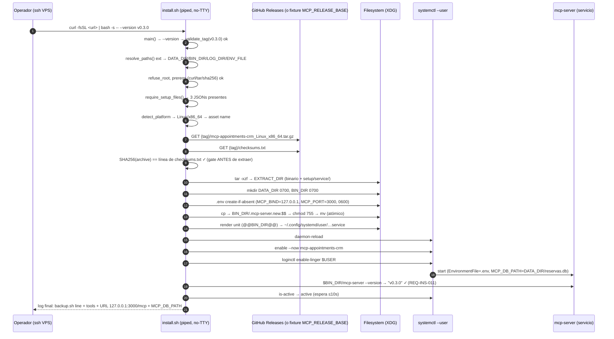
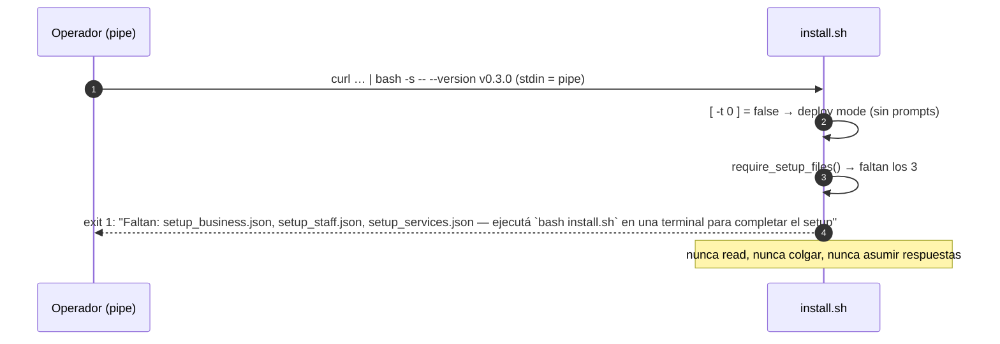

# Design — feat-install-and-service

**Change:** feat-install-and-service
**Phase:** 5 — install-and-service
**Status:** ready for review (tracea REQ-INS-001..013, REQ-BKP-001..004, REQ-SU-001..005, REQ-IDOC-001..004, REQ-BVER-001..003)
**skill_resolution:** paths-injected (gentle-ai SKILL.md)
**Inputs leídos:** proposal.md (final, D1–D6), exploration.md (Q1–Q5), 5 specs nuevas, `scripts/install.sh` (1053 l), `cmd/mcp-server/main.go`, `internal/mcp/config.go`, `internal/db/database.go`, `internal/buildinfo/buildinfo.go`, `docs/deployment.md`, `docs/PRD.md` §3.5, ADR-0001/0002/0005/0007/0008/0014.

> Método: CodeGraph MCP no disponible en esta sesión y sin acceso a shell; lecturas dirigidas sobre los archivos exactos mapeados por exploration (fallback declarado, sin impacto en el resultado).

---

## 1. Context y Goals

Fase 5 cierra el loop **install → service → backup → docs** del producto self-hosted. Las fases anteriores entregaron el binario MCP (transporte, auth, use cases, DB SQLite WAL) y el instalador interactivo Fase 4 (prompts, validadores, `finalize()` con JSONs de setup). Lo que falta para que un integrador entregue el sistema en una sesión es el **pipeline de deploy**: bajar un release verificado, instalarlo user-level, registrar el servicio que sobrevive logout/reboot, y entregar al dueño del negocio un backup probado y dos manuales en español.

**Goals de este design:**

1. Especificar la extensión extend-only de `scripts/install.sh` (pipeline deploy) sin tocar funcionalmente el flujo Fase 4 (REQ-INS-012 / D3).
2. Fijar el layout de archivos por OS (REQ-INS-006 / D4) y la ubicación canónica de `reservas.db` y `.env` (D1/D5), incluyendo dos hallazgos de este design sobre `.env` en macOS y sobre el literal del template systemd (§3, D8/D9).
3. Diseñar `scripts/backup.sh` portable (REQ-BKP-001..004), los 3 templates de `setup/service/` (REQ-SU-001..005) y el flag `mcp-server --version` (REQ-BVER-001..003).
4. Definir seguridad (SHA256 gate, loopback-only, atomic writes, no root), estrategia de tests (shunit2 nuevas suites + Go), rollback < 5 min y operability (maintenance.md).
5. Delimitar explícitamente lo que **no** aplica: prepared statements, FTS5 y cualquier cambio de esquema/SQL (§10).

**Non-goals heredados del proposal:** CI/CD y `.goreleaser.yml` (Fase 6, ADR-0014), Docker (ADR-0001), scheduler de backups (ADR-0005), automatización Windows, cambio del default DB del binario (D1), reescritura del flujo interactivo Fase 4.

---

## 2. Architecture Overview

```text
┌──────────────────────────────────────────────────────────────────────┐
│  VPS limpio (Ubuntu 22+/macOS)                                        │
│                                                                      │
│  curl -fsSL <url>/install.sh | bash -s -- --version v0.3.0           │
│          │                                                           │
│          ▼  [ -t 0 ] = false → sin prompts (REQ-INS-005)             │
│  ┌─────────────────────── install.sh (extendido) ─────────────────┐  │
│  │ main() dispatch: --version <tag> → run_deploy()                │  │
│  │                                                                │  │
│  │ 1. resolve_paths() ext: DATA_DIR/BIN_DIR/LOG_DIR + ENV_FILE    │  │
│  │ 2. refuse_root + prereqs (curl, tar, sha256 tool)              │  │
│  │ 3. tag validation (vX.Y.Z, sin latest)                         │  │
│  │ 4. require_setup_files() — 3 JSONs (REQ-INS-004)               │  │
│  │ 5. detect_platform() → asset GoReleaser (REQ-INS-002)          │  │
│  │ 6. download + SHA256 verify (checksums.txt) (REQ-INS-003)      │  │
│  │ 7. extract → binario → BIN_DIR atómico                         │  │
│  │ 8. .env create-if-absent (REQ-INS-007)                         │  │
│  │ 9. render template (archive o repo) → service unit (REQ-SU-*)  │  │
│  │ 10. systemd --user enable+start + linger / launchctl (008/009) │  │
│  │ 11. verify $BIN_DIR/mcp-server --version == tag (REQ-INS-011)  │  │
│  │ 12. print_post_install_summary (REQ-INS-010)                   │  │
│  └────────────────────────────────────────────────────────────────┘  │
│          │                                                           │
│          ▼                                                           │
│  systemd --user (Linux) / launchd (macOS) ── mcp-server              │
│    EnvironmentFile=.env  +  MCP_DB_PATH=DATA_DIR/reservas.db (D1)    │
│    loopback 127.0.0.1:3000/mcp (ADR-0007)                            │
│                                                                      │
│  scripts/backup.sh <db> → sqlite3 .backup + gzip → backups/*.db.gz   │
└──────────────────────────────────────────────────────────────────────┘
```

La instalación es **bash puro** (ADR-0008): la TUI Bubble Tea no participa y los docs no la referencian como paso (REQ-IDOC-001).

---

## 3. Architecture Decisions

### D1–D6 (heredadas del proposal — rationale y tradeoffs ya cerrados)

| ID | Decisión | Rationale central | Tradeoff aceptado |
|---|---|---|---|
| D1 | `MCP_DB_PATH` lo fija el service unit; **cero cambio Go** de paths | Blast radius mínimo; el binario queda intocado para direct-runs | `./mcp-server` manual sigue usando `./data/appointments.db` — mitigado con caveat en docs (REQ-IDOC-001/002) y `MCP_DB_PATH` declarado en el log final (REQ-INS-010) |
| D2 | Flag `mcp-server --version` mínimo (~20 LOC) en Fase 5 | `deployment.md` ya lo promete y REQ-INS-011 depende de él | Toque de Go en fase de scripts — aislado a `cmd/mcp-server/main.go` con test propio (REQ-BVER-002) |
| D3 | Piso Bash 3.2 + suites Fase 4 sagradas | Portabilidad macOS (/bin/bash nativo) y no-regresión verificable | Verbosidad (composición byte a byte de nombres de asset, sin arrays/mapfile) |
| D4 | Paths XDG-ish por OS vía `resolve_paths()` extendida | PRD §3.5 + `deployment.md` ya documentan ese layout | Tres variantes de path por OS — centralizadas en una sola función |
| D5 | `reservas.db` nombre canónico de producción | Coincide con PRD §3.5 y `backups/reservas-YYYYMMDD.db.gz` | El string interno `appointments.db` sobrevive como default de desarrollo (caveat, nunca ruta de producción) |
| D6 | Degradación explícita sin TTY (`[ -t 0 ]`) | `curl\|bash` jamás debe colgar en un `read` ni asumir respuestas | Un piped install en VPS virgen no puede completar — correcto: los datos de negocio nacen de una sesión interactiva |

**Detalle técnico que refuerza D6:** con `bash -s -- args`, stdin del script **es el pipe**, de modo que cualquier `read` del flujo Fase 4 consumiría bytes del propio script (corrupción) además de colgar. El guard `[ -t 0 ]` no es solo UX: es corrección. El flujo interactivo solo puede correr con TTY.

### Decisiones nuevas de este design (D7–D11)

**D7 — Fuente de templates: el release archive, con fallback al checkout del repo.**
El instalador piped (`curl | bash`) solo tiene `install.sh` en disco; no puede leer `setup/service/` del repo. `docs/deployment.md` (§Artifacts, línea 88) define el contrato del archive: contiene binario, **service templates** y `scripts/`. Por lo tanto:

- Orden de resolución del template: (1) `${EXTRACT_DIR}/setup/service/` del archive extraído; (2) fallback `${SCRIPT_DIR%/scripts}/setup/service/` cuando se ejecuta desde un checkout (dev/tests).
- `setup/service/` en el repo es la fuente de verdad versionada (REQ-SU-001); Fase 6 (goreleaser) la empaqueta en el archive tal como `deployment.md` promete. No hay duplicación: ambas fuentes son los mismos archivos en el pipeline de release.
- Tests usan fixtures de archive construidos localmente copiando `setup/service/` del repo, así el contrato Fase 6 queda ejercitado desde ya.

*Tradeoff:* hasta que Fase 6 publique releases reales, un `curl | bash` contra GitHub no puede completarse (no hay tags publicados). Aceptado: el pipeline se construye contra el contrato documentado (ADR-0014) y se valida con fixtures + el checklist manual de DoD 1.

**D8 — `ENV_FILE` es una variable propia, no `CONFIG_DIR/.env`, porque el binario hardcodea `~/.config/mcp-appointments-crm/.env`.**
Hallazgo de este design (anclado en `internal/mcp/config.go:52-60`): `LoadConfig()` resuelve el `.env` como `filepath.Join(home, ".config", "mcp-appointments-crm", ".env")` en **todos** los OS, ignorando tanto `XDG_CONFIG_HOME` como el `CONFIG_DIR` Darwin (`~/Library/Application Support/MCP Appointments CRM`) que Fase 4 usa para los setup JSONs. Consecuencias:

- **macOS:** si el instalador escribiera `.env` en `CONFIG_DIR` (Library), el binario **nunca lo leería** (la tier dotenv de ADR-0007 quedaría muerta). El plist sí podría inyectar `MCP_BIND`/`MCP_PORT` vía `EnvironmentVariables`, pero eso crea dos fuentes de verdad que divergen — peor que un único path canónico.
- **Linux con `XDG_CONFIG_HOME` no-default:** mismo problema — el `.env` quedaría en un path que el binario no mira.

Decisión: `resolve_paths()` extendida setea `ENV_FILE="$HOME/.config/mcp-appointments-crm/.env"` (espejo exacto del contrato del binario; crear `~/.config/mcp-appointments-crm/` si falta, permisos 0700/0600). En el caso default de Linux (sin `XDG_CONFIG_HOME`) `ENV_FILE == "$CONFIG_DIR/.env"`, satisfaciendo REQ-INS-007 literal. En Darwin y en Linux con `XDG_CONFIG_HOME` custom, `ENV_FILE` diverge de `CONFIG_DIR` **por necesidad** — el non-goal "no rework de `internal/mcp/config.go`" (D1/proposal) lo impone. *Nota para spec review:* REQ-INS-007 dice "escribir `{CONFIG_DIR}/.env`"; este design lee esa cláusula como "el `.env` en la ubicación que el binario reconoce", y propone ajustar la redacción de la spec si el reviewer prefiere el literal (§13, ítem 1).

**D9 — Render del template systemd: el literal `%h/.local/share/...` del template es el default; la línea `MCP_DB_PATH` se reescribe solo si `DATA_DIR` es no-default.**
REQ-SU-002 exige que el template contenga literalmente `Environment=MCP_DB_PATH=%h/.local/share/mcp-appointments-crm/reservas.db`; REQ-INS-006 exige que la DB de producción sea `{DATA_DIR}/reservas.db` donde `DATA_DIR` respeta `XDG_DATA_HOME`. Si el usuario definió `XDG_DATA_HOME`, `%h/.local/share/...` ya no apunta al `DATA_DIR` resuelto. Regla de render:

- Render default (sin `XDG_DATA_HOME`, o igual al default): el template se instala **tal cual** — el literal de REQ-SU-002 queda intacto y `%h` resuelve al home de cualquier usuario (REQ-SU-005).
- Render con `XDG_DATA_HOME` no-default: el instalador sustituye el **valor** de la línea `MCP_DB_PATH` por la ruta absoluta resuelta (`sed` acotado a esa línea). `%h` no puede expresar paths XDG custom; el marcador implícito es "la línea Environment=MCP_DB_PATH", lo que REQ-SU-005 permite ("marcadores que el instalador sustituye al renderizar").
- `ExecStart` sí usa marcador explícito `@@BIN_DIR@@` (systemd no expande `~` ni variables de entorno del usuario en `ExecStart`, y `BIN_DIR` respeta `XDG_BIN_HOME`).

*Tradeoff:* dos reglas de render en lugar de una. Aceptado porque el caso default (99% de VPS) produce byte-idéntico al template versionado y el caso custom queda cubierto por REQ-INS-006.

**D10 — Seams de testabilidad: `compose_asset_name(os, arch)` pura + override de `RELEASE_BASE_URL`.**
Para testear la matriz OS/arch y la verificación SHA256 en shunit2 sin red ni stubbing de `uname`:

- `detect_platform()` llama a `uname -s`/`uname -m` y delega la composición en `compose_asset_name "$os" "$arch"` — función pura testeable para las 4 combinaciones soportadas + las no soportadas (REQ-INS-002).
- `RELEASE_BASE_URL="${MCP_RELEASE_BASE:-https://github.com/egkike/mcp-appointments-crm/releases/download}"` — los tests apuntan a un fixture local (`file://` o directorio servido), lo que también habilita el test de byte-tampered (DoD 4). El override queda documentado como interfaz de testing/instancias privadas; el default es el contrato público de ADR-0014.
- `require_setup_files()` emite la lista de faltantes por nombre (positional params, sin arrays) — testeable contra un `CONFIG_DIR` fixture.

**D11 — Guard anti-root explícito en el pipeline deploy.**
ADR-0002 declara user-level/no-root; REQ-INS-008 exige fallar en vez de escalar. El deploy agrega `refuse_root()`: si `id -u` = 0, aborta con mensaje claro ("la instalación es user-level; ejecutá como usuario normal — ADR-0002") **antes** de crear cualquier archivo. Esto previene instalar en `/root/.local/...` (layout inservible para el dueño real del VPS) y previene `enable-linger` sobre root. El flujo `--setup-only` Fase 4 no se toca (compat REQ-INS-012).

---

## 4. Data Model / File Layout (REQ-INS-006, D4/D5/D8)

### 4.1 Layout por OS (resuelto por `resolve_paths()` extendida)

| Variable | Linux | macOS | Windows (docs only) |
|---|---|---|---|
| `CONFIG_DIR` (setup JSONs, checkpoint) | `${XDG_CONFIG_HOME:-$HOME/.config}/mcp-appointments-crm` *(existente Fase 4)* | `$HOME/Library/Application Support/MCP Appointments CRM` *(existente Fase 4)* | `%APPDATA%\MCP Appointments CRM\` |
| `ENV_FILE` (D8, nuevo) | `$HOME/.config/mcp-appointments-crm/.env` *(= `CONFIG_DIR/.env` en el caso default)* | `$HOME/.config/mcp-appointments-crm/.env` *(hardcode del binario)* | `%APPDATA%\MCP Appointments CRM\.env` |
| `DATA_DIR` | `${XDG_DATA_HOME:-$HOME/.local/share}/mcp-appointments-crm` | `$HOME/Library/Application Support/MCP Appointments CRM` | `%APPDATA%\MCP Appointments CRM\` |
| `BIN_DIR` | `${XDG_BIN_HOME:-$HOME/.local/bin}` | `$HOME/.local/bin` (guía de PATH en docs) | `%LOCALAPPDATA%\Programs\` |
| `LOG_DIR` | `${XDG_STATE_HOME:-$HOME/.local/state}/mcp-appointments-crm` | `$HOME/Library/Logs/MCP Appointments CRM` | — |
| DB producción | `$DATA_DIR/reservas.db` (D5) | idem | idem |
| Backups | `$DATA_DIR/backups/reservas-YYYYMMDD.db.gz` | idem | idem |

Reglas transversales: el rechazo de symlink existente en `CONFIG_DIR` se extiende a `DATA_DIR`/`BIN_DIR`/`LOG_DIR` (REQ-INS-006); `DATA_DIR` se crea `0700` si no existe (el binario también lo crea vía `db.NewDatabase` con `MkdirAll 0750` — el instalador no falla por ausencia, REQ-INS-006 scenario 3); `BIN_DIR` se crea `0700` y el binario queda `0755` (necesita exec).

### 4.2 Artefactos y dueños

| Artefacto | Escrito por | Perms | Ciclo de vida |
|---|---|---|---|
| `setup_business/staff/services.json` | Fase 4 `finalize()` (intacto) | 0600 | Creados en sesión interactiva; prerrequisito del deploy (REQ-INS-004); preservados en upgrade/rollback |
| `setup.json.tmp` (checkpoint) | Fase 4 | 0600 | Intacto; el deploy no lo usa ni lo toca |
| `.env` (`MCP_BIND=127.0.0.1`, `MCP_PORT=3000`) | install.sh deploy, **create-if-absent** | 0600 | Jamás sobrescrito (REQ-INS-007); custom del usuario sobrevive upgrades |
| `reservas.db` (+ `-wal`/`-shm` en runtime) | `db.NewDatabase` del binario al primer arranque del servicio | 0644 típico (SQLite) | Schema idempotente `initSchema` ya existente; **ningún cambio de schema en esta fase** |
| `BIN_DIR/mcp-server` | install.sh deploy (atómico) | 0755 | Reemplazado atómicamente en upgrade (REQ-INS-013) |
| Unit/plist renderizado | install.sh deploy (atómico) | 0644 | `~/.config/systemd/user/` (Linux) / `~/Library/LaunchAgents/` (macOS) |
| `backups/reservas-YYYYMMDD.db.gz` | `backup.sh` | 0600 (umask 077) | Reemplazo del día en re-run (REQ-BKP-002) |

**Data flow de configuración en runtime:** systemd inyecta `MCP_BIND`/`MCP_PORT` desde `.env` vía `EnvironmentFile` **y además** el propio binario relee el mismo `.env` en `LoadConfig()` (misma ruta — belt-and-suspenders, sin divergencia posible); `MCP_DB_PATH` viene del `Environment=` del unit. En macOS, el plist inyecta solo `MCP_DB_PATH`; bind/port los resuelve el binario desde `.env` (D8). Precedencia global intacta: `env vars > .env > defaults 127.0.0.1:3000` (ADR-0007). El instalador **nunca** escribe un bind no-loopback.

---

## 5. Component Design

### 5.1 `scripts/install.sh` — pipeline deploy (extend-only)

**Principio rector (REQ-INS-012/D3):** se agregan funciones nuevas en una sección nueva ("Deploy pipeline", entre la sección de entry points y `usage()`, o tras ella — la ubicación exacta la decide tasks); `run_setup()`, prompt engine, validadores, `transforms`, `finalize()` y `setup_files_exist()` quedan **sin cambios funcionales**. `resolve_paths()` se extiende (agrega sets, no modifica los existentes). `usage()` se extiende (nuevo flag documentado); `main()` se extiende (nuevo case). Ninguna suite existente se modifica.

#### 5.1.1 Dispatch en `main()` (REQ-INS-001)

```bash
main() {
  case "${1:-}" in
    --help) usage; exit 0 ;;
    --version)
      # tag requerido: --version vX.Y.Z (dos args)
      if [ -z "${2:-}" ]; then
        echo "Error: --version requiere un tag (ej. v0.3.0)" >&2; exit 1
      fi
      validate_tag "$2" || exit 1
      INSTALL_TAG="$2"
      run_deploy
      ;;
    --setup-only|"")
      run_setup_guard_tty "$@"   # wrapper nuevo; run_setup() intacto (ver 5.1.3)
      ;;
    *)
      echo "Error: argumento desconocido: $1" >&2; exit 1 ;;
  esac
}
```

- `validate_tag()`: formato `v<digits>.<digits>.<digits>` con `case`/`expr` (Bash 3.2-safe), rechaza `latest` y pre-release con mensaje en español; sin regex de Bash 4.
- `--setup-only` default y `--help` idénticos a Fase 4; argumento desconocido sigue fallando (REQ-INS-001 scenarios 2-3).

#### 5.1.2 `run_deploy()` — pipeline en orden (con REQs)

```text
run_deploy():
  1  resolve_paths            # extendida: DATA_DIR/BIN_DIR/LOG_DIR/ENV_FILE + symlink checks   REQ-INS-006
  2  refuse_root              # id -u = 0 → abort (ADR-0002, D11)                                 —
  3  require_deploy_prereqs   # curl, tar, sha256 tool (sha256sum|shasum -a 256); nombra faltante —
  4  require_setup_files      # los 3 JSONs; nombra cada faltante                                 REQ-INS-004
  5  detect_platform          # uname -s/-m → compose_asset_name → ASSET_NAME; no-map → fail      REQ-INS-002
  6  download_and_verify      # asset + checksums.txt a CURRENT_TMP; SHA256 gate ANTES de extraer REQ-INS-003
  7  extract_archive          # tar -xzf a EXTRACT_DIR (binario + setup/service/ + scripts/)      REQ-INS-003
  8  ensure_dirs              # DATA_DIR 0700, BIN_DIR 0700, LOG_DIR 0700                         REQ-INS-006
  9  ensure_env_file          # create-if-absent MCP_BIND=127.0.0.1/MCP_PORT=3000, 0600           REQ-INS-007
 10  install_binary           # cp a ${BIN_DIR}/.mcp-server.new.$$ → chmod 0755 → mv (atómico)    REQ-INS-003/013
 11  install_service          # render template → unit/plist → daemon-reload/enable+start/linger   REQ-INS-008/009, REQ-SU-*
 12  verify_install           # $BIN_DIR/mcp-server --version == INSTALL_TAG; is-active           REQ-INS-011
 13  print_post_install_summary                                                                REQ-INS-010
```

Cada paso falla → exit no-cero inmediato con mensaje español/inglés explícito; el trap `EXIT/INT/TERM/HUP` existente (`cleanup_tmp`) barre el `CURRENT_TMP` — garantía de "no binario en `BIN_DIR`" ante fallo (DoD 4): el binario solo llega a `BIN_DIR` vía `mv` tras pasar el SHA256 gate y todo lo anterior.

**Detalles clave por paso:**

- **(5) `compose_asset_name(os, arch)`**: map exacto a los 4 assets GoReleaser (`mcp-appointments-crm_{Linux,Darwin}_{x86_64,arm64}.tar.gz`); combinación no mapeada → error nombrando `os/arch` detectados, **antes** de descargar (REQ-INS-002 scenario 2). Windows no se automatiza (REQ-SU-004).
- **(6) `download_and_verify()`**: `curl -fsSL "${RELEASE_BASE_URL}/${INSTALL_TAG}/${ASSET_NAME}"` y `.../checksums.txt` a `mktemp -d` registrado en `CURRENT_TMP`. Verificación: hash del archive con `sha256_file()` (dispatch `sha256sum` / `shasum -a 256`) comparado contra la línea del asset en `checksums.txt` (parse por línea, sin arrays). Tres fallos distinguibles y explícitos: asset ausente en `checksums.txt`, hash distinto, download HTTP fallido — todos con la URL para descarga manual (REQ-INS-003). El gate corre **antes** de `tar` (jamás se extrae/ejecuta un byte no verificado).
- **(10) `install_binary()`**: el `mv` atómico exige misma partición → el temporal vive **en `BIN_DIR`** (`.mcp-server.new.$$`), no en `/tmp`. Patrón idéntico al `atomic_write` existente pero binario (contenido grande, no heredoc): `cp` desde `EXTRACT_DIR` → `chmod 0755` → `mv`.
- **(11) `install_service()`** (Linux): resolver template (D7: `EXTRACT_DIR/setup/service/` o repo fallback) → render (D9: `@@BIN_DIR@@` siempre; línea `MCP_DB_PATH` solo si `DATA_DIR` no-default) → `atomic_write` a `~/.config/systemd/user/mcp-appointments-crm.service` (mkdir -p del dir) → `systemctl --user daemon-reload` → `systemctl --user enable --now mcp-appointments-crm` (en upgrade: `restart`) → `loginctl enable-linger "$USER"`. macOS: render del plist (`@@BIN_DIR@@`, `@@DATA_DIR@@`, `@@LOG_DIR@@`; la ruta Library con espacios se escribe tal cual — XML no necesita escaping de espacios) → `atomic_write` a `~/Library/LaunchAgents/com.mcp.appointments.server.plist` → `launchctl bootout gui/$UID/... 2>/dev/null || true` (idempotente en upgrade) → `launchctl bootstrap gui/$UID <plist>`. Sin sudo en ningún path (REQ-INS-008/009).
- **(12) `verify_install()`**: `$BIN_DIR/mcp-server --version` debe exit 0 y su salida contener `$INSTALL_TAG` (REQ-INS-011, consumidor de REQ-BVER-001). En Linux, además `systemctl --user is-active` con espera acotada (loop de ~10 s con sleep) para cubrir el arranque del proceso.
- **(13) `print_post_install_summary()`**: (a) línea copy-pasteable `bash scripts/backup.sh "$DATA_DIR/reservas.db"` con la ruta real resuelta; (b) bloque "Recommended additional tools" no vacío en español (contenido: jq para inspección de JSONs, sqlite3 CLI para la DB, ufw/verificación firewall loopback, hermes doctor); (c) URL `http://127.0.0.1:3000/mcp` (o puerto del `.env` si difiere) y `MCP_DB_PATH` exacto en uso + caveat de ejecución manual (mitiga split-brain, riesgo 5). En piped mode la salida va a stderr/stdout normal (no hay TTY para `read`, y no se necesita).

#### 5.1.3 Guard no-TTY (REQ-INS-005/D6)

`run_setup_guard_tty()` (wrapper, ~10 l) se invoca desde `main()` en `--setup-only`/`""`:

- `[ -t 0 ]` → `run_setup "$@"` exacto como Fase 4 (REQ-INS-001 scenario 2).
- Sin TTY → mensaje claro: completar el setup en una terminal (`bash install.sh`), o usar `--version vTag` con los JSONs ya presentes; exit no-cero. Nunca `read`, nunca colgar, nunca asumir respuestas (REQ-INS-005 scenario 1). Rationale adicional en §3-D6 (stdin consumiría el script piped).

`run_deploy()` no necesita guard: no tiene prompts; su prerrequisito (JSONs) ya es verificado en el paso 4.

#### 5.1.4 Upgrade (REQ-INS-013)

`run_deploy()` es idempotente por construcción: `.env` create-if-absent (paso 9), JSONs y DB intocados (nunca se escriben), binario reemplazado atómicamente (paso 10), unit re-renderizada + `daemon-reload` + `restart` (paso 11 detecta instalación previa → `enable` ya hecho → `restart` tras `daemon-reload`; en macOS `bootout`+`bootstrap`). `verify_install` confirma la versión nueva. No hay rama de código separada para upgrade — un solo pipeline, estado previo preservado por diseño.

### 5.2 `scripts/backup.sh` (REQ-BKP-001..004)

```bash
#!/bin/bash
# umask 077, set -u; SIN pipefail/set -e; piso Bash 3.2 (D3);
# trap EXIT/INT/TERM/HUP → rm -f "$TMP" (patrón install.sh)
usage() { echo "Uso: backup.sh <ruta-de-la-DB>" >&2; }

main() {
  DB_PATH="${1:-}"; [ -n "$DB_PATH" ] || { usage; exit 1; }
  for tool in sqlite3 gzip; do          # bash está garantizado (el script corre en bash)
    command -v "$tool" >/dev/null 2>&1 || { echo "Error: falta '$tool' en PATH" >&2; exit 1; }
  done                                 # REQ-BKP-001: falla ANTES de tocar la DB
  [ -f "$DB_PATH" ] || { echo "Error: no existe la DB: $DB_PATH" >&2; exit 1; }   # REQ-BKP-002
  BACKUP_DIR="$(dirname "$DB_PATH")/backups"
  mkdir -p "$BACKUP_DIR" || exit 1
  STAMP="$(date +%Y%m%d)"             # fecha local del día de ejecución
  FINAL="$BACKUP_DIR/reservas-$STAMP.db.gz"
  TMP="$(mktemp "$BACKUP_DIR/.backup.XXXXXX")"    # misma partición → mv atómico
  sqlite3 "$DB_PATH" ".backup '$TMP'"  || { rm -f "$TMP"; exit 1; }   # snapshot consistente (WAL-safe)
  gzip -c "$TMP" > "$TMP.gz"           || { rm -f "$TMP" "$TMP.gz"; exit 1; }
  rm -f "$TMP"
  mv "$TMP.gz" "$FINAL"                # re-run del día → reemplaza (REQ-BKP-002 scenario 3)
  echo "Backup: $FINAL ($(wc -c < "$FINAL") bytes)"
}
main "$@"
```

- **Consistencia (REQ-BKP-002):** `sqlite3 .backup` produce una copia standalone consistente incluso con la DB abierta en WAL por el servicio (API online-backup de SQLite). El `.gz` resultante es autónomo: no necesita `-wal`/`-shm`.
- **Portabilidad (REQ-BKP-001):** solo bash + sqlite3 + gzip; sin jq/python/rsync; mismo piso 3.2 que `install.sh`. La detección de prereqs nombra la herramienta faltante y aborta sin crear `backups/` ni tocar la DB.
- **Manual-only (REQ-BKP-004):** cero registro de cron/timers/launchd. La guía de scheduling opcional vive en `maintenance.md` como decisión del cliente (REQ-IDOC-004).
- **Restore (REQ-BKP-003):** documentado en `maintenance.md` — `gunzip -c backups/reservas-YYYYMMDD.db.gz > /ruta/restaurada.db` + `sqlite3 ... "PRAGMA integrity_check;"` (debe dar `ok`) + SELECT de verificación; el mismo procedimiento es el test automatizado (§8).

### 5.3 `setup/service/` — templates (REQ-SU-001..005)

#### 5.3.1 `mcp-appointments-crm.service` (systemd user)

```ini
[Unit]
Description=MCP Appointments CRM server (user-level, loopback-only, ADR-0002/0007)
After=network.target

[Service]
Type=simple
EnvironmentFile=%h/.config/mcp-appointments-crm/.env
Environment=MCP_DB_PATH=%h/.local/share/mcp-appointments-crm/reservas.db
ExecStart=@@BIN_DIR@@/mcp-server
Restart=on-failure
RestartSec=5
# Sin User=/root, sin rutas /etc ni /usr: user-level siempre (REQ-SU-002)

[Install]
WantedBy=default.target
```

Cumple REQ-SU-002: `EnvironmentFile=%h/.config/mcp-appointments-crm/.env`, `Environment=MCP_DB_PATH=%h/.local/share/mcp-appointments-crm/reservas.db` literales (render default, D9), `ExecStart` al `BIN_DIR` vía marcador, `WantedBy=default.target` (+ linger del instalador → arranque post-boot). Sin bind/port hardcodeados — la fuente es el `.env` (ADR-0007). `%h` es specifier de systemd → sirve para cualquier usuario sin editar (REQ-SU-005).

#### 5.3.2 `com.mcp.appointments.server.plist` (launchd)

```xml
<?xml version="1.0" encoding="UTF-8"?>
<!DOCTYPE plist PUBLIC "-//Apple//DTD PLIST 1.0//EN" "http://www.apple.com/DTDs/PropertyList-1.0.dtd">
<plist version="1.0">
<dict>
  <key>Label</key><string>com.mcp.appointments.server</string>
  <key>ProgramArguments</key>
  <array>
    <string>@@BIN_DIR@@/mcp-server</string>
  </array>
  <key>EnvironmentVariables</key>
  <dict>
    <key>MCP_DB_PATH</key><string>@@DATA_DIR@@/reservas.db</string>
  </dict>
  <key>RunAtLoad</key><true/>
  <key>KeepAlive</key><true/>
  <key>StandardOutPath</key><string>@@LOG_DIR@@/mcp-server.out.log</string>
  <key>StandardErrorPath</key><string>@@LOG_DIR@@/mcp-server.err.log</string>
</dict>
</plist>
```

Cumple REQ-SU-003: Label correcto, user-level (`~/Library/LaunchAgents/`), `MCP_DB_PATH` al `DATA_DIR` de macOS (render sustituye `@@DATA_DIR@@` por `$HOME/Library/Application Support/MCP Appointments CRM` — con espacios, válido en XML), `RunAtLoad`+`KeepAlive` para persistencia entre sesiones (launchd persiste por defecto — no se necesita linger). Bind/port: los resuelve el binario desde `ENV_FILE` (D8) — el plist no duplica valores que puedan divergir.

#### 5.3.3 `nssm-install.md` (Windows placeholder, REQ-SU-004)

Documento en español: layout `%APPDATA%\MCP Appointments CRM\` (D4), `MCP_DB_PATH` correspondiente, línea de comando NSSM equivalente (`nssm install MCPAppointmentsCRM ...` con `AppEnvironmentExtra`), y la declaración explícita del límite: **el instalador no automatiza Windows en Fase 5** (non-goal). Exactamente 3 archivos en el directorio (REQ-SU-001).

### 5.4 `mcp-server --version` (REQ-BVER-001..003)

Cambio aislado en `cmd/mcp-server/main.go` (~15 LOC efectivos), antes de `run()`:

```go
func main() {
    // REQ-BVER-001: --version imprime buildinfo.Version y sale 0.
    // Antes de run(): no abre DB, no escucha, no toca nada.
    if len(os.Args) > 1 && os.Args[1] == "--version" {
        fmt.Println(buildinfo.Version)
        return // exit 0
    }
    if err := run(); err != nil { ... }  // idéntico a Fase 4 (REQ-BVER-002)
}
```

- Salida: **string de versión pelado** (`v0.3.0` / `dev`) — trivialmente parseable por REQ-INS-011 (grep del tag). *Nota:* `deployment.md:93` muestra un formato aspiracional más rico (`mcp-server v0.3.0 (commit…)`); este design fija el contrato al string pelado (lo que las specs REQ-BVER-001/REQ-INS-011 consumen) y deja el formato rico como evolución Fase 6 si se agregan `Commit`/`Date` a `buildinfo` (§13, ítem 3).
- `os.Args[1] == "--version"` (no `flag` package): mínimo, sin introducir parsing general que cambie el comportamiento sin argumentos (REQ-BVER-002 scenario 1 — arranque default byte-idéntico en semántica).
- Cero cambios en `internal/mcp/config.go`, `internal/db/`, defaults de DB o precedencia env (D1 + REQ-BVER-002).

---

## 6. Sequence Diagrams

### 6.1 Happy path — `curl | bash` sin TTY, setup completo (DoD 1, REQ-INS-001/004/005)



### 6.2 Fallo — SHA256 tampered (DoD 4, REQ-INS-003)

```mermaid
sequenceDiagram
    autonumber
    participant O as Operador
    participant S as install.sh
    participant GH as Releases (asset alterado: 1 byte)
    participant FS as Filesystem

    O->>S: bash -s -- --version v0.3.0 (no-TTY, JSONs ok)
    S->>GH: GET asset + checksums.txt
    S->>S: SHA256(archive) != esperado ✗
    S->>S: exit 1 + "verificación SHA256 fallida" + URL manual
    Note over S,FS: gate ANTES de tar: jamás se extrae ni ejecuta el byte alterado
    S->>FS: (nada en BIN_DIR — el binario nunca llegó a escribirse)
    S->>S: trap EXIT → cleanup_tmp barre CURRENT_TMP
    O-->>O: BIN_DIR limpio; DB/.env/JSONs intactos; reintentar es seguro
```

### 6.3 Fallo — sin TTY y sin setup (REQ-INS-005 scenario 1, D6)



### 6.4 Upgrade — re-run con tag más nuevo (REQ-INS-013)

```mermaid
sequenceDiagram
    autonumber
    participant O as Operador
    participant S as install.sh --version v0.3.1
    participant FS as Filesystem
    participant SD as systemctl --user
    participant B as mcp-server (v0.3.0 corriendo)

    O->>S: curl … | bash -s -- --version v0.3.1
    S->>S: prerrequisitos + SHA256 v0.3.1 ✓
    S->>FS: .env EXISTE → no se toca (puerto custom preservado)
    S->>FS: JSONs y reservas.db → no se tocan
    S->>FS: binario nuevo → BIN_DIR/.mcp-server.new.$$ → mv (atómico; proceso viejo sigue con su inode)
    S->>FS: unit re-render → daemon-reload
    S->>SD: restart mcp-appointments-crm (enable ya estaba)
    SD->>B: stop viejo → start nuevo (mismo .env + MCP_DB_PATH)
    S->>B: --version → "v0.3.1" ✓
    S-->>O: log final (versión nueva, estado preservado)
```

---

## 7. Security

| Vector | Mitigación | REQ/ADR |
|---|---|---|
| Binario malicioso/corrupto | **SHA256 gate contra `checksums.txt` antes de extraer**; jamás se ejecuta un byte no verificado; fallo → exit no-cero + URL manual + cleanup (§6.2) | REQ-INS-003, ADR-0014 |
| Transporte | HTTPS-only (`github.com`, `raw.githubusercontent.com`); sin HTTP plano; `curl -f` para no tragarse errores HTTP como payload | §5.1.2 |
| Exposición de red | Loopback-only: instalador jamás escribe bind no-loopback (`.env` fija `127.0.0.1`); el binario revalida con `ValidateLoopback` y **falla al arranque** si el entorno inyecta otra cosa (defensa en profundidad: EnvironmentFile + validación binaria) | ADR-0007, REQ-INS-007 |
| Escalada de privilegios | User-level siempre: guard `refuse_root` (D11), `~/.config/systemd/user/` jamás `/etc/systemd/system/`, sin sudo en ningún paso; paso que exigiría root → falla con mensaje | ADR-0002, REQ-INS-008 |
| Escrituras parciales/corruptas | Atómicas en todo el pipeline: binario (temp en `BIN_DIR` + `mv`, misma partición), unit/plist/`.env` (patrón `atomic_write`), backup.gz (temp en `backups/` + `mv`); trap existente limpia temporales en cualquier abort | REQ-INS-003, REQ-BKP-002 |
| Permisos | `umask 077` global; `.env`/JSONs/backup 0600; dirs 0700; binario 0755 (única excepción, necesita exec); DB la crea el binario con `MkdirAll 0750` existente | REQ-INS-006/007 |
| Symlink attacks | Rechazo de symlink extendido a `DATA_DIR`/`BIN_DIR`/`LOG_DIR` (igual que `CONFIG_DIR` hoy) | REQ-INS-006 |
| Consistencia de backup | `sqlite3 .backup` (online-backup API): snapshot consistente con la DB en WAL y el servicio corriendo; el `.gz` es autónomo (sin `-wal` pendiente); integridad verificable con `PRAGMA integrity_check` | REQ-BKP-002/003 |
| Fuga de info sensible | Sin paths internos en errores orientados a cliente (convención existente del repo); el log post-install es operator-facing (local), y solo declara paths/URL del propio host | — |

---

## 8. Testing Strategy

### 8.1 Suites shunit2 nuevas (mismo estilo, al lado de las existentes — REQ-INS-012)

**`scripts/tests/install_deploy_test.sh`** — usa `CONFIG_DIR`/`HOME` fixture (`mktemp -d` como `$HOME`, estándar del e2e existente) y `MCP_RELEASE_BASE` apuntando a un fixture local:

- `compose_asset_name`: matriz 4 combos (Linux/Darwin × x86_64/arm64) → nombre exacto del asset; combos no mapeados (`Windows_NT`/`i686`) → no-cero nombrando la combinación (REQ-INS-002, DoD 3).
- `validate_tag`: `v0.3.0` ok; `latest`, `0.3.0`, `vX` → no-cero (REQ-INS-001).
- `require_setup_files`: 0/1/3 JSONs → exit code y mensaje nombrando exactamente los faltantes (REQ-INS-004, DoD 2).
- Guard no-TTY: `run_setup_guard_tty` con stdin `</dev/null` → no-cero + mensaje, sin colgar (timeout wrapper); con TTY simulado no aplica en CI — cubierto por el e2e existente que ya corre el flujo (REQ-INS-005).
- SHA256: fixture release válido → pasa; **fixture con 1 byte flipeado** → no-cero y `BIN_DIR/mcp-server` no existe tras la corrida (REQ-INS-003, DoD 4); `checksums.txt` sin el asset → no-cero explícito.
- `ensure_env_file`: sin `.env` → crea con `MCP_BIND=127.0.0.1`/`MCP_PORT=3000` 0600; con `.env` custom (`MCP_PORT=3100`) → byte-idéntico tras re-run (REQ-INS-007).
- Render: `@@BIN_DIR@@` sustituido; literales `%h` preservados en render default; con `XDG_DATA_HOME` custom, línea `MCP_DB_PATH` reescrita a la ruta resuelta (D9, REQ-SU-002/005).
- `resolve_paths` extendida: layout Linux default y con `XDG_*` overrides; Darwin (`Library/...`); symlink en `DATA_DIR` → rechazo (REQ-INS-006).
- Refuse root: skip si el runner es root; si es testable (uid manipulable no), se valida por review/lint del guard (D11).
- Piso Bash 3.2: revisión por code review + CI corriendo las suites en imagen con bash 3.2-compatible (ya implícito en el e2e macOS); sin constructs Bash 4 (REQ-INS-012).

**`scripts/tests/backup_test.sh`**:

- Prereqs: PATH mínimo sin `sqlite3` → no-cero nombrándolo, sin crear `backups/` ni tocar la DB (REQ-BKP-001).
- Happy path: fixture DB (creada con `sqlite3` + una reserva insertada) → `backups/reservas-YYYYMMDD.db.gz` existe; `gunzip` → `PRAGMA integrity_check` = `ok`; SELECT devuelve la reserva (REQ-BKP-002/003, DoD 10).
- Ruta inexistente → no-cero con la ruta en el mensaje, sin `backups/` (REQ-BKP-002).
- Re-run mismo día → exit 0, archivo actualizado (REQ-BKP-002).
- Sin scheduling: `crontab -l`/`systemctl --user list-timers` antes/después sin diferencias (REQ-BKP-004).

**Gate invariable:** `install_validators_test.sh` e `install_e2e_test.sh` pasan **sin modificación** (`git diff` vacío sobre ambos — REQ-INS-012 scenario 1).

### 8.2 Tests Go

- `cmd/mcp-server`: test propio del flag (REQ-BVER-002 scenario 2) — dado que el chequeo vive en `main()`, se extrae la decisión a una función pura `wantsVersion(args []string) bool` + test que: (a) `["mcp-server","--version"]` → true y la salida esperada es `buildinfo.Version`; (b) sin args / otros args → false (arranque idéntico a Fase 4). Opcional si el árbol ya tiene patrón e2e: `go build` + `exec` del binario con `--version` → stdout = versión + exit 0 + sin puerto escuchando (REQ-BVER-001 scenario 3).
- `go test ./...` verde completo (no-regresión del resto del binario).

### 8.3 Verificación manual/VM (lo que shunit2 no puede cubrir)

Systemd/linger/launchd no corren en contenedores de test. DoD 1, 5, 6 y 9 se verifican en una VM real (HomeLab VM del repo o equivalente) con un checklist ejecutable que replica `installation.md` paso a paso — el mismo documento es el artefacto de verificación (DoD 12). El resultado (comandos + outputs) se registra en el verify report de la fase.

---

## 9. Rollback y Operability

### 9.1 Rollback (< 5 min por host — del proposal, operacionalizado)

1. Linux: `systemctl --user disable --now mcp-appointments-crm && rm ~/.config/systemd/user/mcp-appointments-crm.service && systemctl --user daemon-reload`. macOS: `launchctl bootout gui/$UID/com.mcp.appointments.server && rm ~/Library/LaunchAgents/com.mcp.appointments.server.plist`.
2. `rm "$BIN_DIR/mcp-server"` — única ubicación del binario; user-level, nunca root (ADR-0002).
3. Revert git: `install.sh` Fase 4 (+ `--setup-only`) vuelve a ser completamente funcional; se eliminan `backup.sh`, `setup/service/`, docs nuevos.
4. **Datos/config jamás se borran:** `reservas.db`, setup JSONs, `.env` quedan intactos → re-ejecutar el instalador anterior (o corregido) no pierde reservas.
5. `loginctl disable-linger $USER` solo si se quiere revertir el efecto (inocuo dejarlo).

Downgrade de versión (no rollback de fase): re-run `install.sh --version vTag-anterior` (§6.4) — documentado en `maintenance.md` (REQ-IDOC-002).

### 9.2 Operability — cobertura de `docs/maintenance.md` (REQ-IDOC-002)

| Sección | Contenido | Fuente design |
|---|---|---|
| Backups | Ejecutar `backup.sh` (línea exacta con `MCP_DB_PATH`), restore con `gunzip` + `integrity_check`, verificación de datos | §5.2, REQ-BKP-002/003 |
| Upgrade | Re-run `--version` más nuevo; qué se preserva (`.env`/DB/JSONs); downgrade | §5.1.4, §6.4, REQ-INS-013 |
| Logs | `journalctl --user -u …` (Linux) + `LOG_DIR` (macOS plist paths; Linux state log si se activa) | §5.3, REQ-IDOC-002(c) |
| Control de servicio por OS | start/stop/status/restart para systemd user y launchctl bootout/bootstrap | §5.1.2(11) |
| Caveat DB manual | Nunca correr `./mcp-server` a mano junto al servicio → bifurca a `./data/appointments.db`; el camino soportado es el servicio | D1/D5, REQ-IDOC-002(e) |
| Troubleshooting | `systemctl --user` sin bus de usuario sobre ssh plano (`XDG_RUNTIME_DIR` no seteado — exportar o usar `machinectl shell`), linger perdido, puerto ocupado, SHA256 mismatch persistente (no instalar, abrir issue) | Riesgo 4 del proposal, `deployment.md` §troubleshooting |
| Scheduling opcional | Guía de cron/systemd timer para `backup.sh`, marcada como decisión del cliente, no función del producto | REQ-IDOC-004, REQ-BKP-004 |

`docs/installation.md` (REQ-IDOC-001) documenta el flujo customer-facing completo: prerrequisitos → (si aplica) `bash install.sh` interactivo en terminal → `curl | bash -s -- --version vTag` → verificación (is-active, endpoint, DB, `--version`) → caveat D1 → referencia a `maintenance.md`. Sin TUI como paso (ADR-0008). Unificación `reservas.db` en todas las docs de producción, `appointments.db` solo como caveat de desarrollo (REQ-IDOC-003).

---

## 10. Out of Design Scope — lo que explícitamente NO aplica

**Prepared statements y FTS5 no aplican a esta fase.** Fase 5 es scripts + templates + docs + un flag CLI; **cero cambios** en `internal/`, repositorios, SQL o esquema:

- La única interacción con SQLite es (a) `db.NewDatabase` del binario al primer arranque del servicio — schema idempotente y pragmas **ya existentes e intactos** (`WAL`, `busy_timeout=5000`, `foreign_keys` vía `buildDSN`) — y (b) `sqlite3 .backup` en `backup.sh`, que es una operación de consistencia a nivel de archivo, no de statements. Las decisiones de prepared statements/FTS5 pertenecen a las fases de dominio/repositorio y sus specs canónicas; nada aquí las toca ni las contradice.
- `internal/mcp/config.go` solo se referencia como contrato leído (D8); no se modifica (REQ-BVER-002).
- No hay migraciones de datos: la DB de producción nace nueva en `DATA_DIR/reservas.db` al primer arranque del servicio (no hay DB previa en producción — Fase 5 es el primer deploy real).

---

## 11. File Change List

| Archivo | Acción | REQs |
|---|---|---|
| `scripts/install.sh` | Extend-only: `main()`/`usage()` extendidos, `resolve_paths()` extendida, nueva sección deploy (~10 funciones nuevas) | REQ-INS-001..013 |
| `cmd/mcp-server/main.go` | Guard `--version` (~15 LOC) + helper pura | REQ-BVER-001..003 |
| `cmd/mcp-server` tests | Test propio del flag | REQ-BVER-002 |
| `scripts/backup.sh` | Nuevo (~60 l) | REQ-BKP-001..004 |
| `setup/service/mcp-appointments-crm.service` | Nuevo template | REQ-SU-001/002/005 |
| `setup/service/com.mcp.appointments.server.plist` | Nuevo template | REQ-SU-001/003/005 |
| `setup/service/nssm-install.md` | Nuevo placeholder (español) | REQ-SU-001/004 |
| `scripts/tests/install_deploy_test.sh` | Nueva suite shunit2 | REQ-INS-002..007/012 |
| `scripts/tests/backup_test.sh` | Nueva suite shunit2 | REQ-BKP-001..004 |
| `docs/installation.md` | Nuevo (español) | REQ-IDOC-001, REQ-BVER-003 |
| `docs/maintenance.md` | Nuevo (español) | REQ-IDOC-002/003/004, REQ-BVER-003 |
| `docs/deployment.md`, `docs/PRD.md` | Alineación menor: `reservas.db` unificado, distinción de las dos interfaces `--version` | REQ-IDOC-003, REQ-BVER-003 |

No se tocan: proposal.md, specs/, tasks.md (regla de fase), ni ningún archivo bajo `internal/`.

---

## 12. REQ Traceability Matrix

| REQ | Diseño en |
|---|---|
| REQ-INS-001 (CLI surface) | §5.1.1 |
| REQ-INS-002 (OS/arch map) | §5.1.2(5), §8.1 |
| REQ-INS-003 (SHA256 + atómico) | §5.1.2(6)(10), §6.2, §7 |
| REQ-INS-004 (JSONs prerrequisito) | §5.1.2(4), §6.3 |
| REQ-INS-005 (no-TTY) | §5.1.3, §3-D6, §6.3 |
| REQ-INS-006 (resolve_paths/XDG) | §4.1, §5.1.2(1)(8) |
| REQ-INS-007 (.env) | §5.1.2(9), §3-D8, §4.2 |
| REQ-INS-008 (systemd+linger+no-root) | §5.1.2(11), §3-D11 |
| REQ-INS-009 (launchd) | §5.1.2(11), §5.3.2 |
| REQ-INS-010 (log final) | §5.1.2(13) |
| REQ-INS-011 (verify --version) | §5.1.2(12), §5.4 |
| REQ-INS-012 (extend-only/Bash 3.2) | §5.1 preamble, §8.1, §3-D3 |
| REQ-INS-013 (upgrade) | §5.1.4, §6.4 |
| REQ-BKP-001..004 | §5.2, §8.1 |
| REQ-SU-001..005 | §5.3, §3-D7/D9 |
| REQ-IDOC-001..004 | §9.2, §11 |
| REQ-BVER-001..003 | §5.4, §8.2, §3-D2 |

---

## 13. Notas para spec review (antes de tasks)

1. **REQ-INS-007 `{CONFIG_DIR}/.env` vs D8:** en Darwin y en Linux con `XDG_CONFIG_HOME` custom, el `.env` debe vivir en `$HOME/.config/mcp-appointments-crm/.env` (path hardcodeado por el binario) y **no** en `CONFIG_DIR`, o la tier dotenv de ADR-0007 queda muerta en macOS. Prouesta: ajustar la redacción de REQ-INS-007 a "el `.env` en la ubicación que el binario reconoce (`ENV_FILE`)" o aceptar la excepción documentada.
2. **REQ-SU-002 literal `%h/.local/share/...` vs `XDG_DATA_HOME` custom:** resuelto en D9 (render default = literal; render custom = línea `MCP_DB_PATH` sustituida). Confirmar que el reviewer acepta la regla de render condicional.
3. **Formato de `mcp-server --version`:** este design fija string pelado (`v0.3.0`); `deployment.md:93` muestra un formato aspiracional con commit/fecha. Alinear expectation en `deployment.md` durante la pasada de unificación (REQ-IDOC-003/REQ-BVER-003) o deferir a Fase 6.
