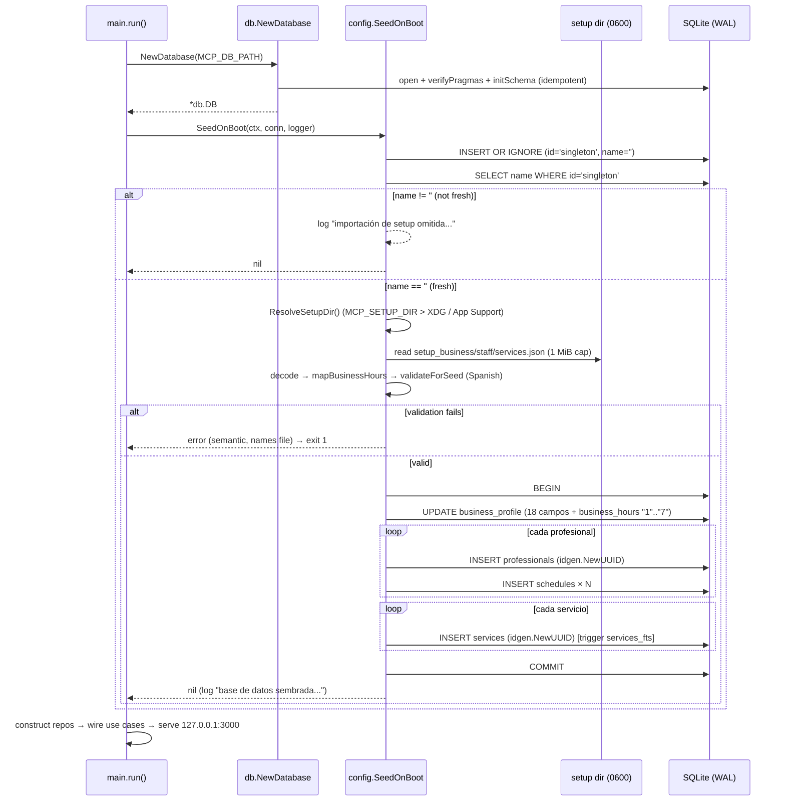

# Design: feat-setup-import — Seed DB from wizard JSONs on first boot

> **Change**: feat-setup-import
> **Status**: Designed
> **Inputs**: `proposal.md` (D1–D7 confirmed), `specs/setup-loader/spec.md`, `specs/setup-seeder/spec.md`, `exploration.md`, Issue #71
> **Code verified against**: `internal/config/doc.go`, `internal/db/{database.go,schema.go}`, `internal/domain/entity/{business_profile,professional,service}.go`, `internal/repository/business_profile.go`, `internal/idgen/uuid.go`, `cmd/mcp-server/main.go`, `scripts/install.sh` (`resolve_paths`, lines 542–580)
> **skill_resolution**: paths-injected

---

## 0. Executive summary (the answer first)

On boot, immediately after `db.NewDatabase` and before any repository construction, `cmd/mcp-server` calls one new function: `config.SeedOnBoot(ctx, database.Conn, logger)`. That function:

1. **Checks the fresh signal** (mirrors the repo's lazy-init: `INSERT OR IGNORE ('singleton','')` then `SELECT name`). `name != ''` → log "omitida" and return `nil` — no file is ever read.
2. **If fresh**: resolves the setup dir per OS (exactly `install.sh resolve_paths`, with `MCP_SETUP_DIR` override), reads the three wizard JSONs, decodes them into concrete structs, maps `business_hours` from day-names to numeric-string keys, validates shapes with semantic Spanish errors.
3. **Seeds in exactly one SQLite transaction**: `UPDATE business_profile` (18 wizard fields + mapped `business_hours`) → `INSERT professionals` (UUID) → `INSERT schedules` → `INSERT services` (UUID, FTS triggers fire) → `COMMIT`. Any failure → `ROLLBACK` → `run()` returns error → `exit 1`. DB left in pre-seed state.

Everything lives in `internal/config` — the package whose `doc.go` already (aspirationally) claims this contract. No `install.sh` changes, no schema changes, no new dependencies.

**Load-bearing invariant:** the fresh guard depends on the seeded profile having a **non-empty `name`**. The seeder therefore MUST reject an empty business name with a fatal error before touching the DB (ADR-SD6); otherwise every boot would look fresh and re-seed.

---

## 1. Architecture overview (boot flow)

```
systemd user unit (MCP_DB_PATH=reservas.db)
        │
        ▼
cmd/mcp-server main.run()
  ├─ mcp.LoadConfig + ValidateLoopback          (existing)
  ├─ db.NewDatabase  → open + verifyPragmas(WAL) + initSchema   (existing)
  ├─ config.SeedOnBoot(ctx, conn, logger)       ◄── NEW (single-threaded boot window)
  │     ├─ IsFreshDB: INSERT OR IGNORE ('singleton','') + SELECT name
  │     ├─ !fresh → log "omitida" → return nil (loader never runs)
  │     └─ fresh → ResolveSetupDir → LoadSetup → mapBusinessHours
  │                → validate (Spanish) → Seed (1 tx, defer rollback)
  ├─ construct 7+ repos                          (existing — untouched)
  ├─ wire use cases + auth + RBAC                 (existing — untouched)
  └─ mcp.Run → listen 127.0.0.1:3000              (existing — untouched)
```

The seed runs in the **only guaranteed single-threaded window** the process has: after the DB handle exists, before any goroutine that could touch the DB. WAL + `busy_timeout=5000` are already enforced by the DSN on every pooled connection (`buildDSN`), so even a mis-future refactor that moves this hook would not corrupt anything — but the placement itself is the concurrency control (exploration R3).

---

## 2. ADRs (design decisions)

| # | Decision | Rationale / rejected alternative |
|---|----------|----------------------------------|
| **SD-1** | All new code (structs + resolver + loader + seeder) lives in `internal/config`, **not** a sibling `internal/seeder` package. | See §2.1 for the full tradeoff. `doc.go`'s contract becomes true; import graph stays `config → {database/sql, idgen, entity, domain}` with no new edges and no cycle risk. |
| **SD-2** | Resolver mirrors `install.sh resolve_paths` per OS with `MCP_SETUP_DIR` env precedence; `HOME` empty → semantic Spanish error; non-Linux/non-macOS → Linux XDG rule (spec fallback). The bash **symlink checks are NOT mirrored**. | Symlink refusal is an install-time safety gate (operator present, interactive). The boot resolver is read-only and unattended; failing boot because `$CONFIG_DIR` is a symlink would brick a working deployment that install-time already blessed. |
| **SD-3** | `is_active` is typed `int` in the setup struct, not `bool`. | The wizard emits JSON `1`/`0` (spec: "typed as integers"). `encoding/json` **fails** decoding `1` into a Go `bool` ("cannot unmarshal number into Go value of type bool"). Convert to `bool` at seed time with a 0/1 whitelist check. |
| **SD-4** | Loader is strictly read-only, caps each file at **1 MiB**, and every error is a semantic Spanish string that names the file. The setup **directory** appears only in structured log fields, never in the error string. | Spec requires naming the file; security checklist forbids internal paths in errors. Size cap mirrors the transport's 1 MiB `jsonParseGuard` precedent — an unbounded `os.ReadFile` on a corrupted/huge file would hang boot. |
| **SD-5** | `business_hours` mapping is a pure function over a fixed `monday→"1"…sunday→"7"` table; `nil` entries (JSON `null`) are skipped (absent = closed); output is `json.Marshal` of a `map[string]struct{Open,Close string}` → deterministic, parseable by `entity.parseBusinessHours`. | `json.Marshal` sorts map keys alphabetically (`"1".."7"`), so stored JSON is byte-stable across boots — trivial to golden-test. HH:MM format is regex-validated at map time (defense-in-depth; the entity only checks "valid JSON object"). |
| **SD-6** | Fresh guard **mirrors the repo lazy-init** (`INSERT OR IGNORE ('singleton','')` then `SELECT name`), and the seeder **rejects empty `name` fatally** before the tx. | On a truly brand-new DB, `initSchema` creates tables but **no `business_profile` row** — a bare `SELECT` returns `ErrNoRows` and "fresh" would be ill-defined. The lazy-init mirror makes the row always exist and the signal total (`name == ''` ⇔ fresh). And because the guard's correctness *is* `name != ''`, seeding an empty name would turn every boot into a re-seed — so it is a fatal validation, not a nicety. |
| **SD-7** | Seeder uses **direct parameterized SQL inside exactly one transaction**, never repos, never `auth.WithCaller`. | Repos are RBAC-gated and expose no tx API (proposal D3). Atomicity is the whole point (R2): one `BEGIN`/`COMMIT`, `defer`-rollback pattern, `RowsAffected == 1` asserted on the singleton UPDATE. |
| **SD-8** | Validation is split: **semantic shape checks run pre-tx in Go** (Spanish, fail-fast, no DB touched); **relational invariants are owned by DB constraints** (`UNIQUE(professional_id, day_of_week)`, `CHECK start_time < end_time`, FKs), with constraint violations translated to semantic Spanish. `entity.Service.Validate` is **NOT** called (its `Price > 0` contradicts the wizard's `price >= 0`, D5); services get their own checks with `price >= 0`. | Defense in depth: Go says *why* nicely, SQLite says *no* reliably. The deliberately-untouched `UNIQUE(professional_id, day_of_week)` path is also the natural mid-tx failure vector the rollback test pins. |
| **SD-9** | Ordering: **guard first, loader second**. When not fresh, no directory is resolved and no file is opened. | Spec: non-fresh + bad JSON must boot normally. Guard-first makes that true by construction (the loader cannot error if it never runs) and keeps the non-fresh boot path at exactly 2 cheap SQL statements. |
| **SD-10** | Seeder tests use a **file-based DB** via `db.NewDatabase(ctx, filepath.Join(t.TempDir(), "seed.db"))`, **never `:memory:`**. | `NewDatabase.verifyPragmas` requires `journal_mode == "wal"`; on `:memory:` SQLite returns `"memory"` → `NewDatabase(":memory:")` **fails**. File-based temp DB also exercises the real production open path (DSN pragmas + `initSchema`) for free. |

### 2.1 SD-1 in detail — why `internal/config` and not a sibling `internal/seeder`

| Dimension | `internal/config` (chosen) | dedicated `internal/seeder` package |
|---|---|---|
| Import graph | `config → {database/sql, idgen, entity, domain}`; only `cmd/mcp-server` imports `config`. One new edge (main → config already exists implicitly via `dotenv`). | `seeder → config` (for the structs) **plus** `seeder → {idgen, entity}`. Two packages, one more edge, an artificial boundary between "load setup" and "apply setup". |
| Contract | `doc.go` says config "loads and validates the JSON configuration files produced by the config-wizard" — the seeder is the natural consumer of exactly those structs; keeping them together means the shape contract (struct ↔ SQL columns) is reviewable in one place. | The structs would live in `config` while their only consumer lives elsewhere — the 18-field mapping review would span packages. |
| Cohesion | One feature, one package, ~4 small files (~520 LOC impl). | Splitting a ~520 LOC feature into two packages is package-org for its own sake — the repo philosophy prefers small components with single responsibility; "first-boot setup import" **is** the single responsibility here. |
| Cycle risk | Zero: nothing under `internal/` imports `config` today except (potentially) `mcp` for dotenv — and `config` imports neither. | Also zero, but with an extra edge to maintain for no behavioral gain. |
| When to revisit | — | If a second consumer of the setup structs appears (e.g., a future `--reimport` CLI, or a backup-restore path), extract `internal/setupimport` then — with two real consumers the boundary earns its cost. |

---

## 3. Package layout — `internal/config` (new files)

| File | Responsibility | Est. LOC |
|------|----------------|----------|
| `setup_types.go` (NEW) | `SetupBusiness`, `SetupStaffMember`, `SetupScheduleEntry`, `SetupService`, `BusinessHoursEntry`, `SetupData` — concrete types pinning the 3 wizard JSON shapes; no `any`/`interface{}` anywhere. | ~90 |
| `setup_resolver.go` (NEW) | `ResolveSetupDir() (string, error)` + unexported `resolveSetupDirOS(goos string, getenv func(string) string) (string, error)` — per-OS mirror of `resolve_paths`. | ~50 |
| `setup_loader.go` (NEW) | `LoadSetup(dir string) (*SetupData, error)` — read-only, 1 MiB cap/file, semantic Spanish errors; `mapBusinessHours(map[string]*BusinessHoursEntry) (string, error)`; `validateForSeed(*SetupData) error` (pre-tx checks incl. entity `Validate` defense-in-depth). | ~170 |
| `setup_seeder.go` (NEW) | `SeedOnBoot(ctx, *sql.DB, *slog.Logger) error` (orchestrator), `isFreshDB`, `seed(ctx, tx, *SetupData) error` — tx, SQL order, rollback, error translation. | ~230 |
| `doc.go` (EDIT) | No wording change needed — the existing contract becomes true. Optionally add one sentence pointing at `setup_seeder.go`. | ~2 |
| `*_test.go` ×4–5 (NEW) | See §9. | ~450–520 |
| `cmd/mcp-server/main.go` (EDIT) | One call site (+8–10 lines incl. comment). | ~10 |
| `docs/installation.md` (EDIT) | First-boot seeding wording (spec REQ, in Spanish). | ~10 |

**Import graph delta** (the only new internal edges):
`internal/config → internal/idgen`, `internal/config → internal/domain/entity`, `cmd/mcp-server → internal/config` (new edge; `config` was previously only a doc shell). No existing edge changes; no package outside `cmd/` imports `config`.

---

## 4. Resolver — `resolveSetupDir` (SD-2)

Pseudocode (mirrors `install.sh resolve_paths` lines 542–580, minus symlink checks — see ADR-SD-2):

```text
func resolveSetupDirOS(goos, getenv) -> (dir string, err error):
    # 1. Explicit override wins on every OS (tests + advanced operators).
    if d := getenv("MCP_SETUP_DIR"); d != "":
        return filepath.Clean(d), nil

    # 2. HOME is required for the per-OS defaults (same refusal as bash).
    home := getenv("HOME")
    if home == "":
        return "", error "no se puede resolver el directorio de setup: la variable HOME no está definida"

    # 3. Per-OS default, byte-for-byte the same composition as resolve_paths.
    switch goos:
    case "darwin":
        return filepath.Join(home, "Library", "Application Support",
                             "MCP Appointments CRM", "setup"), nil
    default:   # linux + any other OS → XDG rule (spec: SHOULD apply Linux rule)
        base := getenv("XDG_CONFIG_HOME")
        if base == "":
            base = filepath.Join(home, ".config")
        return filepath.Join(base, "mcp-appointments-crm", "setup"), nil

# Exported wrapper (production):
func ResolveSetupDir() (string, error):
    return resolveSetupDirOS(runtime.GOOS, os.Getenv)
```

Design properties:

- **`goos` and `getenv` are parameters** of the unexported core so the per-OS table is fully unit-testable on any dev OS without build tags.
- `filepath.Join` normalizes separators and cleans the path (bash builds `"$CONFIG_DIR/setup"`; the trailing slash in the spec text is cosmetic and does not survive `filepath.Join` — equivalent).
- Order of precedence is identical to the spec scenarios: `MCP_SETUP_DIR` → `XDG_CONFIG_HOME` (Linux only) → `$HOME/.config` → macOS `Application Support`.
- Empty-string `MCP_SETUP_DIR` is treated as unset (matches bash `[ -z ... ]` semantics; also makes `env -u`-style tests trivial).

---

## 5. Setup JSON structs (SD-3) — `setup_types.go`

Concrete types, pointer optionals exactly where the wizard allows null, no `any`:

```go
// BusinessHoursEntry is one open day: {"open":"09:00","close":"18:00"}.
// A nil *BusinessHoursEntry in the map means the day is closed (JSON null).
type BusinessHoursEntry struct {
	Open  string `json:"open"`
	Close string `json:"close"`
}

// SetupBusiness pins setup_business.json: 18 wizard fields + nested business_hours
// keyed by day name (monday..sunday), each entry {open,close} or null.
type SetupBusiness struct {
	Name                   string                        `json:"name"`
	Industry               *string                       `json:"industry"`
	Country                *string                       `json:"country"`
	Address                *string                       `json:"address"`
	Latitude               *float64                      `json:"latitude"`
	Longitude              *float64                      `json:"longitude"`
	CoverPhotoURL          *string                       `json:"cover_photo_url"`
	PublicPhone            *string                       `json:"public_phone"`
	MessengerPlatform      *string                       `json:"messenger_platform"`
	MessengerID            *string                       `json:"messenger_id"`
	ContactEmail           *string                       `json:"contact_email"`
	WebsiteURL             *string                       `json:"website_url"`
	GeneralDescription     *string                       `json:"general_description"`
	AcceptedPaymentMethods []string                      `json:"accepted_payment_methods"` // nil ⇔ JSON null/absent
	CurrencyCode           string                        `json:"currency_code"`
	CurrencySymbol         string                        `json:"currency_symbol"`
	Timezone               string                        `json:"timezone"`
	SlotIntervalMinutes    int                           `json:"slot_interval_minutes"`
	BusinessHours          map[string]*BusinessHoursEntry `json:"business_hours"` // day-name keys
}

// SetupScheduleEntry pins one staff schedule row. day_of_week 0–6, 0=Sunday.
// Passed through 1:1 — NO transformation (D7; differs from business_hours's 1–7).
type SetupScheduleEntry struct {
	DayOfWeek int    `json:"day_of_week"`
	StartTime string `json:"start_time"`
	EndTime   string `json:"end_time"`
}

// SetupStaffMember pins one setup_staff.json array element.
type SetupStaffMember struct {
	Name          string                `json:"name"`
	RoleSpecialty *string               `json:"role_specialty"`
	Status        string                `json:"status"` // wizard emits "active"
	Email         *string               `json:"email"`
	Phone         *string               `json:"phone"`
	Specialties   []string              `json:"specialties"` // wizard always emits []
	Schedule      []SetupScheduleEntry  `json:"schedule"`
}

// SetupService pins one setup_services.json array element.
// IsActive is int because the wizard emits JSON 1/0 (ADR-SD-3).
type SetupService struct {
	Name            string   `json:"name"`
	Description     *string  `json:"description"`
	DurationMinutes int      `json:"duration_minutes"`
	Price           float64  `json:"price"`
	IsActive        int      `json:"is_active"` // 0/1, validated
}

// SetupData bundles the three decoded files.
type SetupData struct {
	Business  SetupBusiness
	Staff     []SetupStaffMember
	Services  []SetupService
}
```

Column mapping (the 18 fields → `business_profile` columns, plus the transformed 19th):

| Wizard field (JSON) | Struct | `business_profile` column | Notes |
|---|---|---|---|
| `name` | `Name string` | `name` | NOT NULL; non-empty enforced fatally (SD-6) |
| `industry`…`general_description` (11 optional strings) | `*string` | same-name nullable TEXT | bind nil ⇔ SQL NULL |
| `latitude`, `longitude` | `*float64` | `REAL` nullable | |
| `accepted_payment_methods` | `[]string` | `accepted_payment_methods` TEXT | nil → NULL; else `json.Marshal` → `["efectivo","tarjeta"]` |
| `currency_code`, `currency_symbol`, `timezone` | `string` | NOT NULL cols | empty ⇔ wizard drift → fatal (SD-8 table) |
| `slot_interval_minutes` | `int` | `slot_interval_minutes` | must be > 0 |
| `business_hours` | `map[string]*BusinessHoursEntry` | `business_hours` TEXT | **transformed** by `mapBusinessHours` → `{"1":{"open":..,"close":..}}`, closed days absent |

---

## 6. Loader flow — `LoadSetup` + `mapBusinessHours` (SD-4, SD-5)

```text
func LoadSetup(dir string) -> (*SetupData, error):
    for each (fileName, target) in [
        ("setup_business.json", &out.Business),
        ("setup_staff.json",   &out.Staff),
        ("setup_services.json",&out.Services)]:
        data, err := readFileCapped(filepath.Join(dir, fileName), 1<<20)
        if errors.Is(err, fs.ErrNotExist):
            return nil, error "el archivo de configuración %s no existe" % fileName
        if err (other IO):   # includes size-cap breach
            return nil, error "no se pudo leer el archivo de configuración %s" % fileName   # cap: separate message below
        if err := json.Unmarshal(data, target); err != nil:
            return nil, error "el archivo %s tiene un formato inválido: %w" % (fileName, err)
    return &out, nil
```

- `readFileCapped`: `os.Open` + `io.LimitReader(1 MiB + 1)`; if more than 1 MiB was read → `"el archivo %s supera el tamaño máximo permitido (1 MiB)"`. No unbounded `os.ReadFile` (SD-4).
- Errors name the **file only**; the resolved **dir rides as a structured slog field** at the call site, never in the error text (security checklist: no paths in error messages; the operator learns the dir from `install.sh` output anyway).
- The wrapped `json.Unmarshal` error (e.g., `invalid character 'x' looking for beginning of value`) is semantic enough to keep — it identifies the offending construct without exposing internals (no stack, no raw SQL, no dump). Spec forbids "raw system dumps"; a one-line `json.SyntaxError` is not one.
- Loader never writes: no `Create`/`Write`/`Chmod`/`Remove` call sites anywhere in the package (D6; enforced by test + review).

### `mapBusinessHours` — day-name → numeric-string keys

```text
var dayNameToNumber = {monday:1, tuesday:2, wednesday:3, thursday:4,
                       friday:5, saturday:6, sunday:7}

func mapBusinessHours(in map[string]*BusinessHoursEntry) -> (string, error):
    out := {}
    for dayName, entry := range in:
        if entry == nil:          continue          # null ⇒ closed ⇒ key ABSENT
        n, ok := dayNameToNumber[dayName]
        if !ok: return "", error "business_hours contiene un día desconocido: %q"
        if not hhmm(entry.Open) or not hhmm(entry.Close):
            return "", error "el horario de %s debe tener formato HH:MM"
        out[strconv.Itoa(n)] = {Open: entry.Open, Close: entry.Close}
    return json.Marshal(out)     # "{}" when every day is closed — valid & parseable
```

- `hhmm`: `^([01]\d|2[0-3]):[0-5]\d$` — validated at map time so a malformed wizard time dies **before** the tx with a Spanish message instead of inside SQLite.
- Output decodes cleanly into `entity.businessHoursDay{open,close}` → `parseBusinessHours` (`"1".."7"` string→int) → `IsOpenOn`/`GetOpenClose` (1=Monday…7=Sunday). Pinned by test (§9).
- Staff schedules (`day_of_week` 0–6, 0=Sunday) are **never** routed through this function — 1:1 passthrough (D7).

---

## 7. Fresh guard — `isFreshDB` (SD-6)

```go
func isFreshDB(ctx context.Context, conn *sql.DB) (bool, error) {
	// Mirror of BusinessProfileRepo.Get's lazy-init: guarantees the singleton
	// row exists on a brand-new DB (initSchema creates no business_profile row),
	// and is idempotent + concurrency-safe under WAL (INSERT OR IGNORE).
	if _, err := conn.ExecContext(ctx,
		`INSERT OR IGNORE INTO business_profile (id, name) VALUES (?, ?)`,
		"singleton", ""); err != nil {
		return false, fmt.Errorf("verificar perfil del negocio: %w", err)
	}
	var name string
	if err := conn.QueryRowContext(ctx,
		`SELECT name FROM business_profile WHERE id = ?`, "singleton").Scan(&name); err != nil {
		return false, fmt.Errorf("verificar perfil del negocio: %w", err)
	}
	return name == "", nil
}
```

- **Concurrency note (R3):** this runs in the pre-serve single-threaded window, so there is no racing reader. Even so: `INSERT OR IGNORE` is idempotent under any interleaving, the DSN pins WAL + `busy_timeout=5000` on every pooled connection, and the repo's own `Get` performs the identical lazy-init — the two mechanisms cannot fight each other.
- Guard inspects **only** `business_profile.name` — never `professionals`/`services` (D2: manual deletions must not trigger re-seed).
- Guard SQL failure (DB-level) is fatal regardless of freshness — a broken DB must not boot into serving.

---

## 8. Seeder — single transaction (SD-7, SD-8)

### 8.1 Orchestrator

```text
func SeedOnBoot(ctx, conn *sql.DB, logger *slog.Logger) -> error:
    fresh, err := isFreshDB(ctx, conn)                  # guard FIRST (SD-9)
    if err != nil: return err                            # fatal: DB-level failure
    if not fresh:
        logger.Info("importación de setup omitida: la base de datos ya está configurada")
        return nil                                       # loader never runs
    dir, err := ResolveSetupDir()      ; if err: return err   # fatal (fresh ⇒ operator must fix)
    data, err := LoadSetup(dir)        ; if err: return err   # fatal, semantic Spanish, names file
    if err := validateForSeed(data)    ; if err: return err   # fatal, pre-tx (§8.3)
    if err := seed(ctx, conn, data)   ; if err: return err   # fatal, tx rolled back
    logger.Info("base de datos sembrada desde la configuración inicial",
                "profesionales", len(data.Staff), "servicios", len(data.Services))
    return nil
```

### 8.2 Transaction — exact SQL order

```go
func seed(ctx context.Context, conn *sql.DB, data *SetupData) error {
	tx, err := conn.BeginTx(ctx, nil)
	if err != nil {
		return fmt.Errorf("iniciar transacción de setup: %w", err)
	}
	committed := false
	defer func() {
		if !committed {
			_ = tx.Rollback() // best-effort; error already being returned
		}
	}()

	// (1) business_profile singleton UPDATE (all 18 fields + mapped hours).
	//     Row is guaranteed to exist (guard's INSERT OR IGNORE); 0 rows ⇒ invariant broken.
	res, err := tx.ExecContext(ctx, `
		UPDATE business_profile SET
			name = ?, industry = ?, country = ?, address = ?,
			latitude = ?, longitude = ?, cover_photo_url = ?, public_phone = ?,
			messenger_platform = ?, messenger_id = ?, contact_email = ?, website_url = ?,
			general_description = ?, currency_code = ?, currency_symbol = ?,
			accepted_payment_methods = ?, timezone = ?, slot_interval_minutes = ?,
			business_hours = ?,
			updated_at = strftime('%Y-%m-%dT%H:%M:%fZ', 'now')
		WHERE id = ?`, /* 20 binds */ ..., "singleton")
	if err != nil { return fmt.Errorf("actualizar perfil del negocio: %w", translateConstraint(err)) }
	if n, _ := res.RowsAffected(); n != 1 {
		return fmt.Errorf("actualizar perfil del negocio: no se encontró la fila singleton")
	}

	// (2) professionals (+ their schedules), (3) services.
	for _, m := range data.Staff {
		profID := idgen.NewUUID()
		if _, err := tx.ExecContext(ctx, `
			INSERT INTO professionals
				(id, name, role_specialty, status, email, phone, specialties)
			VALUES (?, ?, ?, ?, ?, ?, ?)`,
			profID, m.Name, m.RoleSpecialty, statusOr(m), m.Email, m.Phone,
			specialtiesJSON(m.Specialties)); err != nil {
			return fmt.Errorf("insertar profesional %q: %w", m.Name, translateConstraint(err))
		}
		for _, s := range m.Schedule {
			if _, err := tx.ExecContext(ctx, `
				INSERT INTO schedules
					(professional_id, day_of_week, start_time, end_time)
				VALUES (?, ?, ?, ?)`,
				profID, s.DayOfWeek, s.StartTime, s.EndTime); err != nil {
				return fmt.Errorf("insertar horario del profesional %q (día %d): %w",
					m.Name, s.DayOfWeek, translateConstraint(err))
			}
		}
	}
	for _, svc := range data.Services {
		if _, err := tx.ExecContext(ctx, `
			INSERT INTO services
				(id, name, description, duration_minutes, price, is_active)
			VALUES (?, ?, ?, ?, ?, ?)`,
			idgen.NewUUID(), svc.Name, svc.Description,
			svc.DurationMinutes, svc.Price, svc.IsActive); err != nil {
			return fmt.Errorf("insertar servicio %q: %w", svc.Name, translateConstraint(err))
		}
	}
	// FTS note: services_fts AFTER INSERT triggers fire on these direct
	// inserts — services become searchable immediately (spec scenario).

	if err := tx.Commit(); err != nil {
		return fmt.Errorf("confirmar transacción de setup: %w", err)
	}
	committed = true
	return nil
}
```

Statement order is fixed and load-bearing: profile → professionals → schedules → services. Schedules **must** follow their professional (FK `professional_id`), so the seeder can never produce the "professional without schedules" partial state that manual SQL could (R2) — the FK ordering makes the invariant structural, and the single tx makes any violation impossible to persist.

Helpers:
- `statusOr(m)`: `m.Status` if non-empty else `"active"` (repo parity; wizard always emits `"active"`).
- `specialtiesJSON(nil)`: `nil` (SQL NULL); else `json.Marshal([]string)` — wizard always emits `[]` → stored as `"[]"`, matching `entity.Professional.Specialties` contract.
- `translateConstraint(err)`: maps the handful of constraint errors to Spanish (`strings.Contains` on `UNIQUE constraint failed: schedules.professional_id, schedules.day_of_week` → `"ya existe un horario para ese día"`), everything else passed through wrapped. Constraints are the backstop (SD-8); Go pre-validation covers everything a human can fix from the error message.

### 8.3 Pre-transaction validation — `validateForSeed` (SD-8)

Runs **before** `BeginTx`; every failure is fatal with a semantic Spanish message and the DB untouched:

| # | Check | Message (exact) |
|---|-------|-----------------|
| 1 | `SetupBusiness.Name` non-empty (trim) | `"el nombre del negocio no puede estar vacío"` — **fresh-guard invariant** (SD-6) |
| 2 | `CurrencyCode`, `CurrencySymbol`, `Timezone` non-empty | `"el campo currency_code del negocio no puede estar vacío"` (etc.) — wizard bakes `ARS`/`$`/`UTC`; emptiness = wizard drift → fail fast |
| 3 | `SlotIntervalMinutes > 0` | `"el intervalo de turnos debe ser mayor a 0 minutos"` |
| 4 | `AcceptedPaymentMethods` (if non-nil): all entries non-empty | `"el método de pago en la posición %d está vacío"` |
| 5 | `business_hours` already mapped+validated (SD-5, done in loader step) — then construct `entity.BusinessProfile` with the mapped JSON + payment-methods JSON + timezone and call `Validate()` | entity messages (messenger whitelist, JSON-object hours, IANA timezone) — defense-in-depth, unchanged Spanish strings |
| 6 | Per staff: construct `entity.Professional`, call `Validate()` | entity messages (`"el nombre no puede estar vacío"`, status enum) |
| 7 | Per staff schedule: `0 ≤ day_of_week ≤ 6`, `start_time`/`end_time` HH:MM, `start < end` (string compare valid on HH:MM) | `"el horario del profesional %q para el día %d: la hora de inicio debe ser anterior a la hora de fin"` |
| 8 | Per service (NOT `entity.Service.Validate` — D5): name non-empty, `duration > 0`, `price >= 0`, `is_active ∈ {0,1}` | `"el servicio %q: el precio no puede ser negativo"`, `"la duración debe ser mayor a 0 minutos"`, `"el campo is_active debe ser 0 o 1"` |
| 9 | **Deliberately NOT pre-checked:** duplicate `(professional, day_of_week)` | DB `UNIQUE` is the authority → mid-tx failure → rollback + translated Spanish error (this is the rollback-test vector) |

### 8.4 Error taxonomy (boot path, all Spanish, all fatal when fresh)

| Condition | Message pattern | DB state after |
|---|---|---|
| HOME undefined | `no se puede resolver el directorio de setup: la variable HOME no está definida` | untouched (placeholder row only) |
| Missing file | `el archivo de configuración setup_staff.json no existe` | untouched |
| Malformed file | `el archivo setup_services.json tiene un formato inválido: <json detail>` | untouched |
| Oversized file | `el archivo setup_business.json supera el tamaño máximo permitido (1 MiB)` | untouched |
| Any validation row above | see §8.3 | untouched |
| Any tx statement fails | wrapped + translated (§8.2) | **rolled back** — exact pre-seed state (R2) |
| Guard SQL fails | `verificar perfil del negocio: ...` | n/a — boot aborts |

Non-fresh path produces **no error ever**: the orchestrator returns `nil` after one Info log (SD-9). `main.run()` wraps whatever comes back as `importar configuración inicial: %w` → existing `main()` does `os.Exit(1)` — no new exit-code plumbing.

---

## 9. Sequence diagram — boot seeding



Failure inside the alt-block: any statement error → `defer tx.Rollback()` → error propagates → `main` logs `mcp server failed` → `os.Exit(1)`. The MCP endpoint never starts listening on a half-configured CRM.

---

## 10. Composition-root wiring — `cmd/mcp-server/main.go`

Placement is exact (spec REQ "Boot wiring"): immediately after the `defer` that closes the database, before the "Construct repositories" block:

```go
 	defer func() { /* existing database.Close() defer, untouched */ }()

+	// Setup import (feat-setup-import): seed the DB from the wizard JSONs on
+	// first boot. Runs in the single-threaded window before repo construction
+	// and HTTP serving. No-op (info log) when the profile is already seeded;
+	// fatal (exit 1) when the DB is fresh and the wizard output is missing or
+	// malformed — a fresh CRM must never boot half-configured silently.
+	if err := config.SeedOnBoot(ctx, database.Conn, logger); err != nil {
+		return fmt.Errorf("importar configuración inicial: %w", err)
+	}

 	// ── Construct repositories (only those the wired use cases consume) ──
 	bookingsRepo := repository.NewBookingsRepo(database.Conn)
```

- **Fatal vs non-fatal** is owned entirely by `SeedOnBoot` (fresh flag decides); `main` stays dumb — one call, one error check. This keeps the composition root additive (≈10 lines) and the policy testable in `internal/config` without booting a server.
- `ctx` (background) and `logger` (`slog.Default()`) already exist at that point in `run()` — no new plumbing.
- Ordering guarantee ("seed runs before serving", spec scenario) is enforced by this placement; `mcp.Run` is unreachable until `SeedOnBoot` returns `nil`. There is no code path where the listener starts first.

---

## 11. Testing approach

All new tests live beside the code (`internal/config/*_test.go`); `go test -v -race ./...` must pass (pre-commit checklist).

| Suite | File | Cases (pin the spec scenarios) | DB / FS |
|---|---|---|---|
| Resolver | `setup_resolver_test.go` | Table over `(goos, env)`: Linux default → `$HOME/.config/mcp-appointments-crm/setup`; `XDG_CONFIG_HOME=/custom` honored; macOS default → `Application Support`; `MCP_SETUP_DIR` wins on **both** OSes; empty `HOME` → Spanish error; `windows`/other → XDG rule; empty `MCP_SETUP_DIR` treated as unset | none (pure fn over injected `getenv`) |
| Loader | `setup_loader_test.go` | Happy path (3 valid files in `t.TempDir()`); missing `setup_staff.json` → error contains filename + "no existe"; malformed `setup_services.json` → "formato inválido" + filename; oversized (>1 MiB) file rejected; **read-only**: content bytes + `ModTime` identical before/after load (spec scenario) | `t.TempDir()` |
| Mapping | `setup_loader_test.go` (or `setup_mapping_test.go`) | `monday` → `"1"`; `sunday` → `"7"`; `null` day → key `"7"` absent (and no `"sunday"`/`""`/null value); full week (6 open + 1 null) → exactly 6 numeric keys with original values; all-closed → `"{}"`; unknown day name → error; bad HH:MM → error; **entity round-trip**: seed output into `entity.BusinessProfile.BusinessHours` → `IsOpenOn(1)` true + `GetOpenClose(1)` = 09:00–18:00, `IsOpenOn(7)` false (spec scenario) | none |
| Seeder | `setup_seeder_test.go` | (a) happy path: full seed → assert singleton `id='singleton'`, **exactly 1 row**, all 18 fields round-tripped, `business_hours` = `{"1":...}` JSON; professionals+schedules counts; `services_fts MATCH` finds a seeded service (spec scenario); (b) `price == 0` service seeds (D5); (c) **rollback**: staff member with duplicate `day_of_week` in schedule (passes pre-validation by design, §8.3 row 9) → error, then `business_profile.name == ''` and `COUNT(professionals) == 0` (spec scenario); (d) **guard**: fresh DB (no row) → fresh; seeded → not fresh; seeded + all professionals deleted → still not fresh, no re-seed (spec scenario) | **file-based** `db.NewDatabase(ctx, filepath.Join(t.TempDir(), "seed.db"))` (SD-10; `:memory:` fails `verifyPragmas` — pinned as a test-file comment) |
| Boot integration | `setup_boot_test.go` | `SeedOnBoot` end-to-end: fresh + valid JSONs via `MCP_SETUP_DIR` → seeded, second `SeedOnBoot` call → no-op, DB unchanged; fresh + malformed JSON → error naming file, DB pre-seed state; **not fresh + missing setup dir entirely** → `nil` error, boots (spec scenario, guard-first); fresh + unset `HOME` → error | same file-based DB pattern |
| Wiring | review-level | Placement ("after `db.NewDatabase`, before repos, before `mcp.Run`") is 10 additive lines pinned by §10 and verified by the apply/verify phases (the mock-free integration test above already covers `SeedOnBoot`'s full boot semantics; a source-grep ordering test would be brittle and adds no real protection) | — |

Test-data strategy: hand-written golden JSON fixtures in `internal/config/testdata/` mirroring exactly what `install.sh finalize()` emits (18-field business object, 1 staff with 2 schedule entries, 2 services one with `price: 0`), so the loader tests double as regression pins against wizard-shape drift (R5).

---

## 12. Security review (per project checklist)

- **SQL injection:** every statement is a prepared statement with `?` placeholders; zero string concatenation into SQL (the only non-`?` token is the constant `strftime(...)` in `updated_at`, containing no external data). Constraint translation never interpolates values into SQL — only into log/error messages.
- **Input validation:** HH:MM regex, day-range/enum/price/duration whitelists, 1 MiB file cap, `is_active ∈ {0,1}` — all before the tx; DB CHECKs/UNIQUE/FK as backstop.
- **Files:** setup JSONs are read-only to the server (no create/modify/delete — D6), already 0600 by the wizard, same single user as the loopback service; they contain no secrets (exploration R7). Loader never rewrites modes or content.
- **Error handling:** all failures are semantic Spanish strings naming only the file; no stack traces, no raw SQL, no internal paths; errors surface on stderr/journal via `main`'s logger — the MCP client can never see them (endpoint not listening yet).
- **No schema migration, no `install.sh` change, no new dependencies** (`modernc.org/sqlite`, `idgen`, `entity` all pre-exist).

---

## 13. Rollout & rollback

- **Rollout:** code lands behind the standard feature-branch PR flow; the behavior activates on first boot after deploy — no flag, no migration, no operator action. `docs/installation.md` replaces the "JSONs are final artifacts" wording with "El servidor siembra la DB en el primer arranque si el perfil está vacío" (spec REQ).
- **Review budget risk (R8, carried from proposal):** estimated ~530 impl + ~500 test lines ≫ 400-line budget → per preflight, `ask-on-risk` pause at delivery. Candidate chain if needed: **PR1** resolver+types+loader+tests (self-contained, no DB) → **PR2** seeder+boot integration tests → **PR3** main.go wiring + docs. Decision deferred to apply/delivery; chain strategy stays "deferred until chaining is selected".
- **Rollback (proposal, restated):** revert the `main.go` hook commit → identical pre-change behavior (empty profile, manual SQL). Seeded rows are ordinary rows; emptying `business_profile.name` restores a fresh DB. Setup JSONs are never touched by the server (D6), so the wizard artifacts survive everything.

---

## 14. Risks (design-level)

| # | Risk | Mitigation |
|---|------|------------|
| RD-1 | Fresh-guard invariant broken by empty seeded name | SD-6: fatal pre-tx check #1 + guard test (d) |
| RD-2 | `:memory:` DB trap in seeder tests (`verifyPragmas` requires WAL) | SD-10: file-based `t.TempDir()` DB, pinned in test comment |
| RD-3 | Wizard emits `is_active: 1`; Go `bool` decode fails silently as a "malformed file" error | SD-3: `IsActive int` + 0/1 whitelist; loader golden fixtures pin the wizard shape |
| RD-4 | Resolver drift bash ↔ Go (R5) | SD-2 byte-parity with `resolve_paths` + per-OS table tests + `MCP_SETUP_DIR` override for all tests |
| RD-5 | `business_hours` mapping corrupts availability (R4) | §11 mapping suite incl. entity round-trip through `IsOpenOn`/`GetOpenClose` |
| RD-6 | Review budget exceeded (R8) | §13 chained-PR candidate; `ask-on-risk` pause |
| RD-7 | Canonical drift: `openspec/specs/business-profile/spec.md` still pins day-name keys with `null` | Out of scope here (spec Notes already flag it); follow-up `business-profile` delta before/at archive — tracked in §15 |

---

## 15. Open follow-ups (out of scope, tracked)

1. `business-profile` spec delta superseding the day-name/`null` "Weekly schedule stored as JSON" requirement (spec Notes; RD-7).
2. `Service.Validate` `price > 0` vs wizard `price >= 0` mismatch (proposal D5 follow-up) — seeder deliberately bypasses it; fix belongs to the service entity change.
3. Extract `internal/setupimport` if a second consumer of the setup structs appears (SD-1 revisit trigger).

---

## SDD result contract

- **status**: complete — design written to `openspec/changes/feat-setup-import/design.md`
- **executive_summary**: Boot-path seeding in `internal/config` fulfilling its `doc.go` contract: per-OS resolver + typed loader + `business_hours` mapping + one-transaction seeder guarded by `business_profile.name == ''` (with lazy-init mirror), wired in `main.run()` right after `db.NewDatabase`. 10 ADRs (SD-1…SD-10) cover package placement tradeoff, resolver parity, struct shapes (incl. `is_active` int gotcha), guard invariant, validation split, and the file-based-DB test trap.
- **artifacts**: `proposal.md`, `specs/setup-loader/spec.md`, `specs/setup-seeder/spec.md`, `exploration.md`, `design.md` (this document)
- **next_recommended**: tasks phase — break §3/§11 into work units matching the candidate PR chain (resolver+types+loader / seeder / wiring+docs), pinning the §8.3 validation matrix and §11 test suites per task.
- **risks**: RD-1…RD-7 (§14); delivery-size risk (R8) triggers `ask-on-risk` at apply/delivery per preflight.
- **skill_resolution**: paths-injected (`golang-patterns`, `cognitive-doc-design` loaded and applied).
