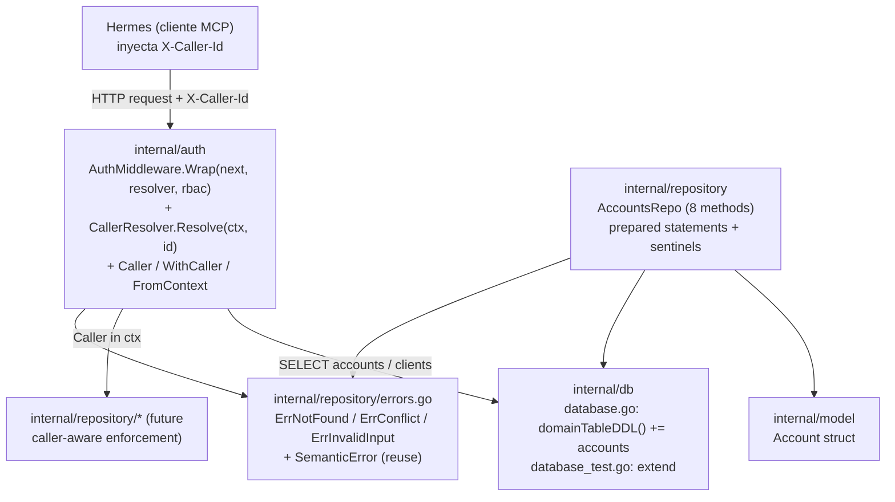

# Design: feat/authorization

> Reference: `proposal.md`, `specs/<capability>/spec.md` (4 specs), `docs/PRD.md` §3.8, ADR-0009
> Change: feat-authorization
> Status: Phase 4 of SDD (después de proposal, spec, design)

## Overview

`feat-authorization` introduce la capa de autorización del MCP server (Fase 0 del roadmap). Añade la **tabla `accounts`** (whitelist `admin`/`staff`) al esquema existente de 10 tablas de dominio + `schema_version` (per `feat-db-layer` design, trae el total a 11 dominio + meta, + `accounts` = 12 con el nuevo schema), y crea el paquete `internal/auth/` con tres piezas: `Caller` (value type + propagación vía `context.Context`), `CallerResolver` (cadena de 1-2 queries `accounts` → `clients`), y `AuthMiddleware` (wrapper HTTP que lee `X-Caller-Id`, resuelve al caller, inyecta el `Caller` en el ctx y aplica RBAC coarse-grained por tool). Completa el cambio con `internal/repository/accounts.go` (8 métodos CRUD con prepared statements + sentinels) y `internal/model/account.go`. El diseño se entrega en **dos PRs encadenados** (per `tasks.md` Forecast table: PR 1 ~460 LOC, PR 2 ~520 LOC; el split es mandatory bajo el budget 400-LOC), y es el puente entre el **qué** (4 specs) y el **cómo** (las tasks de `sdd-tasks`/`sdd-apply`).

El wiring del middleware al `*http.ServeMux` del MCP server es **out-of-scope** (Fase 2): este diseño fija el contrato del middleware en aislamiento para que el wiring sea un ejército de 3 líneas cuando llegue el momento. Sin nuevas dependencias externas (stdlib `context`/`net/http`/`database/sql`/`log/slog`), cumpliendo ADR-0005 y AGENTS.md.

## Layer Architecture



Reglas de dependencia (no escritas, enforced por code review + `go vet`):
- `internal/auth` NO importa a `internal/repository` ni a `internal/mcp`. Depende sólo de stdlib y, para el resolver, de `*sql.DB`. El resolver recibe `*sql.DB` (inyectado), no un repo concreto.
- `internal/auth` importa a `internal/model` para `Account`? **No** — el resolver devuelve `Caller` (struct de `internal/auth`), no `*model.Account`. El modelo `Account` sólo lo toca `AccountsRepo`.
- `internal/repository/accounts.go` importa `internal/model` (Account) y reutiliza los sentinels de `internal/repository/errors.go`. NO importa `internal/auth` (ortogonal: el repo sólo conoce strings).
- `internal/db/database.go` no importa nada nuevo — sólo agrega un string DDL más a `domainTableDDL()`.

## Package Layout

| File | Action | Package | Responsibility |
|------|--------|---------|----------------|
| `internal/auth/caller.go` | Create | `auth` | `Caller` struct, `RoleAdmin/RoleStaff/RoleClient` constants, `WithCaller`/`FromContext` ctx helpers, clave de ctx privada |
| `internal/auth/caller_test.go` | Create | `auth` | Table-driven tests de `WithCaller`/`FromContext` + propagación por wraps (`WithCancel`/`WithTimeout`) (spec `auth-identity`) |
| `internal/auth/resolver.go` | Create | `auth` | `CallerResolver` struct + `Resolve(ctx, id) (Caller, error)`: cadena accounts → clients → `ErrUnauthenticated` (spec `auth-roles`) |
| `internal/auth/resolver_test.go` | Create | `auth` | go-sqlmock tests de los 5 escenarios del resolver (admin, staff, desactivado, client, desconocido) |
| `internal/auth/middleware.go` | Create | `auth` | `AuthMiddleware` con `Wrap(next http.Handler) http.Handler` (o equivalente), RBAC config por tool, audit logging condicional para admin (spec `auth-middleware`) |
| `internal/auth/middleware_test.go` | Create | `auth` | `httptest.NewRecorder` + `httptest.NewRequest` + go-sqlmock: 16 escenarios del middleware |
| `internal/auth/doc.go` | Create | `auth` | Package comment: "Primitivas de autenticación: Caller, ctx propagation, resolver, middleware. Stdlib-only." |
| `internal/repository/accounts.go` | Create | `repository` | `AccountsRepo` con `Create/Get/GetByRole/List/Update/Deactivate/IsActive/ListByProfessional` (spec `accounts-repo`). Constructor recibe `*slog.Logger` para audit log MUST en `Create`/`Deactivate`/`Update`. |
| `internal/repository/accounts_test.go` | Create | `repository` | go-sqlmock tests por cada método (29 escenarios), ≥80% cobertura |
| `internal/model/account.go` | Create | `model` | `Account` struct (7 campos, `ProfessionalID *string`, `IsActive bool`) |
| `internal/db/database.go` | Modify | `db` | Añadir `accounts` a `domainTableDDL()`; contar la nueva tabla en `seedDDL()` description |
| `internal/db/database_test.go` | Modify | `db` | Extender `TestInitSchema_CreatesAllTables` con `accounts`; nuevos tests: CHECKs (role, staff→professional_id), default `is_active=1`, FK implícita no enforced |

## Key Contracts

### 3.1 `Caller` y propagación por contexto

```go
// internal/auth/caller.go
package auth

import "context"

type Caller struct {
    ID             string
    Role           string   // uno de RoleOwner/RoleAdmin/RoleStaff/RoleClient; validado en el resolver, no en el struct
    ProfessionalID *string  // no-nil solo si Role == RoleStaff
    ClientID       *string  // no-nil solo si Role == RoleClient
}

const (
    RoleAdmin  = "admin"
    RoleOwner  = "owner"
    RoleStaff  = "staff"
    RoleClient = "client"
)

func WithCaller(ctx context.Context, caller Caller) context.Context
func FromContext(ctx context.Context) (Caller, bool)
```

La clave de contexto es **privada** (`type callerKey struct{}` o `type callerKey int`) — nunca exportada, para evitar colisiones con otros paquetes (spec `auth-identity` Requirement `WithCaller`). `FromContext` retorna `(Caller{}, false)` si no hay caller; nunca paniquea, nunca retorna error, nunca hace queries. La zero value `Caller{}` es válida y representa "ausente" (la distinción la hace `FromContext`, no el struct).

### 3.2 `CallerResolver`

```go
// internal/auth/resolver.go
package auth

import (
    "context"
    "database/sql"
)

// ErrUnauthenticated es un sentinel del paquete auth para el flujo de resolución.
// Distinto de los sentinels de repository (que son CRUD-level);
// este es auth-level. El middleware lo traduce a HTTP 401 con mensaje Spanish.
var ErrUnauthenticated = errors.New("unauthenticated")

type CallerResolver struct {
    db *sql.DB
}

func NewCallerResolver(db *sql.DB) *CallerResolver
// Resolve ejecuta 1-2 queries en orden:
//   1. SELECT id, role, professional_id, is_active FROM accounts WHERE id = ?
//      - fila con is_active = 1 → Caller{Role: row.role, ProfessionalID: row.professional_id (si staff), ClientID: <from-clients-if-exists>}
//      - fila con is_active = 0 → ErrUnauthenticated + mensaje "tu cuenta está deshabilitada..."
//   2. SELECT id FROM clients WHERE id = ?  (si la cuenta existe y está activa en paso 1, para popular ClientID per ADR-0011)
//      - fila → Caller.ClientID = &id (caller también es client)
//      - no fila → Caller.ClientID = nil (admin/staff/owner sin client row)
//   3. Si accounts no tiene fila → SELECT id FROM clients WHERE id = ?  (caller solo en clients)
//      - fila → Caller{Role: RoleClient, ClientID: &id}
//      - no fila → ErrUnauthenticated + mensaje "no te reconozco..."
func (r *CallerResolver) Resolve(ctx context.Context, id string) (Caller, error)
```

**Decisión de diseño**: la query 1 **NO** filtra por `is_active` en SQL — lee la fila completa y decide en Go. Esto permite distinguir "inactivo" (fila con `is_active=0`) de "inexistente" (sin fila), retornando mensajes de error distintos en cada caso. El algoritmo final es:

1. `SELECT id, role, professional_id, is_active FROM accounts WHERE id = ?` (sin filtro `is_active`):
   - Fila con `is_active == 1` → continuar con paso 2 (popular `ClientID` desde `clients`, per ADR-0011). Continúa con paso 2 incluso si no hay `clients` row (ClientID queda `nil`).
   - Fila con `is_active == 0` → retornar `ErrUnauthenticated` con mensaje "cuenta deshabilitada" (1 query). **NO consulta `clients`**.
2. Si paso 1 devolvió `is_active=1` → `SELECT id FROM clients WHERE id = ?` (1 query extra):
   - Fila → `ClientID = &id` (caller es admin/staff/owner Y también cliente).
   - No fila → `ClientID = nil` (admin/staff/owner sin client row).
3. Si accounts no tiene fila → `SELECT id FROM clients WHERE id = ?` (1 query extra):
   - Fila → `Caller{Role: RoleClient, ClientID: &id}` (1 query en clients, 1 query total).
   - No fila → `ErrUnauthenticated` con mensaje "no te reconozco" (2 queries en accounts+clients).

**Resumen de queries por caso:**
- Caller solo en `clients`: 1 query.
- Caller solo en `accounts`: 1 query a accounts + 1 query a clients (ClientID=nil).
- Caller en ambos (admin+client, owner+client): 2 queries.
- Caller desconocido: 2 queries.
- Caller inactivo: 1 query a accounts (retorna error).

Esto cumple el spec `auth-roles` Requirement "Determinación del role del caller" (paso 2: "Si la fila en `accounts` existe pero `is_active = 0`, el caller MUST ser rechazado") sin hacer `SELECT *` y luego descartar — el costo es el mismo (≤ 2 queries), y la lógica es explícita.

**Sin cache en memoria** en esta versión (ADR-0009 + propuesta §Out of Scope). El `CallerResolver` es un struct inyectable (no un singleton global) para facilitar tests y respetar la regla "no global state" de `golang-patterns`.

### 3.3 `AuthMiddleware` HTTP wrapper

```go
// internal/auth/middleware.go
package auth

import (
    "net/http"
)

// ToolRBAC mapea tool/ruta → conjunto de roles permitidos.
// nil o slice vacío significa "cualquier caller autenticado".
type ToolRBAC map[string][]string

type AuthMiddleware struct {
    resolver *CallerResolver
    rbac     ToolRBAC
    // toolNameFromRequest func(*http.Request) string  // Fase 2: el wiring decide cómo extraer el tool name
}

// Wrap retorna un http.Handler que:
//   1. Lee X-Caller-Id (case-insensitive, http.Header.Get ya lo es).
//   2. Si ausente o vacío tras trim → 401 + body "no se proporcionó X-Caller-Id".
//   3. Resolver.Resolve(ctx, id) → si ErrUnauthenticated → 401 + body con el mensaje Spanish del error.
//   4. Si el tool requiere roles y el caller no los cumple → 403 + body "no tienes permiso para realizar esta acción". **CRITICAL: RBAC check must happen BEFORE WithCaller + next.ServeHTTP.**
//   5. Si caller.Role == RoleAdmin o RoleOwner → emitir audit log ({ts, caller_id, tool}).
//   6. ctx = WithCaller(ctx, caller); next.ServeHTTP(w, r.WithContext(ctx)).
func (m *AuthMiddleware) Wrap(next http.Handler) http.Handler
```

**Decisión de diseño clave**: el middleware delega la resolución a `CallerResolver` y la propagación a `WithCaller`. NO conoce `accounts` ni `clients` directamente. Esto lo hace testeable en aislamiento con un `CallerResolver` que use go-sqlmock, y permite swap futura del resolver (e.g., cache en Fase 2+) sin tocar el middleware.

**Orden RBAC vs. WithCaller**: el RBAC check (step 4) ocurre **antes** de `WithCaller` (step 6). Esto es intencional — el check de roles no necesita el caller inyectado en el ctx (usa el `caller` retornado por el resolver directamente), y el orden asegura que el handler nunca se ejecute si el RBAC falla. Ver `tasks.md` Task 2.3 para los bodies de error y los tests.

**Audit log**: el spec `auth-middleware` Requirement "Logging de auditoría" lo marca como MAY (opcional). El diseño fija: para `admin` se loguea (es la cuenta más sensible, defense-in-depth forense); para `staff`/`client` no se loguea en esta versión (diferible). El log usa `log/slog` con nivel `Info`, campos `ts` (ISO 8601 UTC), `caller_id`, `tool`. NO se loguea PII más allá del `caller_id` (que ya es el phone/handle — no hay secreto adicional).

**Tool name extraction**: en Fase 0 el middleware acepta un `ToolRBAC` opcional y una función `toolNameFromRequest` (también opcional, default: `r.URL.Path`). Cuando Fase 2 wiree el `*http.ServeMux` con paths tipo `/tools/<name>`, la función default extrae el tool del path. El contrato queda fijo ahora para que el wiring sea trivial.

### 3.4 `AccountsRepo`

```go
// internal/repository/accounts.go
package repository

import (
    "context"
    "database/sql"
    "mcp-appointments-crm/internal/model"
)

type AccountsRepo struct {
    db *sql.DB
}

func NewAccountsRepo(db *sql.DB, logger *slog.Logger) *AccountsRepo

func (r *AccountsRepo) Create(ctx context.Context, a *model.Account) error
func (r *AccountsRepo) Get(ctx context.Context, id string) (*model.Account, error)
func (r *AccountsRepo) GetByRole(ctx context.Context, role string) ([]*model.Account, error)
func (r *AccountsRepo) List(ctx context.Context) ([]*model.Account, error)
func (r *AccountsRepo) Update(ctx context.Context, a *model.Account) error
func (r *AccountsRepo) Deactivate(ctx context.Context, id string) error
func (r *AccountsRepo) IsActive(ctx context.Context, id string) (bool, error)
func (r *AccountsRepo) ListByProfessional(ctx context.Context, professionalID string) ([]*model.Account, error)
```

**Dónde vive la validación de `role + professional_id`**: en **tres capas** (defense-in-depth, alineado con PRD §3.8.4):

1. **Schema (SQLite CHECK constraints)** — última línea de defensa. Rejecta `role='manager'`, `role='client'`, y `staff` sin `professional_id`. Un INSERT directo vía SQL tampoco puede saltarse la invariante.
2. **Repo (Go-level validation previa al INSERT)** — primera línea. `Create`/`Update` validan `role ∈ {admin, staff}` y "si staff → professional_id no-nil y no-vacío" **antes** de emitir el INSERT, retornando `ErrInvalidInput` sin tocar la DB. Razón: testing más rápido (sin round-trip a SQLite) y mensajes Spanish más específicos.
3. **CALLER (middleware/resolver)** — aplica en el flujo MCP, no en el repo. El resolver lee `role` de la fila ya validada por DB; no hay nada que validar de nuevo, porque el campo viene de `accounts` que sólo puede contener `admin`/`staff`.

La doble validación (schema + repo) es intencional: si un futuro script de mantenimiento hace `INSERT` directo sin pasar por el repo, el schema lo enforcea; si el repo cae en desincronía con el schema (e.g., se agrega `manager` al schema pero no al repo), el repo sigue siendo conservador y rechaza. Trade-off aceptado: el happy path nunca ejecuta 2 veces la misma validación.

## Data Flow: resolución de caller en cada tool call

```mermaid
sequenceDiagram
    autonumber
    participant Hermes as Hermes (cliente MCP)
    participant MW as AuthMiddleware
    participant Res as CallerResolver
    participant DB as *sql.DB (SQLite)
    participant Handler as handler downstream (Fase 2)

    Hermes->>MW: POST /tools/create_booking<br/>X-Caller-Id: +5491100002222
    Note over MW: 1. Lee X-Caller-Id (case-insensitive, trim)
    alt header ausente o vacío
        MW-->>Hermes: 401 + "no se proporcionó X-Caller-Id"
    end
    MW->>Res: Resolve(ctx, "+5491100002222")
    Res->>DB: QueryRow: SELECT id, role, professional_id, is_active FROM accounts WHERE id=?
    alt fila con is_active=1
        DB-->>Res: (id, role='staff', pro='p-001', is_active=1)
        Res-->>MW: Caller{Role:'staff', ProfessionalID:&'p-001'}
    alt fila con is_active=0
        DB-->>Res: (id, is_active=0)
        Res-->>MW: ErrUnauthenticated + "tu cuenta está deshabilitada..."
        MW-->>Hermes: 401 + body Spanish
    else no fila
        Res->>DB: QueryRow: SELECT id FROM clients WHERE id=?
        alt fila
            DB-->>Res: (id, )
            Res-->>MW: Caller{Role:'client', ClientID:&id}
        else no fila
            Res-->>MW: ErrUnauthenticated + "no te reconozco..."
            MW-->>Hermes: 401 + body Spanish
        end
    end
    Note over MW: 2. ctx = WithCaller(ctx, caller)
    Note over MW: 3. RBAC check si tool tiene RequiredRoles
    alt caller no permite para este tool
        MW-->>Hermes: 403 + "no tienes permiso para realizar esta acción"
    end
    Note over MW: 4. Si caller.Role=='admin' → slog.Info audit log
    MW->>Handler: next.ServeHTTP(w, r.WithContext(ctx))
    Note over Handler: handler hace auth.FromContext(ctx)<br/>y pasa el caller al repo
```

## Enforcement Layers (3-layer defense)

Restate del PRD §3.8.4 + ADR-0009 con interfaces concretas de este diseño:

| Capa | Componente | Qué enforce | Cómo rejection | Mensaje Spanish |
|------|-----------|-------------|----------------|-----------------|
| 1. Coarse | `AuthMiddleware.Wrap` | El caller es autenticable (existe en `accounts` activo o en `clients`) y tiene rol permitido para el tool | HTTP 401 (no identificado) o 403 (rol insuficiente) | "no se proporcionó X-Caller-Id" / "no te reconozco..." / "tu cuenta está deshabilitada..." / "no tienes permiso para realizar esta acción" |
| 2. Medium | `internal/repository/*` (future) | Cada método caller-aware chequea `auth.FromContext(ctx)` y filtra por `professional_id` / `client_id` según rol | `ErrUnauthenticated` (si no hay caller) o `ErrNotFound` (cross-tenant: client pidiendo datos de otro client parece "no encontrado" por seguridad) | "no encontrado" |
| 3. Fine | SQL queries | `WHERE professional_id = ?` (staff) / `WHERE client_id = ?` (client) / sin filtro (admin) | Result set restringido a las filas del caller | — (no hay error, sólo filtrado silencioso) |

**Nota crítica de diseño**: la **capa 2 y 3 NO se implementan en este change** (Fase 0). `AccountsRepo` en este change NO consume el `Caller` — es un CRUD admin-level que asume que el caller ya está autorizado (en Fase 2, los handlers de admin invocarán este repo tras pasar por el middleware coarse). Esto está alineado con la propuesta §Out of Scope ("handler/wiring del MCP server — Fase 2"). Sin embargo, el diseño **documenta el contrato** ahora para que `feat-db-layer` PR 3 (BookingsRepo) pueda introducir la capa 2/3 con un patrón consistente.

## Key Architectural Decisions

### Decisión 1: `Caller` vive en `internal/auth/`, no en `internal/model/`

**Contexto**: `Caller` es un value type que viaja por `context.Context`. Podría vivir en `internal/model` junto a `Account`/`Booking`/etc.

**Decisión**: `Caller` vive en `internal/auth/caller.go`. Es **context-flow state**, no una entidad persistida. Su único writer es el middleware y su único reader son los repos caller-aware.

**Alternativas rechazadas**: (a) `Caller` en `internal/model` — mezcla estado de flow con entidades de dominio, y rompería la regla "model no importa a nadie" (los repos caller-aware importarían `model` para `Caller`, ya lo hacen para entidades, pero `internal/auth` necesitaría importar `model` también → ciclos sutiles si futuro `auth` necesita tipos de `model`). (b) `Caller` en `internal/repository` — anti-patrón: el middleware (consumidor del caller) depende del paquete "data" → acoplamiento invertido.

**Consecuencias**: los repos que enforcement medium-grained (Fase 2+) importarán `internal/auth` para `FromContext`. Es aceptable: `internal/auth` es un paquete foundational (sólo stdlib + `*sql.DB`), sin dependencias circulares. `internal/repository/accounts.go` **NO** importa `internal/auth` (ortogonal: el repo sólo conoce strings).

### Decisión 2: `CallerResolver` sin cache en memoria (Fase 0)

**Contexto**: ADR-0009 menciona "cache en memoria mitigable". Cada tool call hace 1-2 queries → latencia adicional p95 < 5 ms (SQLite in-process, índice PK lookup, loopback).

**Decisión**: `CallerResolver.Resolve` no cachea. Cada call emite las queries frescas. La invalidación zero-staleness es crítica para `is_active = 0` (si un admin desactiva a un staff, el próximo request del staff debe fallar inmediatamente, no tras TTL).

**Alternativas rechazadas**: (a) `sync.Map` con TTL de 5 min — complejidad de invalidación (¿qué pasa si el admin desactiva a un staff y el cache sigue sirviendo?), riesgo de staleness en el hot path de auth. (b) Cache con refresh en background — over-engineering para single-writer loopback.

**Consecuencias**: 1-2 queries por tool call es aceptable (ADR-0009 Consequences "Negative"). El costo se absorbe con `busy_timeout=5000` + WAL + PK lookup. Fase 2+ puede introducir cache con invalidación por escritura (e.g., `AccountsRepo.Update` notifica al resolver) — el contrato `CallerResolver` es inyectable, así el swap no toca al middleware.

### Decisión 3: `ErrUnauthenticated` es un sentinel propio de `internal/auth`, separado de los sentinels de `internal/repository`

**Contexto**: `internal/repository/errors.go` ya define `ErrNotFound`/`ErrConflict`/`ErrInvalidInput`. El flujo de auth podría reusar `ErrNotFound` ("no te encontré en accounts ni clients") y `ErrInvalidInput` ("X-Caller-Id vacío").

**Decisión**: `internal/auth` define `ErrUnauthenticated = errors.New("unauthenticated")` con un mensaje Spanish contextual embebido (diferenciable: "no te reconozco..." vs "tu cuenta está deshabilitada..." vs "no se proporcionó X-Caller-Id"). El middleware hace `errors.Is(err, ErrUnauthenticated)` para decidir HTTP 401; el mensaje Spanish va al body.

**Alternativas rechazadas**: (a) reusar `repository.ErrNotFound` — semántica errónea: "no encontrado" en repos es un lookup fallido, en auth es "no autenticable". Mezclar enumera señales ambiguas para el handler. (b) Usar `*SemanticError` con `ErrCodeUnauthenticated` importando `repository` — violaría la regla "auth no importa a repository" (Decisión 1).

**Consecuencias**: `internal/auth` es standalone. Los tests del middleware pueden usar `errors.Is(err, auth.ErrUnauthenticated)` sin conocer detalles. El handler Fase 2 hace `if errors.Is(err, auth.ErrUnauthenticated) { ... 401 }` antes de caer a los sentinels de repository.

### Decisión 4: Validación doble — schema CHECK + repo-level pre-check (defense-in-depth)

**Contexto**: spec `auth-roles` exige CHECK constraints en DB. spec `accounts-repo` exige `ErrInvalidInput` antes de INSERT para `role` inválido y `staff` sin `professional_id`.

**Decisión**: Las dos validaciones existen. Repo valida primero (Go-level,Spanish message, `ErrInvalidInput`, no toca DB). Schema enforcea segundo (SQLite CHECK, fallback final).

**Alternativas rechazadas**: (a) sólo schema CHECK — el repo devolvería un error SQLite opaco que hay que mapear a `ErrInvalidInput`; los tests go-sqlmock no ejecutan SQLite real → no se puede testear el path. (b) sólo repo — un INSERT directo vía SQL (script `install.sh`, debug) saltearía la invariante.

**Consecuencias**: el happy path hace 1 validación Go (rápida) + 1 INSERT; nunca se duplica el costo porque el happy path pasa ambas. Los tests prueban las dos rutas: go-sqlmock cubre el path Go (ExpectExec nunca llamado cuando ErrInvalidInput); `internal/db/database_test.go` (SQLite in-memory real) cubre el path schema CHECK (INSERT directo con `role='manager'` → SQLITE_CONSTRAINT_CHECK).

### Decisión 5: `AccountsRepo` es caller-agnostic en este change

**Contexto**: spec `accounts-repo` NO menciona ctx-propagated caller en ningún Requirement. El `Caller` se resuelve en el middleware y se usa en los repos business (`BookingsRepo`, `ClientsRepo`), no en el repo que gestiona la whitelist misma.

**Decisión**: `AccountsRepo` methods NO llaman `auth.FromContext`. Asumen que el caller ya está autorizado para gestionar la whitelist (en Fase 2, el handler que invoca `AccountsRepo.Create` tras pasar el middleware coarse con `RequiredRoles: ["admin"]`).

**Alternativas rechazadas**: (a) `AccountsRepo` chequea `Caller.Role == RoleAdmin` — viola spec `accounts-repo` (no menciona caller) y complicaría los tests (necesitaría inyectar caller en cada test). (b) Defer a Fase 2 — no es una decisión contraria; es lo mismo: el chequeo de "sólo admin puede escribir `accounts`" es RBAC coarse, responsabilidad del middleware, no del repo.

**Consecuencias**: `AccountsRepo` no importa `internal/auth`. Los tests go-sqlmock son limpios (sin setup de ctx con caller). El contrato está documentado: el handler Fase 2 debe register el `AccountsRepo` en una ruta con `RequiredRoles: ["admin"]` en el `ToolRBAC`.

### Decisión 6: El schema de `accounts` NO hace FK explícita a `professionals`

**Contexto**: PRD §3.8.2 y ADR-0009 schema usan `professional_id TEXT` sin `REFERENCES professionals(id)`. Pero `bookings` y `schedules` en `feat-db-layer` SÍ usan `REFERENCES` con `ON DELETE CASCADE`/`RESTRICT`.

**Decisión**: El schema de `accounts` replica verbatim el schema del PRD (sin FK explícita). Razón: un admin podría desactivar un profesional (`DELETE FROM professionals WHERE id='p-001'`) sin borrar la cuenta del staff asociada (la cuenta queda "huérfana" pero valida para el rol; el middleware luego rechazará al caller porque `professional_id` apunta a un profesional inexistente — se detecta en el flujo, no en el schema).

**Alternativas rechazadas**: (a) `REFERENCES professionals(id) ON DELETE RESTRICT` — complicaría la desactivación de profesionales (habría que borrar o reasignar la cuenta staff primero); además el PRD no lo especifica. (b) `ON DELETE CASCADE` — borraría la cuenta del staff al borrar el profesional, perdiendo el rastro de quién era. (c) Trigger que setee `professional_id = NULL` al borrar el profesional — break el CHECK `staff → professional_id NOT NULL` → cascada implícita de errores.

**Consecuencias**: el invariant "staff → professional_id existe" se enforce en el **momento de uso**, no en el schema. El middleware (Fase 2) puede opcionalmente verificar `professionals` activo tras resolver el caller. Esta decisión se documenta para que `feat-db-layer` PR 3 no asuma FK implícita. Es reversible si el PRD evoluciona (migración ligera añade `REFERENCES`).

## Migration Plan

### 4.1 Añadir `accounts` al esquema

El cambio es un **schema delta aditivo** (no destructive replace). El esquema existente de `feat-db-layer` (10 tablas de dominio + `schema_version` + 6 triggers FTS + 4 índices secundarios) se conserva; se añade una fila más al slice retornado por `domainTableDDL()`:

```go
// internal/db/database.go — diff
func domainTableDDL() []string {
    return []string{
        // ... existing 10 tables ...
        `CREATE TABLE IF NOT EXISTS accounts ( ... verbatim PRD §3.8.2 ... )`,
    }
}
```

**¿`schema_version` bump?**: **No**. Estado pre-release sin datos de usuario. El `INSERT OR IGNORE INTO schema_version (version=1, ...)` se mantiene. Si se quisiera ser estricto, se actualizaría la **descripción** de la fila v1 a `"... 10 domain tables + accounts per PRD §3.8 + schema_version + 6 FTS triggers + 4 secondary indexes"`. Decisión: la description es informativa, no contrato; la actualizamos para mantener el conteo honesto.

**Idempotencia**: `CREATE TABLE IF NOT EXISTS` — el re-ejecutar `initSchema` tras el merge no falla (Decisión 10 de `feat-db-layer`: "initSchema is all-or-nothing en idempotencia, no transaccional"). Si la mitad de un arranque crea las 10 viejas y falla antes de `accounts`, el re-intento completa `accounts` con `IF NOT EXISTS`.

### 4.2 Init order y seed del admin

`accounts` arranca **vacía**. El admin se crea vía `install.sh` (Fase 2, Out of Scope de este change). El `initSchema` NO hace `INSERT OR IGNORE INTO accounts` — no hay default admin en el schema, porque el phone del admin es data específica de la instalación del negocio.

**`is_active = 1` default**: cubierto por el schema (`DEFAULT 1`). El primer `INSERT` del admin vía `AccountsRepo.Create` con `IsActive: true` funciona sin tocar la columna.

**Integración con `database_test.go`**:
- `TestInitSchema_CreatesAllTables` añade `"accounts"` al slice `expectedTables`.
- Nuevo test `TestAccountsTable_CheckConstraints` (SQLite in-memory real):
  - INSERT con `role='manager'` → `SQLITE_CONSTRAINT_CHECK`.
  - INSERT con `role='client'` → rechazado.
  - INSERT con `role='staff'` sin `professional_id` → `SQLITE_CONSTRAINT_CHECK`.
  - INSERT con `role='admin'` sin `professional_id` → OK.
- Nuevo test `TestAccountsTable_Defaults`:
  - INSERT con `(id, role)` → `is_active == 1`, `created_at` y `updated_at` matching el regex ISO 8601 UTC con milisegundos (regex `^\d{4}-\d{2}-\d{2}T\d{2}:\d{2}:\d{2}\.\d{3}Z$`).
- Extender `TestSchemaVersion_RowInserted` description string (Decisión de arriba: "10 domain tables + accounts per PRD §3.8 + schema_version + 6 FTS triggers + 4 secondary indexes").

## Test Mapping

Tabla operativa para `sdd-tasks` y `sdd-apply`. Cada scenario de spec → archivo de test + estrategia.

| Spec | Scenario | Test file | Strategy |
|---|---|---|---|
| `auth-identity` | Caller con ProfessionalID / ClientID | `internal/auth/caller_test.go` | unit (struct literal) |
| `auth-identity` | WithCaller retorna ctx nuevo | same | unit (`context` assertions) |
| `auth-identity` | WithCaller con zero value no panic | same | unit |
| `auth-identity` | FromContext con caller presente | same | unit |
| `auth-identity` | FromContext en ctx sin caller → `(Caller{}, false)` | same | unit |
| `auth-identity` | FromContext con ctx cancelado | same | unit |
| `auth-identity` | Propagación a través de `WithCancel`/`WithTimeout`/`WithDeadline`/`WithValue` | same | unit table-driven |
| `auth-identity` | Importaciones mínimas (sin `github.com/...`) | (static lint) | grep gate en GGA |
| `auth-roles` | Constantes `RoleOwner`/`RoleAdmin`/`RoleStaff`/`RoleClient` con valores exactos | `internal/auth/caller_test.go` (o `doc_test.go`) | unit |
| `auth-roles` | Tabla `accounts` existe con todas las columnas | `internal/db/database_test.go` | SQLite in-memory (PRAGMA table_info) |
| `auth-roles` | Default `is_active = 1` | `internal/db/database_test.go` | SQLite in-memory |
| `auth-roles` | Insert con role inválido (`'manager'`) falla | `internal/db/database_test.go` | SQLite in-memory (CHECK) |
| `auth-roles` | Insert con role `'client'` rechazado | `internal/db/database_test.go` | SQLite in-memory |
| `auth-roles` | Staff sin `professional_id` rechazado | `internal/db/database_test.go` | SQLite in-memory |
| `auth-roles` | Admin con/without `professional_id` aceptado | `internal/db/database_test.go` | SQLite in-memory |
| `auth-roles` | Staff con `professional_id` aceptado | `internal/db/database_test.go` | SQLite in-memory |
| `auth-roles` | Resolver: admin en accounts (1 query) | `internal/auth/resolver_test.go` | go-sqlmock (1 ExpectQuery accounts, 0 clients) |
| `auth-roles` | Resolver: staff con professional_id | same | go-sqlmock |
| `auth-roles` | Resolver: `is_active=0` → ErrUnauthenticated + "cuenta deshabilitada" | same | go-sqlmock |
| `auth-roles` | Resolver: client en clients (2 queries) | same | go-sqlmock (1 accounts + 1 clients) |
| `auth-roles` | Resolver: desconocido → ErrUnauthenticated + "no te reconozco" | same | go-sqlmock |
| `auth-middleware` | Header presente non-empty | `internal/auth/middleware_test.go` | `httptest` + go-sqlmock |
| `auth-middleware` | Header ausente → 401 + "no se proporcionó X-Caller-Id" | same | `httptest` (no DB) |
| `auth-middleware` | Header vacío/whitespace → 401 | same | `httptest` |
| `auth-middleware` | Header case-insensitive | same | `httptest` |
| `auth-middleware` | Admin encontrado (1 query) | same | `httptest` + go-sqlmock |
| `auth-middleware` | Staff encontrado (1 query) | same | same |
| `auth-middleware` | Cuenta desactivada → 401 + "cuenta deshabilitada" | same | same |
| `auth-middleware` | Client encontrado (2 queries) | same | same |
| `auth-middleware` | Desconocido → 401 + "no te reconozco" | same | same |
| `auth-middleware` | Handler recibe caller en ctx | same | `httptest` (handler that calls `FromContext`) |
| `auth-middleware` | Admin accede a tool que requiere admin | same | `httptest` (RBAC map) |
| `auth-middleware` | Client rechazado en tool de admin → 403 + "no tienes permiso" | same | same |
| `auth-middleware` | Staff accede a tool que permite `[staff, admin]` | same | same |
| `auth-middleware` | Endpoint sin `RequiredRoles` acepta cualquier caller autenticado | same | same |
| `auth-middleware` | Admin accede → se emite audit log | same | `httptest` + captura de log via `slog` test handler |
| `auth-middleware` | Importaciones mínimas (sin deps externas) | (static lint) | grep gate en GGA |
| `accounts-repo` | Account struct: admin con `ProfessionalID == nil` | `internal/repository/accounts_test.go` | unit (struct literal) |
| `accounts-repo` | Account struct: staff con `ProfessionalID != nil` | same | unit |
| `accounts-repo` | Constructor no abre conexión | same | go-sqlmock (mock `*sql.DB`) |
| `accounts-repo` | `Create` admin exitoso | same | go-sqlmock (ExpectExec) |
| `accounts-repo` | `Create` rechazo role inválido (client/manager/empty) | same | go-sqlmock (no ExpectExec) |
| `accounts-repo` | `Create` rechazo staff sin `professional_id` | same | go-sqlmock |
| `accounts-repo` | `Create` rechazo ID duplicado → ErrConflict | same | go-sqlmock (UNIQUE violation) |
| `accounts-repo` | `Create` rechazo ID vacío → ErrInvalidInput | same | go-sqlmock |
| `accounts-repo` | `Get` existente | same | go-sqlmock (ExpectQuery) |
| `accounts-repo` | `Get` staff popula ProfessionalID | same | go-sqlmock |
| `accounts-repo` | `Get` inexistente → ErrNotFound | same | go-sqlmock (sql.ErrNoRows) |
| `accounts-repo` | `GetByRole` múltiples admins (ORDER BY created_at ASC) | same | go-sqlmock (ExpectQuery rows) |
| `accounts-repo` | `GetByRole` sin resultados → slice vacío, nil | same | go-sqlmock |
| `accounts-repo` | `GetByRole` role inválido → ErrInvalidInput sin query | same | go-sqlmock |
| `accounts-repo` | `List` múltiples filas | same | go-sqlmock |
| `accounts-repo` | `List` tabla vacía → slice vacío, nil | same | go-sqlmock |
| `accounts-repo` | `Update` exitoso (rows affected 1) | same | go-sqlmock (ExpectExec) |
| `accounts-repo` | `Update` inexistente → ErrNotFound (rows affected 0) | same | go-sqlmock |
| `accounts-repo` | `Update` role inválido → ErrInvalidInput sin query | same | go-sqlmock |
| `accounts-repo` | `Update` regenera `updated_at` | same | go-sqlmock (assert placeholder de strftime) |
| `accounts-repo` | `Deactivate` exitoso | same | go-sqlmock (audit log) |
| `accounts-repo` | `Deactivate` idempotente (segunda llamada) | same | go-sqlmock |
| `accounts-repo` | `Deactivate` inexistente → ErrNotFound | same | go-sqlmock |
| `accounts-repo` | `Deactivate` ID vacío → ErrInvalidInput sin query | same | go-sqlmock |
| `accounts-repo` | `IsActive` cuenta activa → `(true, nil)` | same | go-sqlmock |
| `accounts-repo` | `IsActive` cuenta inactiva → `(false, nil)` | same | go-sqlmock |
| `accounts-repo` | `IsActive` id inexistente → `(false, nil)` (no error) | same | go-sqlmock (sql.ErrNoRows) |
| `accounts-repo` | `ListByProfessional` múltiples staff (ORDER BY display_name ASC) | same | go-sqlmock |
| `accounts-repo` | `ListByProfessional` excluye admins (role='staff') | same | go-sqlmock |
| `accounts-repo` | `ListByProfessional` ID vacío → ErrInvalidInput | same | go-sqlmock |
| `accounts-repo` | Sentinel se preserva vía wrap (`errors.Is`) | same | go-sqlmock + `errors.Is` |
| `accounts-repo` | Mensaje Spanish sin stack trace / file paths / `goroutine` | same | go-sqlmock + `strings.Contains` negatives |
| `accounts-repo` | Queries con `?` placeholders, sin `fmt.Sprintf` SQL | (static lint) | grep gate en GGA |
| `accounts-repo` | Tests pasan con race detector | (CI) | `go test -v -race ./internal/repository/...` |
| `accounts-repo` | Cobertura ≥ 80% | (CI) | `go test -cover ./internal/repository/...` |

Cobertura target global: **≥ 80%** en `internal/auth/` (per spec `auth-identity`, `auth-middleware`, propuesta §Success Criteria) y en `internal/repository/accounts.go` (per spec `accounts-repo`).

## Error Propagation Pattern

Cómo fluyen los errores del flujo de auth al LLM, respetando AGENTS.md ("no stack traces to LLM", mensajes Spanish) y la Decisión 3 (`ErrUnauthenticated` standalone):

```
[internal/auth/resolver.go — Resolve]
  accounts is_active=0 → return fmt.Errorf("resolve caller %q: %w", id, ErrUnauthenticated)
                          // mensaje Spanish "tu cuenta está deshabilitada..."
                          // Embebido en el error: usar un wrapper que retenga el Spanish message
  no fila en ninguna   → return fmt.Errorf("resolve caller %q: %w", id, ErrUnauthenticated)
                          // mensaje Spanish "no te reconozco. Por favor registrate primero."
```

Decisión de implementación: `ErrUnauthenticated` es el sentinel `errors.Is`-checkable, pero el mensaje Spanish contextual lo lleva un **wrapper struct** `*authError{msg string, inner error}` whose `Error()` returns `msg`. El middleware hace:

```go
if errors.Is(err, auth.ErrUnauthenticated) {
    w.WriteHeader(http.StatusUnauthorized)
    io.WriteString(w, err.Error())  // ya es el mensaje Spanish
    return
}
```

Property: el LLM nunca ve stack trace, el `caller_id` no se loguea en el body (ya está en el header). Server-side, `slog.Warn` con `caller_id` y el code (`ErrUnauthenticated`) para telemetría.

## Risks (in-design)

| Riesgo | Prob | Mitigación en este diseño |
|--------|------|---------------------------|
| **R1** — `AccountsRepo` caller-agnostic puede ser invocado sin chequeo de admin en Fase 2 | Media | Documentado en Decisión 5: el handler Fase 2 **debe** register `AccountsRepo` en ruta con `RequiredRoles: ["admin"]`. Guidance para `sdd-tasks` Fase 2: tarea explícita "Wiring: register AccountsRepo handlers with admin-only RBAC". |
| **R2** — Resolver hace `SELECT` sin `is_active` en la primera query para distinguir inactivo de inexistente | Media | Algoritmo documentado en §3.2: la query 1 lee `is_active`; si la fila existe y `is_active=0`, no se cae al client lookup. Costo: 1 query más en el path "inactivo" (aceptable, el inactivo es el caso patológico, no el hot path). |
| **R3** — `accounts.professional_id` sin FK explícita a `professionals` | Baja | Decisión 6: replicar verbatim PRD. El invariant se enforce en uso (middleware Fase 2 puede validar `professionals.status`). Reversible con migration ligera. **Consumo por `feat-db-layer` PR 3** (actualizado 2026-06-29): los 4 repos complejos de PR 3 (Professionals, Schedules, Bookings, PendingAlerts) consumen `caller.ProfessionalID` para filtrar queries (medium-grained + fine-grained enforcement). La falta de FK explícita a `professionals.id` no es bloqueante porque los repos validan in-use (e.g., `ProfessionalsRepo.Get(caller.ProfessionalID)` valida que el id existe antes de usarlo en WHERE clauses). **Documentar en cada task de PR 3 que use el campo**: agregar nota explícita "validar que `professional_id` referencie un professional existente antes de usarlo en queries de filtrado". Migración ligera para agregar la FK es factible en el futuro si la invariante se quiere enforce a nivel de DB. |
| **R4** — Wireamiento Fase 2 puede olvidar el middleware | Media | Contrato de `AuthMiddleware.Wrap` documentado ahora. `sdd-tasks` Fase 2** Guidance: "Wiring wrap is `mw.Wrap(mux)` — no bypassar". |
| **R5** — Audit log síncrono puede añadir latencia al path admin | Baja | `slog.Info` es async-buffereable; <100 µs en loopback. Aceptable. Si Fase 2+ lo requiere, mover a channel+goroutine. |
| **R6** — Mensaje Spanish embebido en `*authError` puede duplicarse si el handler Fase 2 hace `err.Error()` y lo wrappea | Baja | Contract: el middleware es el **último** bottleneck antes del LLM; nunca re-wrappea el mensaje Spanish. Documentado en §Error Propagation. |
| **R7** — `go-sqlmock` tests del middleware requieren mockear wide queries | Baja | Strategy fija: mock `accounts` ExpectQuery first; si scenario exige "no clients query", no ExpectQuery para clients. Table-driven con sub-tests claros. |
| **R8** — `domainTableDDL()` cuentao en `schema_version` description (10 + accounts + schema_version = 12 tablas) | Baja | Guidance: actualizar description string a "10 domain tables + accounts per PRD §3.8 + schema_version + 6 FTS triggers + 4 secondary indexes". Si se prefiere no tocar, la description no es contrato visual; registrar como follow-up. |

## Implementation Order (preview de `tasks.md`)

Hint del orden para la próxima fase. `sdd-tasks` refina con TDD estricto (test first, prod code second).

1. **Schema** — `internal/db/database.go` add `accounts` a `domainTableDDL()` + actualizar description en `seedDDL()`; extender `internal/db/database_test.go` con CHECKs y defaults. (TDD: tests primero contra SQLite real.)
2. **Model** — `internal/model/account.go` struct `Account` + test de struct literal.
3. **Repo** — `internal/repository/accounts.go` + `_test.go` go-sqlmock (29 escenarios), ≥80% cobertura. TDD: cada método → test primero → implementación.
4. **Caller** — `internal/auth/caller.go` + `_test.go` unit tests de ctx propagation.
5. **Resolver** — `internal/auth/resolver.go` + `_test.go` go-sqlmock (5 escenarios).
6. **Middleware** — `internal/auth/middleware.go` + `_test.go` `httptest` + go-sqlmock (16 escenarios). Audit log sub-test con `slog` test handler.
7. **Doc** — `internal/auth/doc.go` package comment.
8. **(Future Fase 2)** — Wiring del middleware en el `*http.ServeMux`, handlers MCP caller-aware, `install.sh` seed del admin.

Suma de LOC estimada: schema ~+15 (1 statement), model ~+25, repo ~+180 (8 métodos + validaciones), auth (caller+resolver+middleware+doc) ~+120, tests ~+200 (auth ~+150, repo ~+50 ya contado). Total prod+test excede el review budget 400-LOC (~980 LOC estimados), así que el split en **2 PRs encadenados es obligatorio** (no opcional). `sdd-tasks` materializa el split: PR 1 (data layer: schema + model + repo + integration test, ~460 LOC) → PR 2 (auth primitives: Caller + Resolver + Middleware, ~520 LOC). La spec no cambia; el código se entrega en 2 PRs encadenados con `feature-branch-chain`.

## References

- `openspec/changes/feat-authorization/proposal.md` (commit `3d27a09`)
- `openspec/changes/feat-authorization/specs/auth-identity/spec.md` (commit `38e7cbd`)
- `openspec/changes/feat-authorization/specs/auth-roles/spec.md` (commit `38e7cbd`)
- `openspec/changes/feat-authorization/specs/auth-middleware/spec.md` (commit `38e7cbd`)
- `openspec/changes/feat-authorization/specs/accounts-repo/spec.md` (commit `38e7cbd`)
- `docs/PRD.md` §3.8 (líneas 670-801) — modelo canónico de autorización
- `docs/architecture/0009-authorization-model.md` — ADR-0009 (decisión, consecuencias, rejected alternatives, reversibility)
- `openspec/changes/feat-db-layer/design.md` (formato referencia — 503 líneas, mismo tono bilingual)
- `internal/db/database.go` (en `tracker/feat-db-layer`) — esquema actual con 10 tablas dominio + `schema_version`; la función `initSchema` retorna un slice de statements que `domainTableDDL()`/`seedDDL()`/`accountsTableDDL()` extienden
- `internal/db/database_test.go` (en `tracker/feat-db-layer`) — patrón de tests de schema
- `internal/repository/errors.go` (en `tracker/feat-db-layer`) — sentinels `ErrNotFound`/`ErrConflict`/`ErrInvalidInput` + `SemanticError`
- `AGENTS.md` — branch rules (docs → `main` directo), commit format, security checklist, Spanish error messages
- engram obs 488 (session summary del ADR-0009/PRD §3.8 planning)
- Skills cargadas: `sdd-design/SKILL.md`, `.agents/skills/golang-patterns/SKILL.md`