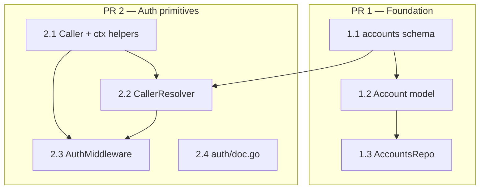

# Tasks: feat/authorization — Authorization model for MCP server

> Reference: `proposal.md`, `specs/<capability>/spec.md` (4 specs), `design.md`, `docs/PRD.md` §3.8, `docs/architecture/0009-authorization-model.md`
> Change: feat-authorization
> Status: Phase 5 of SDD (proposal, spec, design, tasks)

## Overview

`feat-authorization` introduce la capa de autorización del MCP server. Añade la tabla `accounts` (whitelist `admin`/`staff`) al esquema existente, el modelo `Account`, el repositorio `AccountsRepo`, y el paquete `internal/auth/` con `Caller`, `CallerResolver` y `AuthMiddleware`. El trabajo se divide en **2 PRs encadenados**: PR 1 capa de datos (schema + model + repo) y PR 2 primitivas de auth (caller + resolver + middleware). El wiring del middleware al `*http.ServeMux` es Fase 2 y queda fuera de este change.

## Forecast

| PR | Scope | Forecasted LOC | Tasks |
|---|----|----:|----:|
| **1** | foundation (schema + `Account` model + `AccountsRepo`) | ~460 | 1.1–1.3 |
| **2** | auth primitives (`Caller`, `CallerResolver`, `AuthMiddleware`, `doc.go`) | ~520 | 2.1–2.4 |
| **Total** | | **~980** | 7 |

## Review Workload Forecast

| Field | Value |
|-------|-------|
| Estimated changed lines | ~980 (new files, minimal deletions) |
| 400-line budget risk | High |
| Chained PRs recommended | Yes |
| Suggested split | PR 1 (data layer) → PR 2 (auth layer) |
| Delivery strategy | force-chained |
| Chain strategy | feature-branch-chain |

Decision needed before apply: No
Chained PRs recommended: Yes
Chain strategy: feature-branch-chain
400-line budget risk: High

### Suggested Work Units

| Unit | Goal | Likely PR | Notes |
|------|------|-----------|-------|
| 1 | Schema, `Account` model y `AccountsRepo` | PR 1 | Base branch: `feat/feat-authorization-apply`; tests go-sqlmock incluidos |
| 2 | `Caller`, resolver y middleware HTTP | PR 2 | Base branch: PR 1 branch; depende de `accounts` para resolver, pero no del repo directamente |

## Dependency graph



Dentro de cada PR las tareas son seriales. PR 2 depende de PR 1 (necesita la tabla `accounts` para los tests del resolver y middleware).

## PR 1 — Foundation: schema, model and accounts repository

### Task 1.1 — Add `accounts` table to schema

- **Files**:
  - `internal/db/schema.go` (MODIFIED, ~+25 LOC: add `accounts` DDL to `domainTableDDL()` + update `seedDDL()` description)
  - `internal/db/database_test.go` (MODIFIED, ~+70 LOC: integration tests)
- **Spec scenarios satisfied**:
  - `auth-roles` "Schema of `accounts` table" (Requirement 2)
  - `auth-roles` "CHECK constraint de role en DB" (Requirement 4)
  - `auth-roles` "CHECK constraint staff-implica-professional_id" (Requirement 5)
- **Key implementation**:
  - Append a `CREATE TABLE IF NOT EXISTS accounts` statement to `domainTableDDL()` with the exact schema from PRD §3.8.2 / ADR-0009:
    ```sql
    CREATE TABLE IF NOT EXISTS accounts (
        id              TEXT PRIMARY KEY,
        role            TEXT NOT NULL CHECK (role IN ('admin', 'staff')),
        display_name    TEXT,
        professional_id TEXT,
        is_active       INTEGER NOT NULL DEFAULT 1,
        created_at      TEXT NOT NULL DEFAULT (strftime('%Y-%m-%dT%H:%M:%fZ', 'now')),
        updated_at      TEXT NOT NULL DEFAULT (strftime('%Y-%m-%dT%H:%M:%fZ', 'now')),
        CHECK ((role = 'staff' AND professional_id IS NOT NULL) OR (role = 'admin'))
    )
    ```
  - Update `seedDDL()` description to reflect "8 domain tables + accounts per PRD §3.8 + schema_version + ...".
- **Tests** (integration test in `database_test.go` using real in-memory SQLite):
  - `TestAccountsTable_Exists` — `PRAGMA table_info(accounts)` includes all columns with expected types
  - `TestAccountsTable_DefaultIsActive` — INSERT `(id, role)` → `is_active == 1`, timestamps match ISO 8601 UTC with milliseconds
  - `TestAccountsTable_RoleInvalidRejected` — INSERT with `role='manager'` → CHECK constraint violation
  - `TestAccountsTable_ClientRoleRejected` — INSERT with `role='client'` → CHECK constraint violation
  - `TestAccountsTable_StaffRequiresProfessionalID` — INSERT with `role='staff'` and `professional_id=NULL` → CHECK constraint violation
  - `TestAccountsTable_AdminAcceptsNullProfessionalID` — INSERT with `role='admin'` and `professional_id=NULL` → OK
  - `TestAccountsTable_StaffWithProfessionalIDAccepted` — INSERT with `role='staff'` and `professional_id='p-001'` → OK
- **Acceptance**:
  - `go test -v -race ./internal/db/...` passes
  - Coverage of new schema paths ≥ 80%

### Task 1.2 — Add `Account` model

- **Files**:
  - `internal/model/account.go` (NEW, ~30 LOC)
- **Spec scenarios satisfied**:
  - `accounts-repo` "Estructura del modelo `Account`" (Requirement 1)
- **Key implementation**:
  - Define `type Account struct` with fields: `ID string`, `Role string` (`"admin"`|`"staff"`), `DisplayName string`, `ProfessionalID *string` (nullable), `IsActive bool`, `CreatedAt string` (ISO 8601 UTC), `UpdatedAt string` (ISO 8601 UTC).
  - No behavior methods; repos own the behavior.
- **Tests**:
  - None required for pure struct (verified via repo tests).
- **Acceptance**:
  - `go build -o /dev/null ./...` passes
  - `golangci-lint run ./...` clean

### Task 1.3 — Implement `AccountsRepo` (CRUD with go-sqlmock)

- **Files**:
  - `internal/repository/accounts.go` (NEW, ~160 LOC)
  - `internal/repository/accounts_test.go` (NEW, ~240 LOC)
- **Spec scenarios satisfied**:
  - `accounts-repo` (Requirements 2–12, 29 scenarios)
- **Key implementation**:
  - 8 methods: `Create`, `Get`, `GetByRole`, `List`, `Update`, `Delete`, `IsActive`, `ListByProfessional`.
  - Constructor `NewAccountsRepo(db *sql.DB) *AccountsRepo` receives an already opened `*sql.DB`; it does not open connections or run migrations.
  - All queries use `?` placeholders; no `fmt.Sprintf` or string concatenation for SQL values.
  - All errors wrap with `fmt.Errorf("...: %w", err)` using existing sentinels `ErrNotFound`, `ErrConflict`, `ErrInvalidInput`.
  - `Create` and `Update` validate before touching the DB:
    - `ID` not empty
    - `Role` is `"admin"` or `"staff"`
    - If `Role == "staff"`, `ProfessionalID` must be non-nil and non-empty
  - `is_active` is stored as `INTEGER` (0/1) and exposed as `bool`.
  - `Update` regenerates `updated_at` with `strftime('%Y-%m-%dT%H:%M:%fZ', 'now')`.
  - `IsActive` returns `(false, nil)` for missing rows (no `ErrNotFound`).
- **Tests** (go-sqlmock, table-driven):
  - Each of the 29 scenarios in `accounts-repo/spec.md` becomes one subtest.
  - Cover happy path + error paths (DB error, not found, UNIQUE conflict, invalid input).
- **Acceptance**:
  - `go test -v -race ./internal/repository/...` passes
  - Coverage of `accounts.go` ≥ 80%
  - All 29 spec scenarios pass

## PR 2 — Auth primitives: caller, resolver and middleware

### Task 2.1 — Implement `Caller` struct and context helpers

- **Files**:
  - `internal/auth/caller.go` (NEW, ~45 LOC)
  - `internal/auth/caller_test.go` (NEW, ~80 LOC)
- **Spec scenarios satisfied**:
  - `auth-identity` (5 requirements, 10 scenarios)
  - `auth-roles` "Tres roles canónicos como constantes" (Requirement 1)
- **Key implementation**:
  - `type Caller struct { ID string; Role string; ProfessionalID *string; ClientID *string }`
  - Role string constants: `RoleAdmin = "admin"`, `RoleStaff = "staff"`, `RoleClient = "client"`.
  - Private context key (`type callerKey struct{}`) to avoid collisions.
  - `WithCaller(ctx context.Context, caller Caller) context.Context` returns a new context; never mutates input; no panic on zero value.
  - `FromContext(ctx context.Context) (Caller, bool)` returns zero `Caller` and `false` if absent; never panics, never returns error, never queries.
- **Tests**:
  - Each of the 10 scenarios in `auth-identity/spec.md` becomes a subtest.
  - Cover: empty ctx, ctx with caller, zero-value injection, `WithCancel`/`WithTimeout`/`WithDeadline`/`WithValue` propagation.
- **Acceptance**:
  - `go test -v -race ./internal/auth/...` passes
  - Coverage of `caller.go` ≥ 80%
  - All 10 spec scenarios pass

### Task 2.2 — Implement `CallerResolver` (accounts → clients → unauthenticated)

- **Files**:
  - `internal/auth/resolver.go` (NEW, ~75 LOC)
  - `internal/auth/resolver_test.go` (NEW, ~110 LOC)
- **Spec scenarios satisfied**:
  - `auth-roles` "Determinación del role del caller" (Requirement 6)
  - `auth-middleware` "Caller resolution" (Requirement 2)
- **Key implementation**:
  - `type CallerResolver struct { db *sql.DB }`
  - `func NewCallerResolver(db *sql.DB) *CallerResolver`
  - `func (r *CallerResolver) Resolve(ctx context.Context, id string) (Caller, error)`
  - Sentinel `ErrUnauthenticated = errors.New("unauthenticated")` plus a private `authError` wrapper that carries the Spanish message:
    - `"no te reconozco. Por favor registrate primero."` when not found in either table
    - `"tu cuenta está deshabilitada. Contacta al administrador."` when account exists but `is_active = 0`
  - Resolution algorithm (≤ 2 queries):
    1. `SELECT id, role, professional_id, is_active FROM accounts WHERE id = ?`
    2. If row exists and `is_active == 1` → return `Caller{ID, Role: row.role, ProfessionalID: row.professional_id, ClientID: nil}`
    3. If row exists and `is_active == 0` → return `ErrUnauthenticated` with disabled-account message
    4. If no row in accounts → `SELECT id FROM clients WHERE id = ?`
    5. If row in clients → return `Caller{ID, Role: RoleClient, ProfessionalID: nil, ClientID: &id}`
    6. If no row in either → return `ErrUnauthenticated` with not-recognized message
- **Tests** (go-sqlmock, table-driven):
  - Admin in accounts (1 query, no clients query)
  - Staff in accounts with `professional_id`
  - Account exists but `is_active = 0` → `ErrUnauthenticated` + disabled message; no clients query
  - Client in clients (2 queries)
  - Unknown id → `ErrUnauthenticated` + not-recognized message
- **Acceptance**:
  - `go test -v -race ./internal/auth/...` passes
  - Coverage of `resolver.go` ≥ 80%
  - All scenarios pass

### Task 2.3 — Implement `AuthMiddleware` (HTTP wrapper)

- **Files**:
  - `internal/auth/middleware.go` (NEW, ~90 LOC)
  - `internal/auth/middleware_test.go` (NEW, ~160 LOC)
- **Spec scenarios satisfied**:
  - `auth-middleware` (6 requirements, 16 scenarios)
- **Key implementation**:
  - `type ToolRBAC map[string][]string` mapping tool/route → allowed roles; nil or empty means "any authenticated caller".
  - `type AuthMiddleware struct { resolver *CallerResolver; rbac ToolRBAC }`
  - `func NewAuthMiddleware(resolver *CallerResolver, rbac ToolRBAC) *AuthMiddleware`
  - `func (m *AuthMiddleware) Wrap(next http.Handler) http.Handler`:
    1. Read `X-Caller-Id` using `r.Header.Get` (case-insensitive per RFC 7230).
    2. If missing or empty after `strings.TrimSpace` → write JSON `{"error":"no se proporcionó X-Caller-Id"}` with HTTP 401.
    3. Call `resolver.Resolve(ctx, id)`; if `ErrUnauthenticated` → write JSON `{"error":<spanish-message>}` with HTTP 401.
    4. Inject caller into request context with `WithCaller` and call `next.ServeHTTP(w, r.WithContext(ctx))`.
    5. If the tool has `RequiredRoles` and the caller's role is not in the set → write JSON `{"error":"no tienes permiso para realizar esta acción"}` with HTTP 403.
    6. If `caller.Role == RoleAdmin` → emit audit log via `log/slog` with `ts` (ISO 8601 UTC), `caller_id`, and `tool`.
  - Tool name default: `r.URL.Path`; allow injection of `toolNameFromRequest func(*http.Request) string` for Fase 2 wiring.
- **Tests** (table-driven with `httptest.ResponseRecorder`):
  - Each of the 16 scenarios in `auth-middleware/spec.md` becomes a subtest.
  - Cover: missing header, empty/whitespace header, case-insensitive header, admin/staff/client resolution, deactivated account, unknown caller, RBAC allow/deny, endpoint without RequiredRoles, caller present in downstream ctx.
  - Audit log subtest captures `slog` output for admin access.
- **Acceptance**:
  - `go test -v -race ./internal/auth/...` passes
  - Coverage of `middleware.go` ≥ 80%
  - All 16 spec scenarios pass

### Task 2.4 — Add `internal/auth/doc.go`

- **Files**:
  - `internal/auth/doc.go` (NEW, ~5 LOC)
- **Spec scenarios satisfied**:
  - `auth-identity` "Sin dependencias externas" (Requirement 5)
  - `auth-middleware` "Sin dependencias externas" (Requirement 6)
- **Key implementation**:
  - Package comment: "Package auth provides authentication primitives for the MCP server: Caller, context propagation, caller resolution, and HTTP middleware. Uses only the Go standard library."
- **Tests**:
  - None required.
- **Acceptance**:
  - `go build -o /dev/null ./...` passes
  - `golangci-lint run ./...` clean

## Forecast + Review Workload Guard check

| PR | Forecasted | Cap | Status |
|---|---:|---:|:---:|
| 1 | ~460 | 400 | ⚠️ over budget |
| 2 | ~520 | 400 | ⚠️ over budget |

Both PRs exceed the 400-line review budget. The split is mandatory under `force-chained`. If PR 2 still feels too large during implementation, the optional escape hatch is to split it into PR 2a (`Caller` + `CallerResolver`) and PR 2b (`AuthMiddleware` + `doc.go`). The spec contract does not change; only the delivery slice changes.

## Implementation order

Tasks are ordered 1.1 → 1.3 within PR 1, then 2.1 → 2.4 within PR 2. Each task builds on the previous:

- 1.1 schema first (other tasks need the `accounts` table)
- 1.2 model (used by repo)
- 1.3 repo (depends on schema + model)
- 2.1 caller (independent of repo, used by resolver and middleware)
- 2.2 resolver (depends on caller + `accounts`/`clients` schema)
- 2.3 middleware (depends on resolver + caller)
- 2.4 doc (no dependencies)

PR 1 must merge before PR 2 starts. PR 2 uses the `accounts` table in its go-sqlmock expectations.

## Success criteria

- [ ] All 7 tasks merged to `feat/feat-authorization-apply` branch
- [ ] `go test -v -race ./...` passes (covers `internal/auth`, `internal/repository`, `internal/db`)
- [ ] `go build -o /dev/null ./...` passes
- [ ] `golangci-lint run ./...` clean (0 issues)
- [ ] `go vet ./...` clean
- [ ] Coverage ≥ 80% for each new file
- [ ] Strict TDD honored (tests written before production code)
- [ ] GGA clean on every commit
- [ ] Pre-flight (`go fmt`, `go vet`, `go build`, `go test -v -race`, `golangci-lint`) clean

## Future work (NOT in this change)

- **Fase 2**: Wire the middleware into the MCP server. Update `internal/mcp` to wrap handlers with `AuthMiddleware`, register per-tool `RequiredRoles`, and seed the admin account via `install.sh`.
- **Fase 2+**: In-memory cache of active accounts with write-through invalidation to reduce the 1-2 queries per tool call.

## References

- `openspec/changes/feat-authorization/proposal.md` (intent, scope)
- `openspec/changes/feat-authorization/specs/auth-identity/spec.md`
- `openspec/changes/feat-authorization/specs/auth-roles/spec.md`
- `openspec/changes/feat-authorization/specs/auth-middleware/spec.md`
- `openspec/changes/feat-authorization/specs/accounts-repo/spec.md`
- `openspec/changes/feat-authorization/design.md` (architecture, contracts, 6 decisions)
- `docs/PRD.md` §3.8
- `docs/architecture/0009-authorization-model.md`
- `openspec/changes/feat-db-layer/tasks.md` (format reference)
- `AGENTS.md` (project standards: TDD, Spanish error messages, `?` placeholders, `fmt.Errorf("...: %w", err)`)
