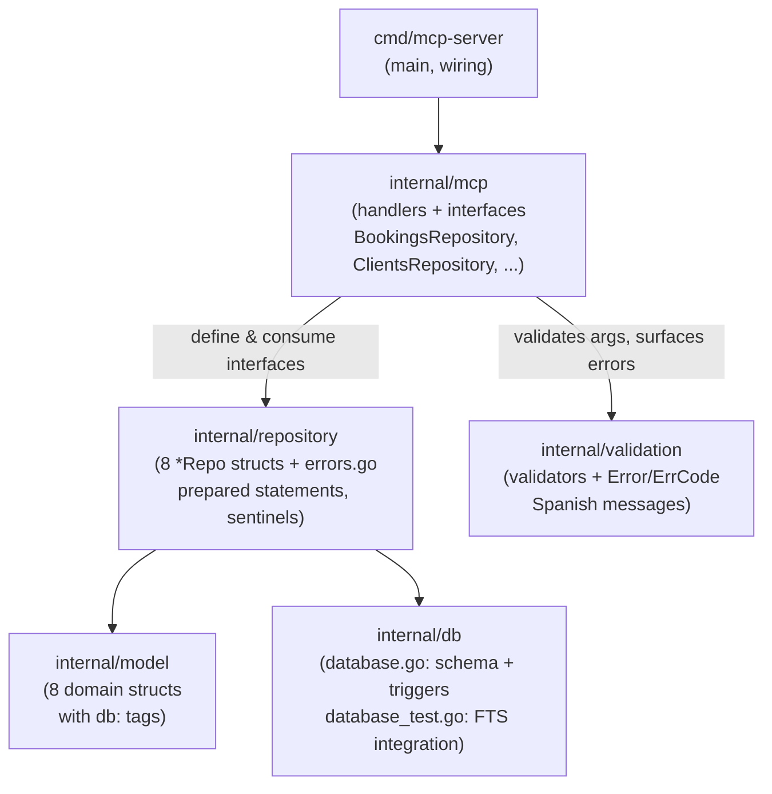
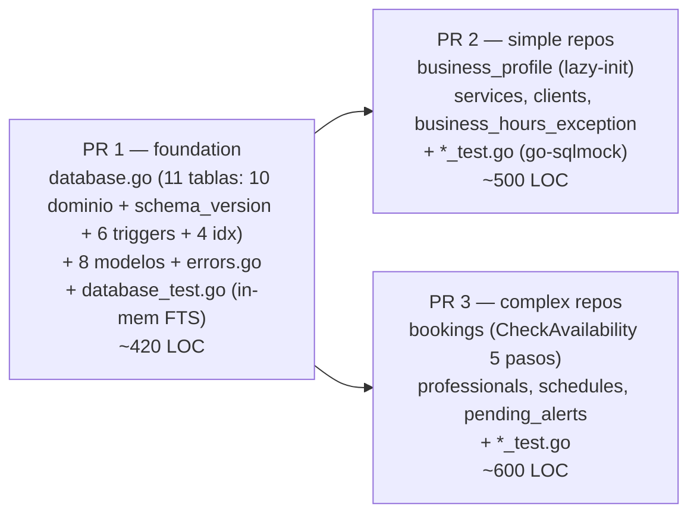
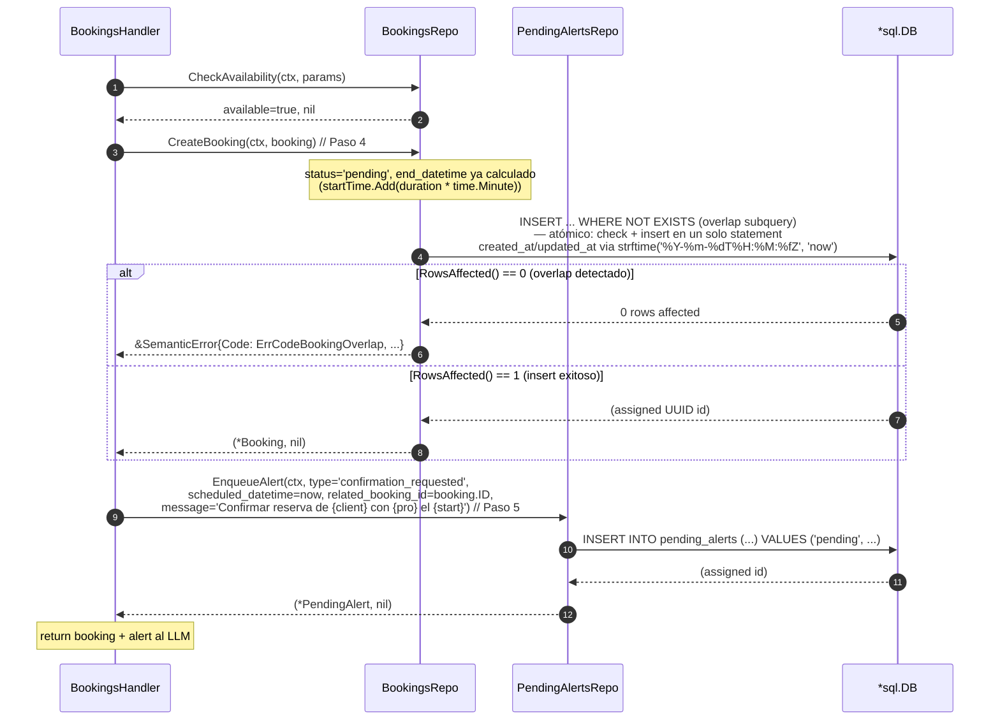

# Design: feat/db-layer

> Reference: `proposal.md`, `specs/<capability>/spec.md`, ADR-0006, ADR-0004, ADR-0005
> Change: feat-db-layer
> Status: Phase 4 of SDD (después de proposal, spec, design)

## Overview

`feat-db-layer` (Fase 1 del roadmap) extiende el esquema SQLite de **4 a 11 tablas**: 10 de dominio (PRD §3.7) + `schema_version` (tracking de migraciones), agrega **6 triggers FTS5** y **4 índices secundarios**, e introduce dos paquetes nuevos: `internal/model/` (8 structs) y `internal/repository/` (8 archivos `*_Repo.go` + 1 `errors.go` con sentinels y SemanticError = 9 archivos totales, con CRUD prepared-statement + la cadena `check_availability` de 5 pasos de PRD §3.7.13). El trabajo se reparte en **3 PRs encadenados** bajo el budget elevado de 600 líneas (obs 456). El diseño es el puente entre el **qué** (las 10 specs) y el **cómo** (las tasks): define la arquitectura de capas, los flujos de datos centrales, 12 decisiones arquitectónicas y el mapeo specs → tests que operará `sdd-tasks` y `sdd-apply`.

## Layer Architecture



Reglas de dependencia (no escritas, enforced por code review + `go vet`):
- `internal/db` no importa a `model`/`repository` (sólo `database/sql` + driver). Define el esquema, no los tipos.
- `internal/model` no importa a nadie (structs puros + `db:` tags).
- `internal/repository` importa `internal/model` y `internal/db` implícitamente vía `*sql.DB`.
- `internal/mcp` define las interfaces narrow de repositorios y las consume. No conoce `*Repo` concretos salvo en el wiring de `cmd/`.

## 3-PR Dependency Graph



Orden estricto: **PR 1 es un gate duro**. PR 2 y PR 3 dependen ambos del esquema nuevo (11 tablas + FKs + triggers). Si PR 1 se revierte, PR 2 y PR 3 quedan bloqueados hasta aterrizar un fix (ver Rollback Plan de la propuesta). PR 2 y PR 3 pueden mergearse en cualquier orden o juntos una vez aterrizado PR 1, porque son capas aisladas (`internal/repository/*`) que no se importan entre sí (salvo `bookings` que referencia `services`/`professionals`/`schedules` vía FK a nivel SQL, no vía Go imports).

## Data Flow: `check_availability` (cadena de 5 pasos)

El centerpiece de Fase 1. Diagrama de secuencia del happy path con el short-circuit en cada fallo.

```mermaid
sequenceDiagram
    autonumber
    participant Handler as internal/mcp<br/>BookingsHandler
    participant Repo as repository.BookingsRepo
    participant DB as *sql.DB (SQLite)

    Handler->>Repo: CheckAvailability(ctx, params)
    Note over Repo: Paso 1 — resolver service_id+duration, professional_id+status
    Repo->>DB: QueryRow: services WHERE id=? AND is_active=1
    DB-->>Repo: (duration_minutes, name) | ErrNotFound
    Repo->>DB: QueryRow: professionals WHERE id=? AND status='active'
    DB-->>Repo: (pro_name) | ErrNotFound
    Note over Repo: Paso 2 — end = start + duration_minutes (Go)
    Note over Repo: Paso 3a — business_hours_exception THEN business_hours JSON
    Repo->>DB: QueryRow: business_hours_exception WHERE exception_date=?
    alt excepcion with is_closed=1
        Repo-->>Handler: error: "el negocio está cerrado el {fecha} ({reason})."
        Note over Handler: stop chain (no 3b/3c/3d/3e)
    else no exception
        Repo->>DB: QueryRow: json_extract(business_hours, '$.<day>.open/close') WHERE id='singleton'
        DB-->>Repo: open_time, close_time | null open → cerrado
    end
    Note over Repo: Paso 3b — schedules WHERE professional_id=? AND day_of_week=?
    Repo->>DB: QueryRow: schedules
    alt no fila
        Repo-->>Handler: error: "el Profesional {name} no trabaja los {día}."
    end
    Note over Repo: Paso 3c — slot_end <= min(business_close, pro_end);<br/>slot_start >= max(business_open, pro_start)
    alt slot fuera de ventana
        Repo-->>Handler: error: "el servicio dura {n} minutos pero solo quedan {r} antes del cierre a las {close}."
    end
    Note over Repo: Paso 3d — overlap (usa end_datetime denormalizado, NO JOIN)
    Repo->>DB: QueryRow: SELECT 1 FROM bookings WHERE professional_id=? AND status!='cancelled' AND start_datetime < ?(end) AND end_datetime > ?(start) LIMIT 1
    alt overlap
        Repo-->>Handler: error: "el Profesional {name} ya tiene una reserva de {a} a {b}."
    end
    Note over Repo: Paso 3e — start_datetime > now (timezone-aware)
    alt en el pasado
        Repo-->>Handler: error: "no se puede reservar en el pasado."
    end
    Repo-->>Handler: (available=true, nil)
```

Notas de implementación que el diseño fija (las tasks las materializan):
- **Short-circuit al primer fallo**: la cadena es `if err := paso3a(); err != nil { return err }` encadenado. La spec "First failure wins" lo exige. No hay paralelización (ADR-0006 Decisión 5 lo rechazó por complejidad vs. el target p95 < 100 ms).
- **3a es siempre 2 queries** (excepción primero, JSON fallback). 3b/3c/3d/3e son 1 query cada uno. En el worst case, `check_availability` hace 6 `QueryRow`/`Query` secuenciales (Paso 1 son 2, Paso 3a son 2). Aceptable por ADR-0006.
- **3d no hace JOIN a `services`**: usa `bookings.end_datetime` denormalizado (Decisión 2). El SQL del PRD §3.7.13 3d es un range comparison `AND start_datetime < ? AND end_datetime > ?` con `status != 'cancelled'`. La comparación SQL de strings es correcta porque todos los valores `*_datetime` están normalizados como UTC ISO 8601 (orden lexicográfico = orden cronológico).
- **`end_datetime` se calcula en Go con `startTime.Add(time.Duration(service.DurationMinutes) * time.Minute)`** (Paso 2), no en SQL. `startTime` es el resultado de cargar la timezone con `loc, err := time.LoadLocation(business_profile.timezone)` (si `err != nil`, retornar error semántico), luego parsear `start_datetime` con `time.ParseInLocation(time.RFC3339, start_datetime, loc)`, y convertir a UTC. El `end_datetime` se almacena con formato `endTime.UTC().Format("2006-01-02T15:04:05.000Z")` (ISO 8601 UTC con milisegundos), donde `endTime` es el valor computado en Paso 2 (`startTime + duration`), NO `time.Now()`. Si `time.LoadLocation` falla (timezone IANA inválido), `CreateBooking` retorna `&SemanticError{Code: ErrCodeInternal, Message: "no se pudo cargar la zona horaria 'X': ..."}`.
- **`day_of_week` y `HH:MM` se derivan en Go** del `start_datetime` parseado. El repositorio carga la timezone con `loc, err := time.LoadLocation(business_profile.timezone)`, parsea `start_datetime` con `time.ParseInLocation(time.RFC3339, start_datetime, loc)`, obtiene `startTime`, y deriva `day_of_week` con `startTime.In(loc).Weekday()` y los `HH:MM` con `startTime.In(loc).Format("15:04")`. El storage no convierte (ver spec `schedules` Notes). **Decisión explícita**: si `business_profile.timezone == 'UTC'` (default de fresh install), el operador DEBE configurarlo a su timezone local antes de aceptar bookings (mitigación del R6 — se enforce en el handler de Fase 2+, pero el código del repo debe estar preparado para que `time.LoadLocation("UTC")` y la conversión den el día correcto para evitar el bug "wrong weekday" cuando el offset es distinto de 0).

## Data Flow: `create_booking` + `pending_alert` (Paso 4 + Paso 5)

Si `CheckAvailability` retorna `nil`, el handler invoca `CreateBooking` y, en la misma transacción conceptual (o llamada subsiguiente), `EnqueueAlert('confirmation_requested')`. Diagrama:



Decisión de diseño (actualizada por juicio 2026-06-25): `CreateBooking` es **atómico** — ejecuta un `INSERT ... WHERE NOT EXISTS (overlap subquery)` que checkea disponibilidad e inserta en un solo statement. Si `RowsAffected() == 0`, retorna `&SemanticError{Code: ErrCodeBookingOverlap, ...}` sin estado parcial. `CheckAvailability` es un "preview" no-autoritativo (ver Decisión 11). `EnqueueAlert` se ejecuta como llamada subsiguiente; **no** en una transacción SQL conjunta con `CreateBooking` en Fase 1. Motivo: el INSERT atómico ya garantiza la correctitud del slot, e insertar el alert es un write secuencial con timestamp `strftime('%Y-%m-%dT%H:%M:%fZ', 'now')`; el coste de una transacción explícita no aporta corrección en el modelo single-writer loopback. Si en Fase 2+ se introduce contención u ordenamiento, se envuelve en `db.BeginTx`. **Esto queda documentado como riesgo menor** (ver Open Questions).

## Key Architectural Decisions

### Decisión 1: Lazy-init para el singleton `business_profile`

**Contexto**: spec `business-profile` exige que un fresh install nunca devuelva empty result, y que un arranque sin llamar al repo (`SELECT` directo vía SQL) sí devolvería 0 filas. La propuesta confirmó con Kike (2026-06-25) que la init se hace en el repositorio, no en `initSchema`.

**Decisión**: `GetBusinessProfile(ctx)` hace `INSERT OR IGNORE INTO business_profile (id, name, ...) VALUES ('singleton', '', ...defaults...)` seguido de `SELECT * FROM business_profile WHERE id = 'singleton'`. Idempotente, self-healing.

**Alternativas rechazadas**: (a) eager-init en `initSchema` — acopla el schema con defaults del dominio y rompe la pureza de `internal/db`; (b) función `SeedBusinessProfile` separada que el caller invoca — requiere que el caller sepa cuándo llamarla, viola "todo acceso vía repo".

**Consecuencias**: la unicidad se garantiza por DOS constraints: (a) PK
`id TEXT PRIMARY KEY DEFAULT 'singleton'` evita dos filas con el mismo id;
(b) `CHECK (id = 'singleton')` rechaza cualquier INSERT con id distinto de
'singleton' (incluso si la PK no es la causa, e.g. un INSERT con id='otro').
El caveat "SELECT directo devuelve 0 filas" se acepta y se enforce por code
review (propuesta). Ventana TOCTOU bajo concurrencia: dos goroutines hacen
`INSERT OR IGNORE` (una gana, la otra no-op vía `IGNORE`), ambas llegan al
`SELECT` y leen la misma fila → seguro sin transacción explícita.

### Decisión 2: `bookings.end_datetime` desnormalizado (consistencia > frescura)

**Contexto**: spec `bookings` "end_datetime is denormalized" + ADR-0006 Decisión 3. El 3d overlap check es la hot path más frecuente.

**Decisión**: `end_datetime` se calcula en Go (Paso 2) como `start + duration_minutes` y se persiste. El 3d es un range comparison sin JOIN.

**Nota sobre comparación de datetimes**: todas las comparaciones de datetime ocurren en Go tras parsear a `time.Time` — **excepto** para overlap checks (3d), que usan comparación de rango de strings UTC ISO 8601 normalizados en SQL. La excepción cubre:
- El predicado atómico de overlap en el `INSERT ... WHERE NOT EXISTS` de `CreateBooking`
- El check 3d de overlap en `CheckAvailability`

En ambos casos, la comparación es segura porque todos los valores `*_datetime` están almacenados como strings UTC ISO 8601 normalizados (orden lexicográfico = orden cronológico). Para comparaciones timezone-aware (3a horario del negocio, 3c slot vs horario, 3e no en el pasado), el repositorio parsea a `time.Time` en Go y usa `time.Time.Before/After`.

**Alternativas rechazadas** (documentadas en ADR-0006): JOIN on read (hot path costosa), generated column (SQLite no referencia tablas externas), trigger que recompute al cambiar `services.duration_minutes` (complejidad, runtime cost).

**Consecuencias**: si `service.duration_minutes` cambia después de hecho un booking, ese booking conserva su `end_datetime` original. Trade-off aceptado (consistencia histórica > frescura). El reschedule recomputa `end_datetime` (spec scenario "Reschedule recomputes end_datetime").

### Decisión 3: Sync FTS5 vía triggers SQL, no código Go

**Contexto**: spec `services`/`clients` "FTS sync via SQL triggers" + ADR-0006 Decisión 4. Estado actual: FTS existe pero sin triggers → siempre 0 resultados (bug #1 de la foundation, obs 464).

**Decisión**: `database.go` define 6 triggers (`{clients,services}_fts_{ai,au,ad}`). El repositorio **nunca** escribe a `*_fts`. Naming con infix `_fts_` (confirmado por Kike, PRD §3.7.10).

**Alternativas rechazadas**: sync manual en Go (cada write del repo debería acordarse → frágil, bulk imports desincronizan), no sync (estado actual, bug).

**Consecuencias**: El repositorio es agnóstico al FTS — el código Go no cambia haya o no FTS. Los triggers son opacos para desarrolladores Go; mitigado por: doc verbatim en PRD §3.7.10, integration test en `database_test.go` (Decisión 6). `content_rowid='rowid'` (no `id`) para evitar fricción con tipos UUID TEXT vs INTEGER rowid (propuesta Risks).

### Decisión 4: Interfaces de repositorio definidas en el paquete consumidor

**Contexto**: spec `data-access` "Interfaces defined where they are consumed" — los handlers MCP dependen de `BookingsRepository` (narrow) y no de `*BookingsRepo` concreto. Patrón Go "Accept interfaces, return structs" (skill `golang-patterns` §Interface Design).

**Decisión**: las interfaces (`BookingsRepository`, `ClientsRepository`, `ServicesRepository`, etc.) viven en `internal/mcp` (el consumidor), no en `internal/repository`. Cada interface lista sólo los métodos que ese handler llama.

**Resolución del conflicto (post-R1)**: `internal/repository/doc.go` fue
borrado en el commit `7b7f1b3` (R1: opción C del juicio 2026-06-25). La spec
`data-access` queda como source of truth para el contrato de interfaces.

**Alternativas rechazadas**: interfaces en `repository` (acoplamiento: el repositorio define su propio contrato → consumidores no pueden recortarlo; además viola el patrón Go idiomático).

**Consecuencias**: `cmd/mcp-server` wirea `*repository.BookingsRepo` a `mcp.BookingsRepository` en el main. Facilita mocking en tests de handler (cuando existan, Fase 2+). El repository package queda "struct-returning, interface-agnostic".

### Decisión 5: Sentinels en `internal/repository/errors.go` — separados de `internal/validation`

**Contexto**: spec `data-access` "Sentinel errors in errors.go" exige `ErrNotFound`, `ErrConflict`, `ErrInvalidInput` usables con `errors.Is`. Existe `internal/validation` con `Error{Code, Message, Cause}` y mensajes en español (doc.go). Dos capas, dos audiencias.

**Decisión** (opción B confirmada por Kike el 2026-06-25): `internal/repository/errors.go` define **dos tipos**:
- **Sentinels Go-level** (`ErrNotFound`/`ErrConflict`/`ErrInvalidInput` como `errors.New`) — para control flow con `errors.Is` (CRUD: "no existe", "FK viola", "input inválido").
- **`SemanticError`** (struct con `Code ErrCode`, `Message string`, `Cause error`) — para errores de negocio del chain 3a-3e. `ErrCode` es un `type ErrCode string` con constantes como `ErrCodeBusinessClosed`, `ErrCodeProfessionalNotWorking`, `ErrCodeSlotOutOfHours`, `ErrCodeBookingOverlap`, `ErrCodeSlotInPast`, etc. (lista completa en la spec `data-access`).

El paquete `repository` **NO importa** `internal/validation`. La separación:
- `repository`: sentinels Go-level + `SemanticError{Code, Message, Cause}`. Standalone. Mensajes Spanish contextuales generados en la cadena `check_availability`.
- `validation` (paquete separado): input validation (formato de email, formato de hora), no errores de negocio.

El handler hace `errors.As(err, &sErr)` para extraer el `Code` y el `Message` y pasarlos al LLM en el formato MCP que corresponda. No hay traducción a `validation.Error` desde el handler.

**Alternativas rechazadas**:
- (a) `repository` importa `validation` — desacoplamiento cuestionable: el paquete "data" depende de un paquete "UI/messages".
- (c) `repository` devuelve `error` plain + un adapter convierte en el handler — más boilerplate, archivos extra, sin beneficio claro.

**Consecuencias**:
- El repository es **standalone y testeable** sin dependencias del paquete de validación.
- Los mensajes semánticos contextuales (3a-3e) son `*SemanticError`, no sentinels reusables.
- `errors.As(err, &sErr)` en el handler extrae `sErr.Code` (machine-readable) + `sErr.Message` (Spanish, contextual) directamente.
- Los tests de repo pueden usar `errors.As(err, &repoErr)` para verificar tipo + code + message en una sola assertion.
- Decisión documentada en spec `data-access` (nuevo Requirement 9: "Semantic error type for business domain errors").

### Decisión 6: Split de tests — `go-sqlmock` para CRUD, SQLite in-memory real para triggers FTS

**Contexto**: spec `data-access` "go-sqlmock for CRUD, real in-memory SQLite for FTS sync". `go-sqlmock` mockea el protocolo `database/sql`, no ejecuta SQL → no simula efectos de trigger.

**Decisión**:
- `internal/repository/*_test.go`: `go-sqlmock` (table-driven, ExpectQuery/ExpectExec). Cubre CRUD, validation paths, sentinels, ≥80% coverage.
- `internal/db/database_test.go`: real `sql.Open("sqlite", ":memory:")` + `initSchema`. Cubre triggers FTS (INSERT/UPDATE/DELETE mantienen `clients_fts`/`services_fts` sincronizados) + tabla `schema_version`.

**Alternativas rechazadas**: 100% go-sqlmock (no prueba triggers — lafeature Fisheries de ADR-0006 Decisión 4), 100% SQLite in-memory (lento, mock less structured, no testing de contract SQL).

**Consecuencias**: único lugar que requiere el driver real en tests es `internal/db/database_test.go`. Esta es la única desviación documentada del patrón "100% go-sqlmock" (propuesta Consecuencias negativas).

### Decisión 7: PR 1 como gate duro — orden estricto del chain

**Contexto**: propuesta Rollback Plan + budget 600. PR 2 y PR 3 importan el esquema nuevo (FKs, triggers, tipos).

**Decisión**: PR 1 (foundation) **debe** mergear antes. PR 2 y PR 3 pueden ir en cualquier orden o juntos después, pero nunca solos.

**Alternativas rechazadas**: (a) un único PR de ~1800 LOC → rompe el Review Workload Guard (budget 600); (b) PR 2/3 sin PR 1 (esquema viejo no cumple) → no compila.

**Consecuencias**: si PR 1 necesita revertirse post-merge, PR 2 y PR 3 quedan blocked hasta fix. Aceptable: estado pre-release, sin datos de usuario (propuesta). El Review Workload Guard se aplica por PR individual: PR 1 ~420 LOC (< 600 ✓), PR 2 ~500 LOC (< 600 ✓), PR 3 ~600 LOC (= 600, en el borde — ver riesgo).

### Decisión 8: `schema_version` en PR 1, sin runner de migraciones

**Contexto**: spec `schema-version` + propuesta "Schema version + estrategia de migración". Fase 1 introduce la tabla para tracking; el runner incremental es Fase 2+.

**Decisión**: `database.go` crea `schema_version` y en el primer arranque inserta fila `(version=1, 'initial schema: 10 domain tables per PRD §3.7 + schema_version + 6 FTS sync triggers + 4 secondary indexes')`. `initSchema` usa la presencia de esa fila como señal de "ya inicializado" → idempotente (`CREATE TABLE IF NOT EXISTS` + `INSERT ... WHERE NOT EXISTS` style).

**Alternativas rechazadas**: introducir un runner de migraciones en Fase 1 (over-engineering para base sin datos — propuesta rechazó explícitamente).

**Consecuencias**: el costo es ~5 LOC en Fase 1. El beneficio es estructural: cuando Fase 2+ agregue columnas/tablas, el patrón versionado ya está (ver Migration Strategy). El `INSERT` de v1 puede ser `INSERT OR IGNORE` para idempotencia sin leer primero.

### Decisión 9 (añadida): 4 índices secundarios — qué y por qué

**Contexto**: propuesta menciona "4 índices secundarios" pero las specs los dispersan. Diseño los consolida.

**Decisión**: los 4 índices secundarios son:
1. `business_hours_exception(exception_date)` UNIQUE — sirve 3a lookup O(log n), también enforce unicidad (spec `business-hours-exception`).
2. `schedules(professional_id, day_of_week)` UNIQUE — sirve 3b lookup + enforce una fila por (pro, día) (spec `schedules`).
3. `bookings(professional_id, start_datetime, end_datetime)` — sirve el overlap check (Paso 3d) y la agenda del profesional. El overlap query filtra por `professional_id` y compara rangos; el index cubre el leading prefix `(professional_id, start_datetime)`.
4. `pending_alerts(scheduled_datetime, status)` — sirve `ListPending` index-served sin full scan (spec `pending-alerts` "Secondary index on (scheduled_datetime, status)").

**Rationale**: cada uno soporta un query hot del flujo de reservas o de la cola de alertas. No se agregan índices sobre FKs porque SQLite no los requiere para integridad y los FKs de `bookings` no son hot-path de search.

### Decisión 10 (añadida): `initSchema` es all-or-nothing en idempotencia, no transaccional

**Contexto**: spec `schema-version` scenario "InitSchema Failure Mid-Way" exige que re-ejecutar tras fallo parcial deje estado consistente.

**Decisión**: `initSchema` usa **todos** `CREATE TABLE IF NOT EXISTS` + `CREATE TRIGGER IF NOT EXISTS` + `CREATE INDEX IF NOT EXISTS`. Si falla a mitad, el re-intento salta los ya creados y completa los faltantes. `schema_version` se crea **al final** del batch exitoso como "commit marker".

**Alternativas rechazadas**: envolver todo en `BEGIN TRANSACTION`/`COMMIT` — algunos DDL de SQLite (especialmente FTS5 virtual tables y triggers) tienen comportamiento transaccional limitado y agrega complejidad sin valor en estado pre-release.

**Consecuencias**: simple, cumple el scenario de la spec. El "rollback de un CREATE fallido" no ocurre; en su lugar, el re-intento es idempotente. Documentado en `database.go` package-level comment si GGA lo permite.

### Decisión 11 (añadida por juicio 2026-06-25): `CreateBooking` es atómico, `CheckAvailability` es preview

**Contexto**: el design original hacía `CheckAvailability` + `CreateBooking` como dos
llamadas separadas. El juicio del 2026-06-25 (C3) identificó que esto permite una
race condition: dos requests concurrentes pueden pasar ambas el check y luego
insertar bookings que se solapan, violando PRD O3.

**Decisión**: `CreateBooking` es la fuente de verdad de availability. Implementa
un único `INSERT ... WHERE NOT EXISTS (overlap subquery)` atómico. Si
`RowsAffected() == 0`, retorna `&SemanticError{Code: ErrCodeBookingOverlap, ...}`
sin estado parcial. `CheckAvailability` se mantiene como un método de
"preview" no-autoritativo — útil para que el LLM pregunte "¿está libre?"
antes de pedirle al usuario que confirme, pero el resultado es informativo,
no garantiza el slot. La garantía real viene del INSERT atómico.

**Alternativas rechazadas**:
- (a) `db.BeginTx()` envolviendo check + insert — funciona pero lockea durante
  la transacción y agrega ~10 LOC de boilerplate.
- (b) Usar `db.BeginTx()` con `SET TRANSACTION` y lock explícito — más robusto
  pero innecesario dado que SQLite serializa writes a nivel de statement.
- (c) Documentar la race como limitación MVP — viola PRD O3, inaceptable para
  un sistema de reservas.

**Consecuencias**: el SQL de `CreateBooking` es más complejo (subquery) pero
la correctitud está garantizada. Los tests de la spec `bookings` ahora cubren
tanto el camino feliz (no overlap → RowsAffected=1) como el overlap (→ RowsAffected=0
+ error). `CheckAvailability` se mantiene como utilidad pero su rol cambia de
"autoritativo" a "preview".

**Por qué SQLite previene la race**: SQLite es single-writer — las
operaciones de escritura se serializan. Cuando dos goroutines hacen
`CreateBooking` simultáneamente, una adquiere el write lock primero; su
INSERT ejecuta (incluyendo el subquery de overlap) y se confirma. La
segunda goroutine espera el lock, luego su INSERT ejecuta y su subquery
ve el booking recién insertado de la primera goroutine (porque SQLite
serializa a nivel de statement), por lo que el WHERE NOT EXISTS falla y
RowsAffected es 0. Por eso el INSERT atómico + SQLite single-writer
garantizan 0 colisiones sin transacción explícita.

**Asunción explícita sobre validaciones**: si el caller (MCP handler) llama
`CreateBooking` directamente sin antes llamar `CheckAvailability`, las
validaciones de 3a (horario del negocio), 3b (profesional trabaja), 3c
(slot cabe en horario) y 3e (no en el pasado) NO se ejecutan. Solo el
overlap check (3d) se ejecuta atómicamente vía el `INSERT ... WHERE NOT
EXISTS`. Esto es aceptable en Fase 1 (loopback, single-writer) pero Fase 2+
debería mover esas validaciones dentro de `CreateBooking` para que sean
obligatorias.

### Decisión 12 (añadida por juicio 2026-06-25): Singleton de `business_profile` enforced con CHECK constraint

**Contexto**: el spec `business-profile` exige que un INSERT de una segunda fila
falle. El schema `id TEXT PRIMARY KEY DEFAULT 'singleton'` solo setea el default;
un INSERT con `id='otro'` pasaría. El juicio del 2026-06-25 (C6) lo identificó.

**Decisión**: agregar `CHECK (id = 'singleton')` al schema de `business_profile`.
Combinado con la PK, la garantía es enforced a nivel DB:
- PK evita dos filas con el mismo id
- CHECK evita que cualquier id distinto de `'singleton'` sea aceptado

```sql
CREATE TABLE business_profile (
    id TEXT PRIMARY KEY DEFAULT 'singleton',
    -- ... otras columnas ...
    CHECK (id = 'singleton')
);
```

**Alternativas rechazadas**:
- (b) Confiar en la convención "todo acceso vía repo" — defensa débil; un INSERT
  directo vía SQL (script de mantenimiento, debug) la rompe.

**Consecuencias**: la spec `business-profile` ya cubre este comportamiento en el
scenario "Direct INSERT of a second row fails" — el CHECK lo hace efectivo a
nivel SQL. El test del spec puede usar `ExpectExec` con el constraint violated
y verificar que retorna `ErrConflict`.

## Test Mapping

Tabla operativa para `sdd-tasks` y `sdd-apply`. Cada scenario de spec → archivo de test + estrategia.

| Spec | Scenario | Test file | Strategy |
|---|---|---|---|
| `schema-version` | First-Run Creation | `internal/db/database_test.go` | SQLite in-memory real |
| `schema-version` | Subsequent Run Idempotent | same | same |
| `schema-version` | Version 1 Row Inserted | same | same |
| `schema-version` | Multiple InitSchema Calls | same | same |
| `business-profile` | First-Run Creation (lazy-init) | `internal/repository/business_profile_test.go` | go-sqlmock (ExpectExec INSERT OR IGNORE + ExpectQuery SELECT) |
| `business-profile` | Re-invocation no dup | same | go-sqlmock |
| `business-profile` | Two simultaneous first calls | same | go-sqlmock (sequential ExpectExec, race detector smoke) |
| `business-profile` | JSON business_hours round-trip | same | go-sqlmock |
| `business-profile` | Defaults applied on first insert | same | go-sqlmock |
| `business-profile` | Messenger fields location | `internal/db/database_test.go` | SQLite in-memory (PRAGMA table_info) |
| `business-hours-exception` | Duplicate date fails | `internal/repository/business_hours_exception_test.go` | go-sqlmock (ExpectExec returns UNIQUE err → wrapped ErrConflict) |
| `business-hours-exception` | open_time < close_time validation | same | go-sqlmock + app-level validation |
| `business-hours-exception` | Exception overrides JSON (checked via bookings 3a scenario) | `internal/repository/bookings_test.go` | go-sqlmock |
| `professionals` | UUID auto-assigned | `internal/repository/professionals_test.go` | go-sqlmock |
| `professionals` | GetActive filters status | same | go-sqlmock |
| `professionals` | Specialty to unknown service rejected | same | go-sqlmock (expect sub-query returns 0) |
| `professionals` | No hard-delete method | (static: contract review) | n/a — interface narrowness enforced at design |
| `schedules` | UNIQUE(professional_id, day_of_week) | `internal/repository/schedules_test.go` | go-sqlmock (UNIQUE err → ErrConflict) |
| `schedules` | day_of_week range 0..6 | same | app-level validation unit test |
| `schedules` | HH:MM format + start<end | same | same |
| `services` | duration_minutes > 0 | `internal/repository/services_test.go` | go-sqlmock + validation |
| `services` | ListActive filter | same | go-sqlmock |
| `services` | FTS sync INSERT/UPDATE/DELETE | `internal/db/database_test.go` | **SQLite in-memory real** (Decisión 6) |
| `services` | SearchFTS ranked | `internal/repository/services_test.go` | go-sqlmock (expect MATCH query) |
| `services` | Malformed FTS query rejected | same | go-sqlmock + sanitize helper unit |
| `clients` | phone UNIQUE → ErrConflict | `internal/repository/clients_test.go` | go-sqlmock |
| `clients` | GetOrCreate idempotent | same | go-sqlmock |
| `clients` | No messenger columns | `internal/db/database_test.go` | SQLite in-memory (PRAGMA table_info) |
| `clients` | FTS sync INSERT/UPDATE/DELETE | `internal/db/database_test.go` | SQLite in-memory real |
| `clients` | SearchFTS ranked | `internal/repository/clients_test.go` | go-sqlmock |
| `bookings` | Table named bookings (no appointments) | `internal/db/database_test.go` | SQLite in-memory (sqlite_master) |
| `bookings` | FK violations (client/pro/service bogus) → ErrConflict | `internal/repository/bookings_test.go` | go-sqlmock (FK err) |
| `bookings` | end_datetime computed at insert | same | go-sqlmock |
| `bookings` | Reschedule recomputes end | same | go-sqlmock |
| `bookings` | Overlap uses stored end_datetime | same | go-sqlmock (expect query without JOIN) |
| `bookings` | Status FSM transitions | same | go-sqlmock table-driven (pending→confirmed, →cancelled, rejected) |
| `bookings` | 3a — closed by exception | same | go-sqlmock (sub-test, expect early return) |
| `bookings` | 3a — closed by JSON null | same | go-sqlmock |
| `bookings` | 3b — pro not working weekday | same | go-sqlmock |
| `bookings` | 3c — slot exceeds window | same | go-sqlmock |
| `bookings` | 3d — overlap (and ignores cancelled) | same | go-sqlmock |
| `bookings` | 3e — past slot | same | go-sqlmock |
| `bookings` | Happy path all 5 pass | same | go-sqlmock (5 sequential ExpectQuery) |
| `bookings` | First failure wins (3a beats 3d) | same | go-sqlmock (assert 3d never executed) |
| `pending-alerts` | Default status pending | `internal/repository/pending_alerts_test.go` | go-sqlmock |
| `pending-alerts` | ListPending filters status+scheduled, ASC, LIMIT | same | go-sqlmock (ExpectQuery ORDER BY + LIMIT) |
| `pending-alerts` | MarkAsSent idempotent + cancelled behavior | same | go-sqlmock (documented godoc choice) |
| `pending-alerts` | type allowlist | same | app-level validation unit |
| `pending-alerts` | idx exists | `internal/db/database_test.go` | SQLite in-memory (PRAGMA index_list) |
| `data-access` | ctx.Context first param | (static review per PR) | n/a |
| `data-access` | Prepared statements `?` only | (static review via lint) | n/a |
| `data-access` | errors.Is works on sentinels | `internal/repository/errors_test.go` | unit (errors.Is) |
| `data-access` | Coverage ≥80% | `go test -cover ./internal/repository/...` | report (in PR description) |
| `data-access` | No os.Getenv for MCP_BIND/MCP_PORT | (static search per PR) | grep gate |

## Error Propagation Pattern

Cómo fluyen los errores del repositorio al LLM, respetando AGENTS.md ("no stack traces to LLM", mensajes semánticos en español) y la Decisión 5 (`repository` standalone, sin import de `validation`):

```
[internal/repository/bookings.go — CheckAvailability]
  3a fails → return fmt.Errorf("check_availability 3a: %w",
                 &SemanticError{
                     Code:    ErrCodeBusinessClosed,
                     Message: fmt.Sprintf("el negocio está cerrado el %s (%s)", fecha, reason),
                 })
  FK violated → return fmt.Errorf("create booking: %w", ErrConflict)
  not found   → return fmt.Errorf("get booking %s: %w", id, ErrNotFound)

[internal/mcp/handlers/bookings.go]
  err := repo.CheckAvailability(ctx, params)
  if err != nil {
      var sErr *SemanticError
      if errors.As(err, &sErr) {
          // sErr.Code + sErr.Message listos para el LLM (Spanish, contextual)
          log.Printf("[mcp] check_availability code=%s: %s", sErr.Code, sErr.Message)  // server-side
          return mcpErrorFromSemantic(sErr)  // wraps in MCP error format
      }
      if errors.Is(err, ErrNotFound) {
          return mcpNotFoundError()  // genérico
      }
      // fallback: nunca expone %v del error wrapped
      log.Printf("[mcp] unexpected: %+v", err)  // server-side only
      return mcpInternalError()  // never exposes wrapped error to LLM
  }
```

Propiedades garantizadas (specs `data-access` + AGENTS.md + Decisión 5):
- **Cada error se wrappa con `fmt.Errorf("...: %w", err)`** en cada capa.
- **El LLM nunca ve stack trace**: `sErr.Message` es Spanish plano; `sErr.Cause` queda server-side.
- **Dos canales**:
  - **Sentinels Go** (`ErrNotFound`/`ErrConflict`/`ErrInvalidInput`) para control flow con `errors.Is` (CRUD).
  - **`*SemanticError{Code, Message, Cause}`** para errores de negocio del chain 3a-3e. Extraído con `errors.As`.
- **Mensajes de la cadena 3a-3e**: van directo como `*SemanticError` (Decisión 5) porque son semánticos contextuales, no sentinels reusables.

## Migration Strategy (Forward-Looking, Fase 2+)

Documentación del patrón **planeado**, no contrato. Fase 1 sólo crea `schema_version` + fila v1; el runner es Fase 2+.

Sketch del patrón futuro (cuando se agregue la primera migración):

```go
// internal/db/migrate.go — Fase 2+ (NO en Fase 1)
func Migrate(ctx context.Context, db *sql.DB) error {
    current, err := getCurrentVersion(ctx, db)   // SELECT MAX(version) FROM schema_version → 1 en Fase 1
    if err != nil { return fmt.Errorf("migrate get version: %w", err) }
    target := latestVersion                       // 2 cuando Fase 2 agregue algo
    for v := current + 1; v <= target; v++ {
        if err := runMigration(ctx, db, v); err != nil {
            return fmt.Errorf("migrate to v%d: %w", v, err)
        }
        if _, err := db.ExecContext(ctx,
            "INSERT INTO schema_version (version, description) VALUES (?, ?)",
            v, migrationDescription(v)); err != nil {
            return fmt.Errorf("migrate record v%d: %w", v, err)
        }
    }
    return nil
}
```

Notas:
- En Fase 1, `initSchema` inserta v1 directamente (Decisión 8). `Migrate` no existe.
- Fase 2+ inserta **nuevas filas** (una por migración) — no UPDATE — preservando el historial `applied_at`.
- El boundary "destructive replace" se mantiene en Fase 1 (sin datos de usuario); a partir del primer release público, `initSchema` debe dejar de DROP/CREATE y delegar a `Migrate` (decisión Fase 2+).

## Open Questions / Risks

- **R1 — Conflicto con `internal/repository/doc.go`** ✅ **RESUELTO el 2026-06-25**: el placeholder de foundation fue borrado (`git rm internal/repository/doc.go`) como parte de este ajuste. La spec `data-access` queda como source of truth ("interfaces defined in the consumer package"). El PR 1 de Fase 1 no necesita tocar este archivo porque ya no existe. El design asume la ausencia del file.
- **R2 — PR 3 está en el borde del budget (≈600 LOC)**: `bookings.go` solo es ≈200 LOC (CRUD + 5-step chain). Si la implementación creep a 650 LOC, se dispara `ask-on-risk` (auto-forecast). **Guidance para `sdd-tasks`**: prever un slice opcional dentro de PR 3, e.g., `bookings`-CRUD (CreateBooking, GetBooking, CancelBooking, RescheduleBooking) como task inicial, y `CheckAvailability` (la cadena de 5 pasos) como task final. Si el forecast total de PR 3 supera 600, se mergea solo el slice de CRUD y el slice de `CheckAvailability` queda en un PR 3b (segundo slot del chain). La spec no cambia; el código se entrega en 2 sub-PRs.
- **R3 — Tests de triggers requieren JSON1 + FTS5 con `modernc.org/sqlite`**: smoke test en `database_test.go` debe assert que `SELECT json_extract('{"a":1}', '$.a')` y `SELECT fts5(?)` están disponibles antes de los casos, sino `t.Skip("driver no soporta JSON1/FTS5")` claro y con link al issue. **Guidance para `sdd-tasks`**: PR 1 incluye este smoke test como primer test del file, antes de los tests de triggers FTS. Si la CI (Fase 5+) usa el driver `modernc.org/sqlite` puro (sin CGo), no hay riesgo — `modernc.org/sqlite` v1.53+ trae JSON1 y FTS5 compilados.
- **R4 — TOCTOU en lazy-init de singleton**: dos goroutines haciendo `INSERT OR IGNORE` + `SELECT` — la spec "Two simultaneous first calls" exige 1 fila al final y ambas devuelvan la misma. Bajo `INSERT OR IGNORE` una gana (insert), la otra no-op; ambas hacen `SELECT` → misma fila. **Test**: `go-sqlmock` sequential ExpectExec + ExpectQuery ×2, más un smoke `go test -race`. No requiere transacción. Documentar en godoc de `GetBusinessProfile`.
- **R5 — `CreateBooking` + `EnqueueAlert` no son transaccionales en Fase 1**: si `EnqueueAlert` falla después de un `CreateBooking` exitoso, queda un booking sin alerta. Aceptable en Fase 1 (loopback, single-writer, sin órden estricto). Fase 2+ debería envolver en `db.BeginTx`. Documentado arriba en el data flow.
- **R6 — `day_of_week` y `HH:MM` derivación de timezone**: `business_profile.timezone` puede ser `'UTC'` en fresh install (default). Si el owner no configura su timezone, los `start_datetime` con offset `-03:00` derivarían `day_of_week` de la fecha UTC, no local → potencial bug de "wrong weekday". **Mitigación en este design (Decisión que el `CheckAvailability` debe implementar)**: el código del repo debe cargar la timezone con `loc, _ := time.LoadLocation(business_profile.timezone)` y luego parsear `start_datetime` con `time.ParseInLocation(..., loc)`, derivando `day_of_week`/`HH:MM` del resultado (no de UTC). Si el operador nunca configura `timezone`, sigue siendo UTC y el bug existe — pero el código está preparado. **Guidance para `sdd-tasks`**: PR 3 incluye un test que valida este caso con `timezone='America/Argentina/Buenos_Aires'` y un `start_datetime` con offset `-03:00` que cruza medianoche UTC (e.g., `2026-06-25T23:00:00-03:00` = `2026-06-26T02:00:00Z` → debe resolver a `jueves 23:00` local, no `viernes 02:00` UTC).
- **R7 — `repository` ↔ `validation`** ✅ **RESUELTO el 2026-06-25**: opción B elegida por Kike. `repository` define su propio `SemanticError{Code, Message, Cause}` con `ErrCode` como typed string constant. No import de `validation`. Spec `data-access` actualizada con un nuevo Requirement 9. Decisión 5 del design reescrita. Tests usan `errors.As(err, &repoErr)` directamente.

## Integración con `feat-authorization` (Fase 0 antes de PR 3)

> **Actualizado el 2026-06-29**: el change `feat-authorization` (Fase 0 del roadmap) introduce la capa de autorización **antes** de PR 3. Cuando PR 3 de este change se implemente, los 4 repos complejos van a consumir el `auth.Caller` propagado por `context.Context`. Las decisiones de diseño que aplican son:

- **Caller en `internal/auth/`** (no en `internal/model/`): el caller es context-flow state, no un entity persistido. Los repos importan `internal/auth` para acceder al `Caller` via `auth.FromContext(ctx)`.
- **3 capas de enforcement**:
  - **Coarse-grained (middleware, Fase 2)**: rechaza tool calls con `401` (unauthenticated) o `403` (forbidden role).
  - **Medium-grained (repos)**: cada método chequea `caller.Role` y filtra por `caller.ProfessionalID` (staff) o `caller.ClientID` (client). Errores con sentinels existentes (`ErrUnauthenticated`, `ErrNotFound` para cross-tenant; el `403 Forbidden` se maneja a nivel HTTP middleware, no como Go sentinel).
  - **Fine-grained (SQL)**: `WHERE professional_id = ?` para staff, `WHERE client_id = ?` para client, sin filtro para admin.
- **Por método de PR 3**:
  - **`ProfessionalsRepo`** (Task 3.1): admin-only para `Create`/`Update`. Un staff puede `Get` (ver staff colegas) pero no modificar.
  - **`SchedulesRepo`** (Task 3.2): admin-only para `Upsert`/`Delete`. Un staff puede `Get` para ver su propio schedule (filtrar por `caller.ProfessionalID`).
  - **`PendingAlertsRepo`** (Task 3.3): admin-only.
  - **`BookingsRepo`** (Task 3.4): `CreateBooking`/`RescheduleBooking`/`CancelBooking` son client-only (filtra por `caller.ClientID`). `GetBooking`/`ListMyBookings` filtran por `caller.ClientID` para client, `caller.ProfessionalID` para staff, full para admin.
  - **`CheckAvailability`** (Task 3.5): el caller es **siempre un client**. No cambia la lógica del chain 3a-3e, pero el caller.id se usa para validar que el slot es para el cliente correcto.
- **`*SemanticError` no cambia**: la cadena 3a-3e sigue devolviendo `*SemanticError{Code, Message, Cause}` al LLM. El caller context es ortogonal al chain de validaciones.
- **FK faltante en `accounts.professional_id`** (R3 de `feat-authorization` design): PR 3 va a consumir `caller.ProfessionalID` para filtrar Bookings. La falta de FK explícita a `professionals.id` no es bloqueante (los repos de PR 3 validan in-use), pero debe documentarse en cada task que use el campo.

Ver `openspec/changes/feat-authorization/design.md` para los detalles completos del auth context (Caller struct, CallerResolver, AuthMiddleware).

## References

- `openspec/changes/feat-db-layer/proposal.md` (commit `7d0dc77`)
- `openspec/changes/feat-db-layer/specs/<capability>/spec.md` (commits `29f1d9b`, `5b13740`) — todas las 10 capabilities
- `docs/PRD.md` §3.7 (esquema 10 tablas de dominio + `schema_version`), §3.7.10 (6 triggers FTS + naming triggers), §3.7.13 (cadena 5 pasos)
- `docs/architecture/0006-data-model-and-reservations.md` (ADR-0006 — 5 decisiones)
- `docs/architecture/0004-naming-conventions.md` (ADR-0004)
- `docs/architecture/0005-optional-external-tools.md` (ADR-0005)
- `docs/architecture/0007-server-config.md` (ADR-0007)
- engram obs 452 (contexto), 453 (testing-capabilities), 456 (preflight/budget 600), 464 (project state + 12 gaps)
- Skills cargadas: `_shared/openspec-convention.md`, `.agents/skills/golang-patterns/SKILL.md`, `.agents/skills/golang-testing/SKILL.md`