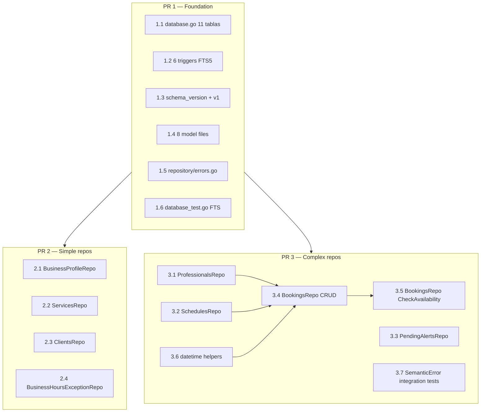

# Tasks: feat/db-layer

> Reference: `proposal.md`, `specs/<capability>/spec.md`, `design.md`, ADR-0006
> Change: feat-db-layer
> Status: Phase 5 of SDD (proposal, spec, design, tasks)
> Cap: 600 lines/PR (elevated for Fase 1; 400 for Fases 2-5)

## Overview

Fase 1 extiende la base SQLite de 4 a 11 tablas (10 de dominio + `schema_version`), agrega 6 triggers FTS5 y construye la capa de repositorio con TDD estricto. El trabajo se divide en **3 PRs encadenados**: PR 1 fundacional (esquema + modelos + sentinels + integración FTS), PR 2 repositorios simples y PR 3 repositorios complejos, encabezados por `BookingsRepo` con la cadena `check_availability` de 5 pasos. PR 1 es gate duro; PR 2 y PR 3 dependen de él y pueden mergearse en cualquier orden una vez aterrizado PR 1.

## Forecast

| PR | Scope | Forecasted LOC | Tasks |
|---|----|----:|----:|
| **1** | foundation (schema + models + sentinels + FTS integration test) | ~420 | 1.1–1.6 |
| **2** | simple repos (BusinessProfile, Services, Clients, BusinessHoursException) | ~500 | 2.1–2.4 |
| **3** | complex repos (Bookings with CheckAvailability, Professionals, Schedules, PendingAlerts) | ~600 | 3.1–3.7 |
| **Total** | | **~1520** | 14 |

## Dependency graph



Dentro de cada PR las tareas son principalmente seriales. PR 2 y PR 3 dependen de PR 1. Dentro de PR 3, `BookingsRepo` CRUD (3.4) necesita que existan `ProfessionalsRepo` (3.1), `SchedulesRepo` (3.2) y los helpers de datetime (3.6); `CheckAvailability` (3.5) depende del CRUD de bookings.

## Repository method signatures (reference)

```go
// En internal/repository/errors.go
type ErrCode string

const (
    ErrCodeBusinessClosed         ErrCode = "BUSINESS_CLOSED"
    ErrCodeProfessionalNotWorking ErrCode = "PROFESSIONAL_NOT_WORKING"
    ErrCodeSlotOutOfHours         ErrCode = "SLOT_OUT_OF_HOURS"
    ErrCodeBookingOverlap         ErrCode = "BOOKING_OVERLAP"
    ErrCodeSlotInPast             ErrCode = "SLOT_IN_PAST"
    ErrCodeNotFound               ErrCode = "NOT_FOUND"
    ErrCodeConflict               ErrCode = "CONFLICT"
    ErrCodeInvalidInput           ErrCode = "INVALID_INPUT"
    ErrCodeInternal               ErrCode = "INTERNAL"
)

type SemanticError struct {
    Code    ErrCode
    Message string
    Cause   error
}

// CheckAvailability input
type CheckAvailabilityParams struct {
    ServiceID      string
    ProfessionalID string
    StartDatetime  string  // RFC3339, will be parsed to time.Time in business_profile.timezone
}

// CheckAvailability output
type CheckAvailabilityResult struct {
    Available bool
    Reason    string  // populated when Available == false
}

// CreateBooking input
type CreateBookingInput struct {
    ClientID       string
    ProfessionalID string
    ServiceID      string
    StartDatetime  string  // RFC3339
    Notes          string
    PaymentMethod  string
    // end_datetime is COMPUTED in the repo, not caller-provided
}

// CreateBooking output
type CreateBookingResult struct {
    Booking  *model.Booking  // with id, end_datetime, created_at, updated_at set
}
```

## PR 1 — Foundation (schema + models + sentinels + FTS integration)

### Task 1.1 — Rewrite `internal/db/database.go` to the 11-table schema

- **Files**:
  - `internal/db/database.go` (rewrite; ~150 LOC)
- **Spec scenarios satisfied**:
  - `schema-version` "First-Run Creation", "Subsequent Run Is Idempotent", "Version 1 Row Inserted"
  - `business-profile` schema reference
  - `business-hours-exception` schema reference
  - `professionals` schema reference
  - `schedules` schema reference
  - `services` schema reference
  - `clients` schema reference
  - `bookings` schema reference
  - `pending-alerts` schema reference
- **Key changes from current `database.go`** (per ADR-0004, ADR-0006, design Decisión 11/12):
  - `appointments` → `bookings` (rename)
  - `duration_mins` → `duration_minutes` (rename)
  - `start_time`/`end_time` → `start_datetime`/`end_datetime` (only in `bookings`)
  - Add columns: `bookings.professional_id` (FK), `bookings.notes`, `bookings.payment_method`, `bookings.end_datetime` (stored denorm), `clients.preferences`, `services.description`
  - Move: `messenger_platform`, `messenger_id` from `clients` to `business_profile`
  - IDs (per tabla, ver PRD §3.7 y Decisión 12):

    | Tabla | PK | Default | Notas |
    |---|---|---|---|
    | `business_profile` | `TEXT` | `'singleton'` | Singleton (ver Decisión 12) |
    | `business_hours_exception` | `INTEGER` (AUTOINCREMENT) | — | Surrogate key |
    | `clients` | `TEXT` (UUID v4) | — | Generado por repo |
    | `services` | `TEXT` (UUID v4) | — | Generado por repo |
    | `professionals` | `TEXT` (UUID v4) | — | Generado por repo |
    | `bookings` | `TEXT` (UUID v4) | — | Generado por repo |
    | `pending_alerts` | `INTEGER` (AUTOINCREMENT) | — | Surrogate key |
    | `schedules` | `INTEGER` (AUTOINCREMENT) | — | Surrogate key |
    | `schema_version` | `INTEGER` | — | Es el número de versión |

  - Índices secundarios (4 en total, per §3.7.11):
    - `business_hours_exception(exception_date)` UNIQUE — sirve 3a lookup O(log n)
    - `schedules(professional_id, day_of_week)` UNIQUE — sirve 3b lookup + enforce unicidad
    - **`bookings(start_datetime, professional_id, client_id)`** — sirve overlap check (3d) y agenda del cliente
    - `pending_alerts(scheduled_datetime, status)` — sirve `ListPending` index-served
  - Timestamps: `DATETIME` → `TEXT NOT NULL DEFAULT (strftime('%Y-%m-%dT%H:%M:%fZ', 'now'))`
  - `business_profile`: add `CHECK (id = 'singleton')` constraint (per Decisión 12)
  - Refactorizar `initSchema` como función package-level: `func initSchema(ctx context.Context, db *sql.DB) error` (en vez de método de `*DB`). Esto permite que el test de integración FTS (Task 1.6) lo llame directamente con un `*sql.DB` in-memory sin tener que instanciar un `*DB` wrapper.
- **Acceptance**:
  - `go build -o /dev/null ./...` succeeds
  - All 11 tables can be created via `initSchema(ctx, db)` on a fresh SQLite file
  - The 6 FTS sync triggers are created (see Task 1.2)
  - `foreign_keys=ON`, WAL mode and `_busy_timeout=5000` remain active
  - [ ] `go mod tidy` ejecutado; `go-sqlmock` y `google/uuid` son dependencias directas (sin `// indirect`)

### Task 1.2 — Add 6 FTS sync triggers to `database.go`

- **Files**:
  - `internal/db/database.go` (extend; ~30 LOC for the triggers)
- **Spec scenarios satisfied**:
  - `services` "FTS sync INSERT/UPDATE/DELETE"
  - `clients` "FTS sync INSERT/UPDATE/DELETE"
  - design Decisión 3 (FTS via SQL triggers, ADR-0006)
- **Trigger naming** (per confirmation in commit `7d0dc77`): with infix `_fts_` for consistency with table names. So `clients_fts_ai` / `clients_fts_au` / `clients_fts_ad` and `services_fts_ai` / `services_fts_au` / `services_fts_ad`.
- **Acceptance**:
  - All 6 triggers are created in the same `initSchema` batch (Task 1.1)
  - `content_rowid='rowid'` (UUID-safe, not `'id'`) for both FTS tables
  - No repository code writes directly to `*_fts`

### Task 1.3 — Add `schema_version` table + initial INSERT

- **Files**:
  - `internal/db/database.go` (extend; ~5 LOC)
- **Spec scenarios satisfied**:
  - `schema-version` "Multiple InitSchema Calls", "Schema Initialization Idempotency", "Version Tracking Reserved for Future Migrations"
- **Implementation**:
  - CREATE TABLE `schema_version` per spec §3.7.3
  - At the end of the `initSchema` batch, INSERT `(version=1, description='initial schema: 10 domain tables per PRD §3.7 + schema_version + 6 FTS sync triggers + 4 secondary indexes')` — use `INSERT OR IGNORE` for idempotency
- **Acceptance**:
  - After `initSchema`, exactly 1 row exists in `schema_version` with `version=1`
  - Re-running `initSchema` is a no-op (idempotent)
  - Partial-failure retry leaves DB eventually consistent

### Task 1.4 — Create 8 domain model files and update `internal/model/doc.go`

- **Files**:
  - `internal/model/business_profile.go` (~30 LOC)
  - `internal/model/client.go` (~15 LOC)
  - `internal/model/service.go` (~20 LOC)
  - `internal/model/professional.go` (~25 LOC)
  - `internal/model/booking.go` (~30 LOC, with `BookingStatus` typed string + FSM constants; `Booking.ID` is generated as UUID v4 by `BookingsRepo.CreateBooking` — caller does not provide it)
  - `internal/model/schedule.go` (~15 LOC)
  - `internal/model/business_hours_exception.go` (~15 LOC)
  - `internal/model/pending_alert.go` (~20 LOC)
  - `internal/model/doc.go` (~10 LOC, documents datetime convention)
- **Naming** (per ADR-0004): singular for models (Booking, Client, etc.); plural for repos (BookingsRepo, etc.) — repos are created in PR 2/PR 3.
- **Fields per spec**: see each spec's table schema.
- **Datetime convention** (per design Decisión 2 / round-3 C2): all `*_datetime` fields are `string` type. They hold ISO 8601 UTC strings (`2026-07-13T13:30:00.000Z`). Document this in `internal/model/doc.go`.
- **Acceptance**:
  - All 8 structs have all fields from their respective spec
  - `BookingStatus` is `type BookingStatus string` with constants `BookingStatusPending`, `BookingStatusConfirmed`, `BookingStatusCancelled` and a valid-transitions helper
  - `go build -o /dev/null ./...` succeeds
- **Dependency promotion**: Correr `go mod tidy` para que `go-sqlmock` (v1.5.2) y `google/uuid` (v1.6.0) pasen de `// indirect` a dependencia directa. Verificar con `go list -m -u all` que ambas estén en `require` (sin `// indirect`).

### Task 1.5 — Create `internal/repository/errors.go` (sentinels + SemanticError)

- **Files**:
  - `internal/repository/errors.go` (~50 LOC)
- **Spec scenarios satisfied**:
  - `data-access` "Sentinel errors in `errors.go`" (3 sentinels)
  - `data-access` "Semantic error type for business domain errors" (4 scenarios)
- **Implementation**:
  - Sentinel errors: `ErrNotFound`, `ErrConflict`, `ErrInvalidInput` as `errors.New(...)` (3 LOC)
  - `ErrCode` typed string + constants: `ErrCodeBusinessClosed`, `ErrCodeProfessionalNotWorking`, `ErrCodeSlotOutOfHours`, `ErrCodeBookingOverlap`, `ErrCodeSlotInPast`, `ErrCodeNotFound`, `ErrCodeConflict`, `ErrCodeInvalidInput`, `ErrCodeInternal`
  - `SemanticError` struct with `Code`, `Message`, `Cause` fields and `Error()` + `Unwrap()` methods
  - Standard wrapping: `fmt.Errorf("...: %w", err)` used at every layer
- **Acceptance**:
  - `errors.Is(err, repository.ErrNotFound)` works
  - `errors.As(err, &sErr)` extracts `*SemanticError` with `Code` and `Message` accessible
  - `repository` package does NOT import `internal/validation` (no circular dep, per ADR-0005)

### Task 1.6 — Add FTS trigger integration test in `internal/db/database_test.go`

- **Files**:
  - `internal/db/database_test.go` (NEW, ~100 LOC)
- **Spec scenarios satisfied**:
  - `data-access` "Test split — go-sqlmock for CRUD, real in-memory SQLite for FTS sync triggers"
  - `services` "FTS sync INSERT/UPDATE/DELETE"
  - `clients` "FTS sync INSERT/UPDATE/DELETE"
  - `schema-version` "First-Run Creation", "Subsequent Run Idempotent", "Version 1 Row Inserted", "Multiple InitSchema Calls"
- **Implementation**:
  - `package db`
  - Use `sql.Open("sqlite", ":memory:")` (not `go-sqlmock`)
  - Test scenarios (per design's Test Mapping):
    - Smoke: assert `SELECT json_extract('{"a":1}', '$.a')` and `fts5(?)` are available; `t.Skip` with clear message if not
    - Run `initSchema` and assert `schema_version` has 1 row with `version=1`
    - Run `initSchema` twice and assert idempotency
    - Insert a client → query `clients_fts` → assert row exists
    - Update a client → query `clients_fts` → assert updated content
    - Delete a client → query `clients_fts` → assert row gone
    - Same for `services_fts`
- **Acceptance**:
  - `go test -v -race ./internal/db/...` passes
  - All 6 FTS sync scenarios pass
  - `golangci-lint run ./internal/db/...` clean

## PR 2 — Simple repos (BusinessProfile, Services, Clients, BusinessHoursException)

### Task 2.1 — Implement `BusinessProfileRepo` with lazy-init

- **Files**:
  - `internal/repository/business_profile.go` (NEW, ~50 LOC)
  - `internal/repository/business_profile_test.go` (NEW, ~80 LOC)
- **Spec scenarios satisfied**:
  - `business-profile` "First-Run Creation (lazy-init)", "Re-invocation no dup", "Two simultaneous first calls", "JSON business_hours round-trip", "Defaults applied on first insert", "Messenger fields location"
  - `data-access` "Idempotent GetBusinessProfile (lazy-init)"
- **Key behavior** (per design Decisión 1, round-3 W6 note):
  - `GetBusinessProfile(ctx)`:
    ```go
    _, _ = db.ExecContext(ctx, `INSERT OR IGNORE INTO business_profile (id, name) VALUES ('singleton', '')`)
    row := db.QueryRowContext(ctx, `SELECT ... FROM business_profile WHERE id = 'singleton'`)
    ```
  - `UpdateBusinessProfile(ctx, profile)`: UPDATE with `updated_at = strftime(...)`; return `ErrNotFound` if no row
- **Tests** (go-sqlmock):
  - First call: ExpectExec INSERT OR IGNORE, then ExpectQuery SELECT, return single row
  - Second call: same sequence; verify INSERT OR IGNORE was called (idempotent)
  - Two concurrent calls (sequential go-sqlmock): both pass; verify no duplicate row
  - JSON business_hours round-trip
- **Acceptance**:
  - `go test -v -race ./internal/repository/...` passes
  - Coverage of this file ≥ 80% (per data-access spec)

### Task 2.2 — Implement `ServicesRepo`

- **Files**:
  - `internal/repository/services.go` (NEW, ~50 LOC)
  - `internal/repository/services_test.go` (NEW, ~80 LOC)
- **Spec scenarios satisfied**:
  - `services` "duration_minutes > 0", "ListActive filter", "SearchFTS ranked", "Malformed FTS query rejected"
- **Tests** (go-sqlmock):
  - `Create`, `Get`, `ListActive`, `Update`, `Delete`
  - `SearchFTS(query)` with ranking
  - Malformed FTS query → sanitized or `ErrInvalidInput`
- **Acceptance**:
  - All scenarios pass; coverage ≥ 80%

### Task 2.3 — Implement `ClientsRepo`

- **Files**:
  - `internal/repository/clients.go` (NEW, ~60 LOC)
  - `internal/repository/clients_test.go` (NEW, ~80 LOC)
- **Spec scenarios satisfied**:
  - `clients` "phone UNIQUE → ErrConflict", "GetOrCreate idempotent", "SearchFTS ranked"
  - Also: "No messenger columns" (verified via PRAGMA in the FTS integration test from Task 1.6)
- **Tests** (go-sqlmock):
  - `Create`, `Get`, `GetByPhone`, `GetOrCreate`, `Update`, `Delete`
  - `SearchFTS(query)`: parse the FTS5 query, run the MATCH, return results ordered by FTS5 rank DESC (mirrors the `services` repo's ranking behavior per spec)
  - Phone UNIQUE violation → `ErrConflict`
- **Acceptance**:
  - All scenarios pass; coverage ≥ 80%

### Task 2.4 — Implement `BusinessHoursExceptionRepo`

- **Files**:
  - `internal/repository/business_hours_exception.go` (NEW, ~40 LOC)
  - `internal/repository/business_hours_exception_test.go` (NEW, ~60 LOC)
- **Spec scenarios satisfied**:
  - `business-hours-exception` "Duplicate date fails", "open_time < close_time validation", "Rejecting date with time component" (repo rejects before DB)
- **Tests** (go-sqlmock):
  - `Create`, `GetByDate`, `List`, `Delete`
  - Duplicate date → `ErrConflict`
  - Malformed date (e.g., `2026-12-25T00:00:00`) → `ErrInvalidInput` (rejected at app layer, NOT sent to DB)
  - `is_closed=0` requires `open_time` and `close_time` validation
- **Acceptance**:
  - All scenarios pass; coverage ≥ 80%

## PR 3 — Complex repos (Bookings with CheckAvailability, Professionals, Schedules, PendingAlerts)

### Task 3.1 — Implement `ProfessionalsRepo`

- **Files**:
  - `internal/repository/professionals.go` (NEW, ~50 LOC)
  - `internal/repository/professionals_test.go` (NEW, ~60 LOC)
- **Spec scenarios satisfied**:
  - `professionals` "UUID auto-assigned", "GetActive filters status", "Specialty to unknown service rejected", "No hard-delete method"
- **Tests** (go-sqlmock):
  - `Create`, `Get`, `GetActive`, `Update` (no Delete — only soft via `status='inactive'`)
  - Specialty validation: each `service_id` in `specialties` JSON must exist
- **Acceptance**:
  - All scenarios pass; coverage ≥ 80%

### Task 3.2 — Implement `SchedulesRepo`

- **Files**:
  - `internal/repository/schedules.go` (NEW, ~40 LOC)
  - `internal/repository/schedules_test.go` (NEW, ~60 LOC)
- **Spec scenarios satisfied**:
  - `schedules` "UNIQUE(professional_id, day_of_week)", "day_of_week range 0..6", "HH:MM format + start<end"
- **Note**: schedules use `start_time`/`end_time` (NOT `start_datetime`/`end_datetime` — these are local daily times, not datetimes). Verified in round-3 W2 fix.
- **Tests** (go-sqlmock):
  - `GetByProfessionalAndDay`, `Upsert`, `Delete`
  - UNIQUE violation → `ErrConflict`
  - `day_of_week` out of range → `ErrInvalidInput`
- **Acceptance**:
  - All scenarios pass; coverage ≥ 80%

### Task 3.3 — Implement `PendingAlertsRepo`

- **Files**:
  - `internal/repository/pending_alerts.go` (NEW, ~50 LOC)
  - `internal/repository/pending_alerts_test.go` (NEW, ~70 LOC)
- **Spec scenarios satisfied**:
  - `pending-alerts` "Default status pending", "ListPending filters status+scheduled, ASC, LIMIT", "MarkAsSent idempotent + cancelled behavior" (no-op on cancelled, per round-1 W18)
- **Tests** (go-sqlmock):
  - `Create`, `ListPending(limit, before)`, `MarkAsSent`, `Cancel`
  - MarkAsSent on cancelled → returns nil (no-op)
  - Unknown `type` → `ErrInvalidInput`
- **Acceptance**:
  - All scenarios pass; coverage ≥ 80%

### Task 3.4 — Implement `BookingsRepo` (CRUD only, no CheckAvailability)

- **Files**:
  - `internal/repository/bookings.go` (NEW, ~120 LOC for CRUD; the centerpiece)
  - `internal/repository/bookings_test.go` (NEW, ~100 LOC for CRUD tests)
- **Spec scenarios satisfied**:
  - `bookings` "Table named bookings (no appointments)", "FK violations (client/pro/service bogus) → ErrConflict", "end_datetime computed at insert", "Reschedule recomputes end", "Overlap uses stored end_datetime", "Status FSM transitions"
- **Key implementation**:
  - `CreateBooking` uses the **atomic INSERT** (per design Decisión 11, round-2 D1):
    ```sql
    INSERT INTO bookings (id, client_id, professional_id, service_id, start_datetime, end_datetime, status, notes, payment_method, created_at, updated_at)
    SELECT ?, ?, ?, ?, ?, ?, 'pending', ?, ?, strftime('%Y-%m-%dT%H:%M:%fZ', 'now'), strftime('%Y-%m-%dT%H:%M:%fZ', 'now')
    WHERE NOT EXISTS (
        SELECT 1 FROM bookings
        WHERE professional_id = ? AND status != 'cancelled'
          AND start_datetime < ? AND end_datetime > ?
    )
    ```
    If `RowsAffected() == 0`, return `&SemanticError{Code: ErrCodeBookingOverlap, ...}`.
  - `GetBooking`, `CancelBooking`, `RescheduleBooking` (actualiza `start_datetime`, recomputando `end_datetime`. Corre el mismo overlap guard atómico — `INSERT` con `WHERE NOT EXISTS` o `SELECT count` — que `CreateBooking`. Si hay overlap, retorna `&SemanticError{Code: ErrCodeBookingOverlap, ...}` sin modificar la fila)
  - **Bypass assumption** (per design Decisión 11 + S1): `CreateBooking` does NOT run 3a-3c/3e validations — only the atomic 3d overlap. This must be documented in the function godoc.
- **Tests** (go-sqlmock):
  - Successful insert: ExpectQuery 1 time (for service.duration_minutes), ExpectExec INSERT ... WHERE NOT EXISTS, return rows affected = 1
  - Overlap (atomic guard): same setup but ExpectExec returns rows affected = 0; verify SemanticError{Code: ErrCodeBookingOverlap, ...} returned
  - FK violation (client_id, professional_id, or service_id bogus): ExpectExec returns SQLite FK error; verify wrapped as ErrConflict
  - Service not found: ExpectQuery returns sql.ErrNoRows; verify wrapped as ErrNotFound
  - Reschedule: verify end_datetime recomputed
  - Status FSM: pending→confirmed OK; cancelled→confirmed REJECTED
- **Acceptance**:
  - All scenarios pass; coverage ≥ 80%
  - The atomic INSERT is the single source of truth for availability (per D1)

### Task 3.5 — Implement `BookingsRepo.CheckAvailability` (the 5-step chain)

- **Files**:
  - `internal/repository/bookings.go` (extend, ~100 LOC for the chain)
  - `internal/repository/bookings_test.go` (extend, ~120 LOC for the chain tests)
- **Spec scenarios satisfied**:
  - `bookings` "5-step chain (9 scenarios)" — 3a, 3b, 3c, 3d, 3e + happy path + first-failure-wins + 3d-ignores-cancelled + 3c-before-pro
- **Key implementation** (per design Decisión 11 + round-3 C2):
  - The chain runs 3a → 3b → 3c → 3d → 3e in order; first failure returns
  - **3a** (exception first, then JSON): query `business_hours_exception` for the date. If a row exists: if `is_closed=1` → return `ErrCodeBusinessClosed`; if `is_closed=0` → use the exception's `open_time`/`close_time`. Otherwise, fallback to JSON `business_hours` for the weekday.
  - **3b**: query `schedules` for `(professional_id, day_of_week)`
  - **3c**: compare `slot_start` and `slot_end` against the tighter of business/professional hours
  - **3d**: SQL range comparison `start_datetime < ? AND end_datetime > ?` (carve-out from D2 per C2; UTC normalized → safe)
  - **3e**: Go parses `start_datetime` and compares with `time.Now().UTC()` (timezone-aware)
- **Tests** (go-sqlmock):
  - 9 scenarios: 3a-closed-by-exception, 3a-closed-by-JSON, 3b-pro-not-working, 3c-slot-out-of-hours, 3c-before-pro-start, 3d-overlap, 3d-ignores-cancelled, 3e-past, happy-path-all-5-pass
  - Plus the "first failure wins" meta-scenario (assert 3d is NEVER called if 3a fails)
  - Plus timezone-cross-midnight test: `2026-06-25T23:00:00-03:00` → local Thursday 23:00, not UTC Friday 02:00
- **Acceptance**:
  - All 9 scenarios pass; coverage ≥ 80%

### Task 3.6 — Implement datetime parsing helpers

- **Files**:
  - `internal/repository/datetime.go` (NEW, ~30 LOC)
  - `internal/repository/datetime_test.go` (NEW, ~40 LOC)
- **Purpose** (per design + ADR-0006 + round-2 D2):
  - Centralize the UTC ISO 8601 + Go parsing logic
  - `func ParseBusinessTimezone(s string) (*time.Location, error)` — loads the IANA location
  - `func ParseStartDatetime(input string, loc *time.Location) (time.Time, error)` — uses `time.ParseInLocation(time.RFC3339, input, loc)`
  - `func FormatStorage(t time.Time) string` — uses `"2006-01-02T15:04:05.000Z"` layout
- **Tests**:
  - Round-trip: parse → format → parse again → same instant
  - Cross-timezone: `2026-06-25T23:00:00-03:00` parses to same instant as `2026-06-26T02:00:00Z` (both 02:00 UTC)
  - Invalid IANA → returns error (don't silently default to UTC)
- **Acceptance**:
  - All helpers covered; coverage ≥ 80%
  - Used by Tasks 3.4 and 3.5

### Task 3.7 — `SemanticError` integration tests

- **Files**:
  - `internal/repository/errors_test.go` (NEW, ~30 LOC)
- **Spec scenarios satisfied**:
  - `data-access` "SemanticError is the business error type", "Cause is preserved through the chain", "ErrCode is one of the defined constants", "repository does not import internal/validation"
- **Tests**:
  - Construct a `*SemanticError` with `Cause`; verify `errors.Unwrap` returns the cause
  - `errors.As` extracts correctly
  - All `ErrCode` constants are non-empty strings
  - Use `go list -f '{{.Imports}}' ./internal/repository/` to verify `internal/validation` is NOT in the import list
- **Acceptance**:
  - All scenarios pass

## Forecast + Review Workload Guard check

The forecast is in the table at the top. The Review Workload Guard would check each PR against the 600-line cap:

| PR | Forecasted | Cap | Status |
|---|---:|---:|:---:|
| 1 | ~420 | 600 | ✅ under |
| 2 | ~500 | 600 | ✅ under |
| 3 | ~600 | 600 | ⚠️ at the edge |

If PR 3 ends up > 600, the fix is to use the optional sub-slice approach from design Decisión R2 guidance: split PR 3 into PR 3a (CRUD repos: Professionals, Schedules, PendingAlerts, Bookings CRUD + datetime helpers) and PR 3b (CheckAvailability). The spec contract does not change; only the delivery slice changes.

## Decisions recorded in tasks

1. **Datetime helpers as a separate task (3.6)**: centralized in `internal/repository/datetime.go` so the UTC parsing logic is reused by `CreateBooking`, `RescheduleBooking` and `CheckAvailability`, and is independently tested.
2. **PR 3 ordering**: Professionals (3.1) and Schedules (3.2) before Bookings CRUD (3.4) because `CreateBooking` performs FK/presence checks against those tables; PendingAlerts (3.3) is independent and can be done in parallel with 3.1/3.2.
3. **Review Workload Guard trigger**: PR 3 is at the 600-line cap. If implementation exceeds it, split into 3a (CRUD repos) + 3b (CheckAvailability chain) without changing specs.

## Process

1. Execute PR 1 tasks in order (1.1 → 1.6); PR 1 is a hard gate.
2. Execute PR 2 tasks in any order after PR 1 merges; recommended order 2.1 → 2.2 → 2.3 → 2.4.
3. Execute PR 3 tasks in order 3.1/3.2/3.3 (parallel-friendly) → 3.6 → 3.4 → 3.5 → 3.7.
4. After each task: `go test -v -race ./...` must pass.
5. After each PR: run full pre-flight (`go fmt`, `go vet`, `go build`, `go test -v -race`, `golangci-lint`, GGA).
6. Do not commit without user confirmation per AGENTS.md.
